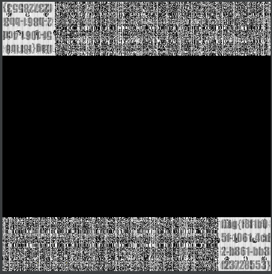
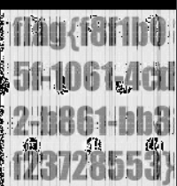

- 赛前培训
	- 例题1
	  collapsed:: true
		- SSRF
	- 例题2
	  collapsed:: true
		- 流量分析
	- 例题3
		- 像素值转化
			- [水印隐藏](https://github.com/chishaxie/BlindWaterMark) 工具
			- 首先使用python脚本将题目中的txt中的数字即**RSA**值转成图片
			  collapsed:: true
				- ```python
				  from PIL import Image
				  
				  
				  x = 800    #x坐标  通过对txt里的行数进行整数分解
				  y = 800    #y坐标  x * y = 行数
				  im = Image.new("RGB", (x, y))   #创建图片
				  file = open('2.txt')    #打开rbg值的文件
				  for i in range(0, x):
				      for j in range(0, y):
				          line = file.readline()  #获取一行的rgb值
				          rgb = line.split(" ")  #分离rgb，文本中逗号后面有空格
				          im.putpixel((i, j), (int(rgb[0]), int(rgb[1]), int(rgb[2])))
				  im.save('2.png')
				  #im.show()   #也可用im.save('flag.jpg')保存下来
				  ```
				- > 长宽的取值 
				            1.视频中为看txt行数，一行一个像素点，TXT行数=长*宽 即各为800
				             2. 其实受限于这个工具，图片转换前后长宽一致，所以也可以得出是 800*800的图片
			- 得到一个png文件 11KB的png文件,也就是本题的原图
			  collapsed:: true
				- 
			- 使用该工具进行decode 即可得到3.png，打开即可看到flag在左上角以及右下角
				- ```sh
				  python bwmforpy3.py decode   1.png 2.png 3.png
				  ```
				- 
				- 
- 鹏哥培训
	- RSA
- Spoic
  https://blog.csdn.net/weixin_43349916/article/details/123232335 
  Spoic
  https://blog.csdn.net/weixin_42640909/article/details/112142215?utm_medium=distribute.pc_feed_404.none-task-blog-2~default~BlogCommendFromBaidu~Rate-1-112142215-blog-null.pc_404_mixedpudn&depth_1-utm_source=distribute.pc_feed_404.none-task-blog-2~default~BlogCommendFromBaidu~Rate-1-112142215-blog-null.pc_404_mixedpud 
  Spoic
  pip install pycryptodome
  pip install crypto 
  Spoic
  https://sagecell.sagemath.org/
-