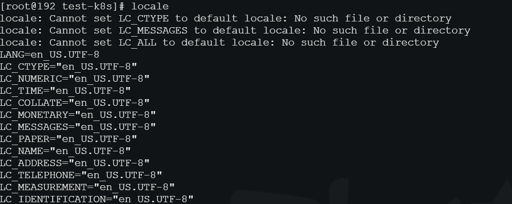

- [[CentOS 8配置静态IP]]
## 安装传输文件
id:: 2011e4ba-45e2-4f57-893f-c52da61ee4d7
collapsed:: true
	- ### 安装
	  collapsed:: true
		- ```
		  yum install lrzsz -y
		  ```
	- ### 查看是否安装完成
	  collapsed:: true
		- ````
		  rpm -qa | grep lrzsz -y
		  ````
	- ### 从服务器上传文件到本地：
	  collapsed:: true
		- ```
		  sz
		  ```
	- ### 从本地上传文件到服务器：
	  collapsed:: true
		- ```
		  rz
		  ```
- ## 开启端口
  collapsed:: true
	- ### CentOS7
	- CentOS7之后，无法使用iptables控制Linuxs的端口，原因：Centos 7使用firewalld代替了原来的iptables。
	- ### firewalld的基本使用
	  collapsed:: true
		- 通过 ((62d2ca46-73f9-43ce-9f39-5705dd28d2e5)) 开关防火墙
		- ### 配置firewalld-cmd
		  collapsed:: true
			- 查看版本： firewall-cmd --version
			  
			  查看帮助： firewall-cmd --help
			  
			  显示状态： firewall-cmd --state
			  
			  查看所有打开的端口： firewall-cmd --zone=public --list-ports
			  
			  更新防火墙规则： firewall-cmd --reload
			  
			  查看区域信息:  firewall-cmd --get-active-zones
			  
			  查看指定接口所属区域： firewall-cmd --get-zone-of-interface=eth0
			  
			  拒绝所有包：firewall-cmd --panic-on
			  
			  取消拒绝状态： firewall-cmd --panic-off
			  
			  查看是否拒绝： firewall-cmd --query-panic
- ## 服务管理工具
  id:: 62d2ca46-73f9-43ce-9f39-5705dd28d2e5
  collapsed:: true
	- ### systemctl是CentOS7的服务管理工具中主要的工具，它融合之前service和chkconfig的功能于一体。
		- 启动一个服务：systemctl start firewalld.service
		  关闭一个服务：systemctl stop firewalld.service
		  重启一个服务：systemctl restart firewalld.service
		  显示一个服务的状态：systemctl status firewalld.service
		  在开机时启用一个服务：systemctl enable firewalld.service
		  在开机时禁用一个服务：systemctl disable firewalld.service
		  查看服务是否开机启动：systemctl is-enabled firewalld.service
		  查看已启动的服务列表：systemctl list-unit-files|grep enabled
		  查看启动失败的服务列表：systemctl --failed
		- 启动： systemctl start firewalld
		- 关闭： systemctl stop firewalld
		- 查看状态： systemctl status firewalld
		- 开机禁用  ： systemctl disable firewalld
		- 开机启用  ： systemctl enable firewalld
- ## 安装 java环境
  collapsed:: true
	- ```
	  yum -y install java-1.8.0-openjdk
	  ```
	- 使用 ((2011e4ba-45e2-4f57-893f-c52da61ee4d7)) 上传 使用java -jar 运行jar包
- ## CentOS 8配置静态IP
  collapsed:: true
	- 修改网卡配置
		- ```sh
		  cd /etc/sysconfig/network-scripts/
		  ls
		  vim ifcfg-ens160
		  ## ``````
		  TYPE=Ethernet
		  PROXY_METHOD=none
		  BROWSER_ONLY=no
		  BOOTPROTO=static
		  DEFROUTE=yes
		  IPV4_FAILURE_FATAL=no
		  IPV6INIT=yes
		  IPV6_AUTOCONF=yes
		  IPV6_DEFROUTE=yes
		  IPV6_FAILURE_FATAL=no
		  IPV6_ADDR_GEN_MODE=stable-privacy
		  NAME=ens33
		  UUID=066b4926-b40c-4c28-a5b4-2310d2b96613
		  DEVICE=ens33
		  ONBOOT=yes
		  IPADDR=192.168.0.111
		  NETMASK=255.255.255.0
		  GATEWAY=192.168.0.1
		  DNS1=192.168.0.1
		  PREFIX=24
		  
		  ```
	- 重启网卡
		- ```sh
		  nmcli c reload
		  ```
	- 启用ens33网卡
		- ```sh
		  nmcli c up ens160
		  ```
## npm
collapsed:: true
	- ### 安装
		- 下载
			- ```
			  wget https://npm.taobao.org/mirrors/node/v10.14.1/node-v10.14.1-linux-x64.tar.gz
			  ```
		- 解压重命名
			- ```
			  tar -xvf  node-v8.0.0-linux-x64.tar.xz
			  mv node-v8.1.4-linux-x64 node
			  ```
	- 配置环境变量
		- ```
		  vim /etc/profile
		  ```
		  
		  根据自己实际目录在文件末尾加入以下内容
		  
		  ```
		  #set for nodejs  
		  export NODE_HOME=/usr/local/node  
		  export PATH=$NODE_HOME/bin:$PATH
		  ```
		  
		   使配置文件生效并查看是否安装成功
		  
		   ```
		  source /etc/profile
		  node -v
		  npm -v
		   ```
		  
		  可下载源码编译安装，但编译时间较长不推荐
		  
		  ```
		  wget https://npm.taobao.org/mirrors/node/v10.13.0/node-v10.13.0.tar.gz
		  ```
	- ## 一些npm命令
	- 安装cnpm
	  
	  ```
	  npm install -g cnpm --registry=https://registry.npm.taobao.org
	  cnpm -v
	  ```
	- 直接换源  
	  单次：``npm install --registry=https://registry.npm.taobao.org``   
	  永久： ``npm config set registry https://registry.npm.taobao.org``
	- 查看数据源
	  
	  ```
	  npm config get registry
	  ```
	- 删除数据源
	  
	  ```
	  npm config rm proxy
	  
	  npm config rm https-proxy
	  ```
	- ## pm2 start app.js
- ## 编码
  collapsed:: true
	- 查看字符编码和语言
	  collapsed:: true
		- 使用locale命令，语言是en_US(美式英语)，编码是UTF-8
		- 
	- **修改字符编码和语言**
		- centos6  修改 /etc/sysconfig/i18n
		- centos7  修改 /etc/locale.conf
		- 改为 `LANG="zh_CN.GBK"`
		-