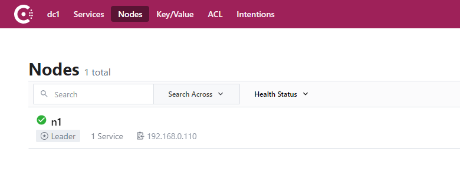

- 介绍
  collapsed:: true
	- Consul 是 HashiCorp 公司推出的开源工具，用于实现分布式系统的服务发现与配置。与其它分布式服
	  务注册与发现的方案相比较，Consul 的方案更“一站式”，内置了服务注册与发现框架、分布一致性协议
	  实现、健康检查、Key/Value 存储、多数据中心方案，不再需要依赖其它工具（比如 ZooKeeper 等）。
	  使用起来也较为简单。
	- Consul 使用 Go 语言编写，因此具有天然可移植性(支持Linux、windows和Mac
	  OS X)；安装包仅包含一个可执行文件，方便部署，与 Docker 等轻量级容器可无缝配合。
- 特性
  collapsed:: true
	- 服务发现
	- 健康检查
	- Key/Value 存储
	- 多数据中心
	- 社区活跃
- 优势
  collapsed:: true
	- 使用 Raft 算法来保证一致性, 比复杂的 Paxos 算法更直接. 相比较而言, zookeeper 采用的是
	  Paxos, 而 etcd 使用的则是 Raft。
	- 支持多数据中心，内外网的服务采用不同的端口进行监听。 多数据中心集群可以避免单数据中心的
	  单点故障,而其部署则需要考虑网络延迟, 分片等情况等。 zookeeper 和 etcd 均不提供多数据中心
	  功能的支持。
	- 支持健康检查。 etcd 不提供此功能。
	- 支持 http 和 dns 协议接口。 zookeeper 的集成较为复杂, etcd 只支持 http 协议。
	- 官方提供 web 管理界面, etcd 无此功能。
	- 综合比较, Consul 作为服务注册和配置管理的新星, 比较值得关注和研究。
	- 提供了rest api 便于集成：https://www.consul.io/api-docs/index
- Consul 角色
  collapsed:: true
	- client: 客户端, 无状态, 将 HTTP 和 DNS 接口请求转发给局域网内的服务端集群。
	- server: 服务端, 保存配置信息, 高可用集群, 在局域网内与本地客户端通讯, 通过广域网与其它数据
	  中心通讯。 每个数据中心的 server 数量推荐为 3 个或是 5 个。
	- Consul 客户端、服务端还支持跨中心的使用，更加提高了它的高可用性。
- 安装
  collapsed:: true
	- 1、以consul server运行，参考如下命令：
		- ```sh
		  consul agent -server -bootstrap-expect 1 -data-dir D:\SpringCloud\Consul\data -node=n1 -ui -client=0.0.0.0 -bind=192.168.0.110	
		  ```
		-
		- 参数介绍
		  collapsed:: true
			- server 定义 agent 运行在 server 模式
			- bootstrap-expect 1 在一个 datacenter 中期望提供的 server 节点数目，当该值提供的时候，
			- consul一直等到达到指定 sever 数目的时候才会引导整个集群。这里我们为了方便演示只启动一个
			  服务端
			- data-dir 参数设置 Consul 自己的维护的数据存储路径
			- node=n1 节点在集群中的名称，在一个集群中必须是唯一的，默认是该节点的主机名
			- bind=192.168.10.11 该地址用来在集群内部的通讯，集群内的所有节点到地址都必须是可达的，
			  默认是 0.0.0.0
			- datacenter=dc1 指定当前数据中心名字，该参数可以不设置
			- ui 指定可以以 UI 的方式呈现，当前的 UI 访问地址是:http://本机 IP:8500
			- client=0.0.0.0 consul 服务侦听地址，这个地址提供 HTTP、DNS、RPC 等服务，默认是127.0.0.1所以不对外提供服务，如果你要对外提供服务改成 0.0.0.0，我们当前配置为对外提供地址。
		- 完整启动选项参数见官方文档：https://www.consul.io/docs/agent/options
		- 启动后访问控制台UI: http://192.168.10.11:8500/
	- 控制台
		- 
		- Services ：服务信息。
		  Nodes ：节点信息，Consul支持集群。
		  Key/Value ：存储的动态配置信息。
		  ACL ：权限信息。
		  Intentions ：通过命令的方式对consul进行管理。
- 项目中使用Consul
	- 添加依赖
		- `pom.xml`
		  collapsed:: true
			- ```xml
			  <!--consul-->
			  <dependency>
			  <groupId>org.springframework.cloud</groupId>
			  <artifactId>spring-cloud-starter-consul-discovery</artifactId>
			  <version>2.2.1.RELEASE</version>
			  </dependency>
			  <dependency>
			  <groupId>org.springframework.boot</groupId>
			  <artifactId>spring-boot-starter-actuator</artifactId>
			  <version>2.2.10.RELEASE</version>
			  </dependency>
			  ```
	- 添加 @EnableDiscoveryClient 注解
	  collapsed:: true
		- 在启动类上添加 @EnableDiscoveryClient 注解
	- 配置Consul服务信息
	  collapsed:: true
		- `application.yaml`
			- ```yaml
			  server:
			    port: 18082
			  spring:
			    application:
			      name: hailtaxi-order
			    datasource:
			      driver-class-name: com.mysql.cj.jdbc.Driver
			      # 使用docker启动MySQL数据库：
			      # 1. docker run -itd --name mysql-hailtaxi -p 3306:3306 -v /opt/itcast/spring-cloud/data/mysql:/var/lib/mysql -v /opt/itcast/spring-cloud/sql/:/opt/sql -e MYSQL_ROOT_PASSWORD=123456 mysql:8.0
			      # 2. docker exec -it mysql-hailtaxi bash
			      # 3. 执行sql脚本，导入测试数据
			      url: jdbc:mysql://192.168.0.111:3306/hailtaxi-order?useUnicode=true&characterEncoding=UTF-8&serverTimezone=UTC
			      username: root
			      password: 123456
			    cloud:
			      #Consul配置
			      consul:
			        host: localhost
			        port: 8500
			        discovery:
			          #注册到Consul中的服务名字
			          service-name: ${spring.application.name}
			          #注册的服务的实例 Id，最好不要重复，这里参考官网建议的方式 带随机数
			          #instance-id: ${spring.application.name}:${vcap.application.instance_id:${spring.application.i nstance_id:${random.value}}}
			          # 自定义实例id为:应用名:ip:port
			          instance-id: ${spring.application.name}:${spring.cloud.client.ip-address}:${server.port}
			          prefer-ip-address: true
			          ip-address: 192.168.0.110
			          # 开启服务注册
			          register: true
			          # 开启服务发现
			          enabled: true
			          # 2分钟之后健康检查未通过取消注册
			          health-check-critical-timeout: 2m
			          # consul健康检查的轮询周期
			          health-check-interval: 10s
			  ```
-