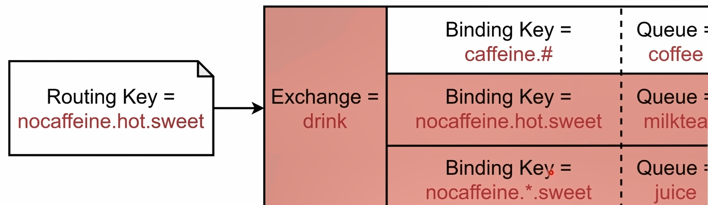
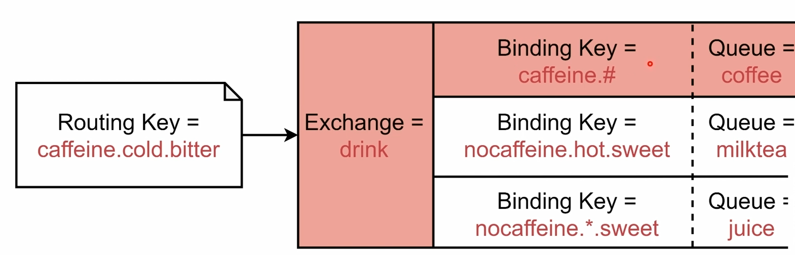

- 类型
	- Direct Exchange （Routing = Binding）
	  collapsed:: true
		- Message中的Routing Key如果和Binding Key一致，Direct Exchange则将message发到对应的queue中
		- 
	- Fanout Exchange （广播）
	  collapsed:: true
		- 每个发到Fanout Exchange的message都会分发到**所有**绑定的queue上去
		- 
	- Topic Exchange (类似正则,但单位是单词,可当成Direct用)
	  collapsed:: true
		- 根据Routing Key及通配规则，Topic Exchange将消息分发到目标Queue中
			- 全匹配：与Direct类似
			- Binding Key中的#:匹配任意个数的word
			- Binding Key中的*:匹配任意1个word
		- 
		- 
	- Headers