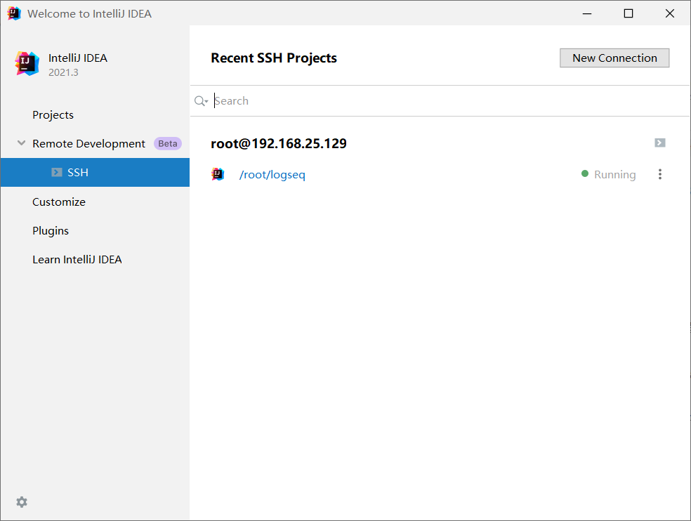
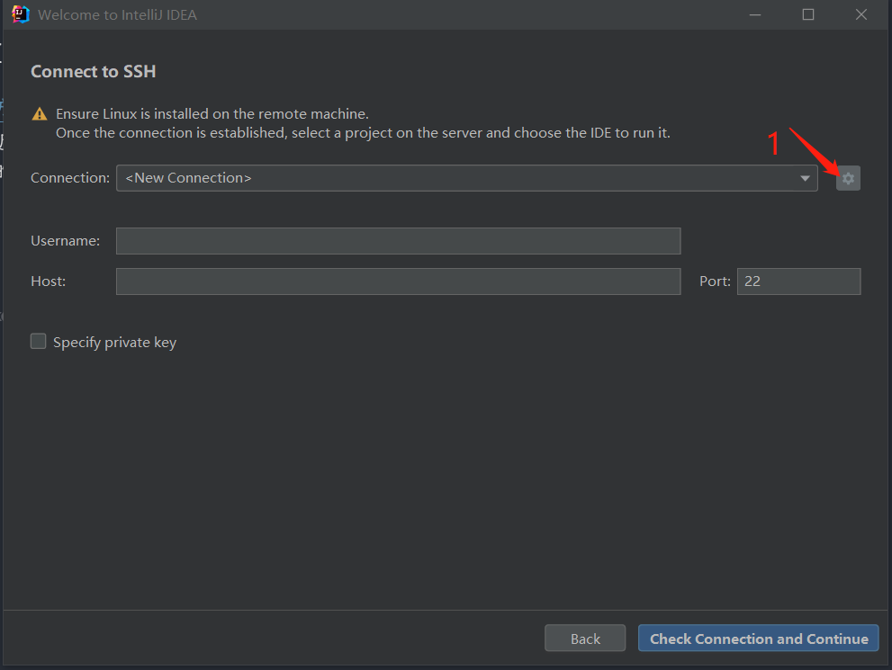
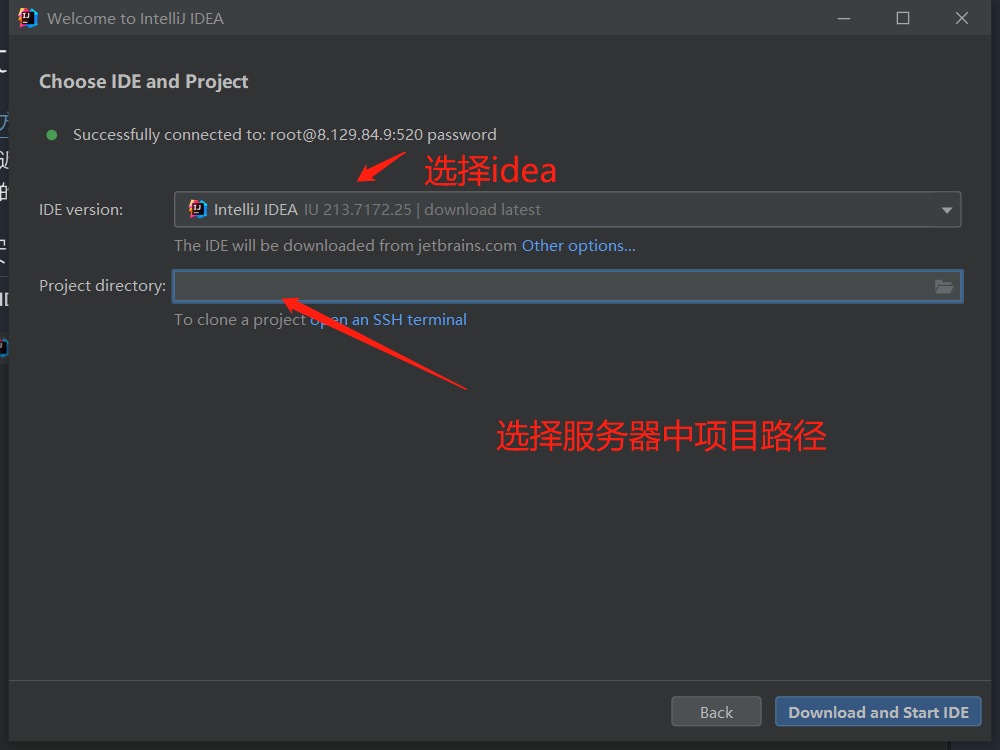

- [官方文档](https://www.jetbrains.com/help/idea/remote-development-starting-page.html)
- 最近工作开始出差，开发环境也开始从公司台式到笔记本来回切换，配置略微繁琐，正好看见这个JetBrains提供的远程开发IDE，于是打算在服务器部署一套。具体过程如下
- ##  安装过程
- 在IDEA页面 Project选项选择 ssh 进入以下界面，添加服务器信息
- 
- 
- 
- 随后就是自动下载安装idea在服务器上并打开项目了