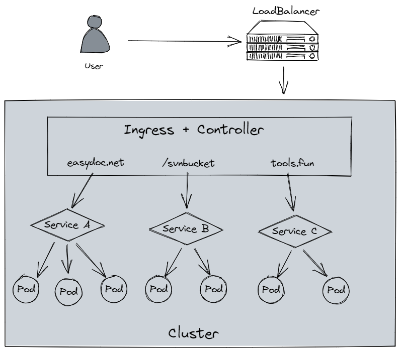

title:: Kubernetes

- ## 简介
  collapsed:: true
	- ### 什么是Kubernetes
	  collapsed:: true
		- 一个为 容器化 应用提供集群部署和管理的开源工具，由 Google 开发。
		- Kubernetes 可以为你提供集中式的管理集群机器和应用，加机器、版本升级、版本回滚，那都是一个命令就搞定的事，不停机的灰度更新，确保高可用、高性能、高扩展。
	- ### 主要特性
	  collapsed:: true
		- 高可用，不宕机，自动灾难恢复
		- 灰度更新，不影响业务正常运转
		- 一键回滚到历史版本
		- 方便的伸缩扩展（应用伸缩，机器加减）、提供负载均衡
		  有一个完善的生态
	- ## 不同的应用部署方案
	  collapsed:: true
		- 
		- 传统部署方式
		  collapsed:: true
			- 应用直接在物理机上部署，机器资源分配不好控制，出现Bug时，可能机器的大部分资源被某个应用占用，导致其他应用无法正常运行，无法做到应用隔离。
		- 虚拟机部署
		  collapsed:: true
			- 在单个物理机上运行多个虚拟机，每个虚拟机都是完整独立的系统，性能损耗大。
		- 容器部署
		  collapsed:: true
			- 所有容器共享主机的系统，轻量级的虚拟机，性能损耗小，资源隔离，CPU和内存可按需分配
	- ## 集群架构
	  collapsed:: true
		- ### Master与worker
		  collapsed:: true
			- 
			- master
			  collapsed:: true
				- 主节点，控制平台，不需要很高性能，不跑任务，通常一个就行了，也可以开多个主节点来提高集群可用度。
			- worker
			  collapsed:: true
				- 工作节点，可以是虚拟机或物理计算机，任务都在这里跑，机器性能需要好点；通常都有很多个，可以不断加机器扩大集群；每个工作节点由主节点管理
		- ### Pod
		  collapsed:: true
			- 
			- K8S 调度、管理的最小单位，一个 Pod 可以包含一个或多个容器，每个 Pod 有自己的虚拟IP。
			- 一个工作节点可以有多个 pod，主节点会考量负载自动调度 pod 到哪个节点运行。
			- **StatefulSet**: 定义一组有状态Pod,K8S将自动维护
			- **Deployment**: 定义一组无状态Pod,K8S将自动维护
			- **Service**: 一组Pod的抽象访问方式，相当于负载均衡器
		- ### 组件
		  collapsed:: true
			- 
			- kube-apiserver
			  collapsed:: true
				- API 服务器，公开了 Kubernetes API
			- etcd
			  collapsed:: true
				- 键值数据库，可以作为保存 Kubernetes 所有集群数据的后台数据库
			- kube-scheduler
			  collapsed:: true
				- 调度 Pod 到哪个节点运行
			- kube-controller
			  collapsed:: true
				- 集群控制器
			- cloud-controller
			  collapsed:: true
				- 与云服务商交互
			- [官网详情](https://kubernetes.io/zh-cn/docs/concepts/overview/components/)
- ## 安装 Kubernetes 集群
  collapsed:: true
	- > 非云平台均需要Docker环境
	- ### minikube
	  collapsed:: true
		- 只是一个 K8S 集群模拟器，只有一个节点的集群，只为测试用，master 和 worker 都在一起
		- [安装方法](https://minikube.sigs.k8s.io/docs/start/)
		- Windows
			- ```sh
			  winget install minikube
			  ```
	- ### 云平台 Kubernetes
	  collapsed:: true
		- 可视化搭建，只需简单几步就可以创建好一个集群。
		  优点：安装简单，生态齐全，负载均衡器、存储等都给你配套好，简单操作就搞定
		- [腾讯云容器服务 TKE](https://cloud.tencent.com/product/tke) （控制台搜索容器）
		  登录阿里云控制台 - 产品搜索 Kubernetes
	- ### 裸机安装（Bare Metal）
	  collapsed:: true
		- 缺点
		  collapsed:: true
			- 至少需要两台机器（主节点、工作节点个一台），需要自己安装 Kubernetes 组件，配置会稍微麻烦点。
			  可以到各云厂商按时租用服务器，费用低，用完就销毁。
			  缺点：配置麻烦，缺少生态支持，例如负载均衡器、云存储。
		- 主节点需要组件
		  collapsed:: true
			- docker（也可以是其他容器运行时）
			- kubectl 集群命令行交互工具
			- kubeadm 集群初始化工具
		- 工作节点需要组件
		  collapsed:: true
			- docker（也可以是其他容器运行时）
			- kubelet 管理 Pod 和容器，确保他们健康稳定运行。
			  collapsed:: true
				- kube-proxy 网络代理，负责网络相关的工作
		- 手动搭建
		  collapsed:: true
			- 安装docker
			  collapsed:: true
				- {{embed ((62c58c80-6b37-4239-bdc0-10760eef278f))}}
			- 修改host
			  collapsed:: true
				- ```sh
				                # 所有节点都修改 hosts
				                vim /etc/hosts
				                192.168.0.112 CentOS8-001
				                192.168.0.113 CentOS8-002
				                192.168.0.114 CentOS8-003
				                ```
	- 关闭 SELinux
	  collapsed:: true
	- ```sh
	                setenforce 0
	                sed -i --follow-symlinks 's/SELINUX=enforcing/SELINUX=disabled/g' /etc/sysconfig/selinux
	                ```
	- 关闭防火墙
	  collapsed:: true
	- ```sh
	                systemctl stop firewalld
	                systemctl disable firewalld
	                ```
	- 添加安装源
	  collapsed:: true
	- ```sh
	                # 添加 k8s 安装源
	                cat <<EOF > kubernetes.repo
	                [kubernetes]
	                name=Kubernetes
	                baseurl=https://mirrors.aliyun.com/kubernetes/yum/repos/kubernetes-el7-x86_64
	                enabled=1
	                gpgcheck=0
	                repo_gpgcheck=0
	                gpgkey=https://mirrors.aliyun.com/kubernetes/yum/doc/yum-key.gpg https://mirrors.aliyun.com/kubernetes/yum/doc/rpm-package-key.gpg
	                EOF
	                mv kubernetes.repo /etc/yum.repos.d/
	  
	                # 添加 Docker 安装源
	                yum-config-manager --add-repo http://mirrors.aliyun.com/docker-ce/linux/centos/docker-ce.repo
	                ```
	- 安装所需组件
	  collapsed:: true
	- ```sh
	                yum install -y kubelet-1.22.4 kubectl-1.22.4 kubeadm-1.22.4
	                ```
	- 启动 kubelet、docker，并设置开机启动
	  collapsed:: true
	- ```sh
	                systemctl enable kubelet
	                systemctl start kubelet
	                systemctl enable docker
	                systemctl start docker
	                ```
	- 修改 docker 配置
	  collapsed:: true
	- ```sh
	                # kubernetes 官方推荐 docker 等使用 systemd 作为 cgroupdriver，否则 kubelet 启动不了
	                cat <<EOF > daemon.json
	                {
	                  "exec-opts": ["native.cgroupdriver=systemd"],
	                  "registry-mirrors": ["https://ud6340vz.mirror.aliyuncs.com"]
	                }
	                EOF
	                mv daemon.json /etc/docker/
	  
	                # 重启生效
	                systemctl daemon-reload
	                systemctl restart docker
	                ```
	- 关闭swap分区
	  collapsed:: true
	- ```sh
	                swapoff -a
	                ```
	- ---
	- 用 kubeadm 初始化集群（仅在主节点跑)
	  collapsed:: true
	- ```sh
	  
	                # 初始化集群控制台 Control plane
	                # 失败了可以用 kubeadm reset 重置
	                kubeadm init --image-repository=registry.aliyuncs.com/google_containers
	  
	                # 记得把 kubeadm join xxx 保存起来 (大概是在最后面的位置)
	                # 忘记了重新获取：kubeadm token create --print-join-command
	  
	                # 复制授权文件，以便 kubectl 可以有权限访问集群
	                # 如果你其他节点需要访问集群，需要从主节点复制这个文件过去其他节点
	                mkdir -p $HOME/.kube
	                cp -i /etc/kubernetes/admin.conf $HOME/.kube/config
	                chown $(id -u):$(id -g) $HOME/.kube/config
	  
	                # 在其他机器上创建 ~/.kube/config 文件也能通过 kubectl 访问到集群
	                ```
	- [kubeadm init  做了啥](https://kubernetes.io/docs/reference/setup-tools/kubeadm/kubeadm-init/)
	- 把工作节点加入集群（只在工作节点跑）
	  collapsed:: true
	- ```sh
	                kubeadm join 192.168.0.112:6443 --token m1aebg.gbtul07qttzju3le \
	      --discovery-token-ca-cert-hash sha256:a7bca1335811e6e49c0dd01377ab58937f19b5894b5a10ad0f171afe86177ce8 
	                ```
	- 安装网络插件（主节点跑）
	  collapsed:: true
	- ```sh
	                # 很有可能国内网络访问不到这个资源，你可以网上找找国内的源安装 flannel
	                kubectl apply -f ./kube-flannel.yml
	                ```
	- kube-flannel.yml 文件内容如下
	- ```yml
	                ---
	                # Source: calico/templates/calico-config.yaml
	                # This ConfigMap is used to configure a self-hosted Calico installation.
	                kind: ConfigMap
	                apiVersion: v1
	                metadata:
	                  name: calico-config
	                  namespace: kube-system
	                data:
	                  # Typha is disabled.
	                  typha_service_name: "none"
	                  # Configure the backend to use.
	                  calico_backend: "bird"
	  
	                  # Configure the MTU to use for workload interfaces and tunnels.
	                  # By default, MTU is auto-detected, and explicitly setting this field should not be required.
	                  # You can override auto-detection by providing a non-zero value.
	                  veth_mtu: "0"
	  
	                  # The CNI network configuration to install on each node. The special
	                  # values in this config will be automatically populated.
	                  cni_network_config: |-
	  {
	    "name": "k8s-pod-network",
	    "cniVersion": "0.3.1",
	    "plugins": [
	      {
	        "type": "calico",
	        "log_level": "info",
	        "log_file_path": "/var/log/calico/cni/cni.log",
	        "datastore_type": "kubernetes",
	        "nodename": "__KUBERNETES_NODE_NAME__",
	        "mtu": __CNI_MTU__,
	        "ipam": {
	            "type": "calico-ipam"
	        },
	        "policy": {
	            "type": "k8s"
	        },
	        "kubernetes": {
	            "kubeconfig": "__KUBECONFIG_FILEPATH__"
	        }
	      },
	      {
	        "type": "portmap",
	        "snat": true,
	        "capabilities": {"portMappings": true}
	      },
	      {
	        "type": "bandwidth",
	        "capabilities": {"bandwidth": true}
	      }
	    ]
	  }
	  
	                ---
	                # Source: calico/templates/kdd-crds.yaml
	  
	                apiVersion: apiextensions.k8s.io/v1
	                kind: CustomResourceDefinition
	                metadata:
	                  name: bgpconfigurations.crd.projectcalico.org
	                spec:
	                  group: crd.projectcalico.org
	                  names:
	  kind: BGPConfiguration
	  listKind: BGPConfigurationList
	  plural: bgpconfigurations
	  singular: bgpconfiguration
	                  scope: Cluster
	                  versions:
	                  - name: v1
	  schema:
	    openAPIV3Schema:
	      description: BGPConfiguration contains the configuration for any BGP routing.
	      properties:
	        apiVersion:
	          description: 'APIVersion defines the versioned schema of this representation
	            of an object. Servers should convert recognized schemas to the latest
	            internal value, and may reject unrecognized values. More info: https://git.k8s.io/community/contributors/devel/sig-architecture/api-conventions.md#resources'
	          type: string
	        kind:
	          description: 'Kind is a string value representing the REST resource this
	            object represents. Servers may infer this from the endpoint the client
	            submits requests to. Cannot be updated. In CamelCase. More info: https://git.k8s.io/community/contributors/devel/sig-architecture/api-conventions.md#types-kinds'
	          type: string
	        metadata:
	          type: object
	        spec:
	          description: BGPConfigurationSpec contains the values of the BGP configuration.
	          properties:
	            asNumber:
	              description: 'ASNumber is the default AS number used by a node. [Default:
	                64512]'
	              format: int32
	              type: integer
	            communities:
	              description: Communities is a list of BGP community values and their
	                arbitrary names for tagging routes.
	              items:
	                description: Community contains standard or large community value
	                  and its name.
	                properties:
	                  name:
	                    description: Name given to community value.
	                    type: string
	                  value:
	                    description: Value must be of format `aa:nn` or `aa:nn:mm`.
	                      For standard community use `aa:nn` format, where `aa` and
	                      `nn` are 16 bit number. For large community use `aa:nn:mm`
	                      format, where `aa`, `nn` and `mm` are 32 bit number. Where,
	                      `aa` is an AS Number, `nn` and `mm` are per-AS identifier.
	                    pattern: ^(\d+):(\d+)$|^(\d+):(\d+):(\d+)$
	                    type: string
	                type: object
	              type: array
	            listenPort:
	              description: ListenPort is the port where BGP protocol should listen.
	                Defaults to 179
	              maximum: 65535
	              minimum: 1
	              type: integer
	            logSeverityScreen:
	              description: 'LogSeverityScreen is the log severity above which logs
	                are sent to the stdout. [Default: INFO]'
	              type: string
	            nodeToNodeMeshEnabled:
	              description: 'NodeToNodeMeshEnabled sets whether full node to node
	                BGP mesh is enabled. [Default: true]'
	              type: boolean
	            prefixAdvertisements:
	              description: PrefixAdvertisements contains per-prefix advertisement
	                configuration.
	              items:
	                description: PrefixAdvertisement configures advertisement properties
	                  for the specified CIDR.
	                properties:
	                  cidr:
	                    description: CIDR for which properties should be advertised.
	                    type: string
	                  communities:
	                    description: Communities can be list of either community names
	                      already defined in `Specs.Communities` or community value
	                      of format `aa:nn` or `aa:nn:mm`. For standard community use
	                      `aa:nn` format, where `aa` and `nn` are 16 bit number. For
	                      large community use `aa:nn:mm` format, where `aa`, `nn` and
	                      `mm` are 32 bit number. Where,`aa` is an AS Number, `nn` and
	                      `mm` are per-AS identifier.
	                    items:
	                      type: string
	                    type: array
	                type: object
	              type: array
	            serviceClusterIPs:
	              description: ServiceClusterIPs are the CIDR blocks from which service
	                cluster IPs are allocated. If specified, Calico will advertise these
	                blocks, as well as any cluster IPs within them.
	              items:
	                description: ServiceClusterIPBlock represents a single allowed ClusterIP
	                  CIDR block.
	                properties:
	                  cidr:
	                    type: string
	                type: object
	              type: array
	            serviceExternalIPs:
	              description: ServiceExternalIPs are the CIDR blocks for Kubernetes
	                Service External IPs. Kubernetes Service ExternalIPs will only be
	                advertised if they are within one of these blocks.
	              items:
	                description: ServiceExternalIPBlock represents a single allowed
	                  External IP CIDR block.
	                properties:
	                  cidr:
	                    type: string
	                type: object
	              type: array
	            serviceLoadBalancerIPs:
	              description: ServiceLoadBalancerIPs are the CIDR blocks for Kubernetes
	                Service LoadBalancer IPs. Kubernetes Service status.LoadBalancer.Ingress
	                IPs will only be advertised if they are within one of these blocks.
	              items:
	                description: ServiceLoadBalancerIPBlock represents a single allowed
	                  LoadBalancer IP CIDR block.
	                properties:
	                  cidr:
	                    type: string
	                type: object
	              type: array
	          type: object
	      type: object
	  served: true
	  storage: true
	                status:
	                  acceptedNames:
	  kind: ""
	  plural: ""
	                  conditions: []
	                  storedVersions: []
	  
	                ---
	                apiVersion: apiextensions.k8s.io/v1
	                kind: CustomResourceDefinition
	                metadata:
	                  name: bgppeers.crd.projectcalico.org
	                spec:
	                  group: crd.projectcalico.org
	                  names:
	  kind: BGPPeer
	  listKind: BGPPeerList
	  plural: bgppeers
	  singular: bgppeer
	                  scope: Cluster
	                  versions:
	                  - name: v1
	  schema:
	    openAPIV3Schema:
	      properties:
	        apiVersion:
	          description: 'APIVersion defines the versioned schema of this representation
	            of an object. Servers should convert recognized schemas to the latest
	            internal value, and may reject unrecognized values. More info: https://git.k8s.io/community/contributors/devel/sig-architecture/api-conventions.md#resources'
	          type: string
	        kind:
	          description: 'Kind is a string value representing the REST resource this
	            object represents. Servers may infer this from the endpoint the client
	            submits requests to. Cannot be updated. In CamelCase. More info: https://git.k8s.io/community/contributors/devel/sig-architecture/api-conventions.md#types-kinds'
	          type: string
	        metadata:
	          type: object
	        spec:
	          description: BGPPeerSpec contains the specification for a BGPPeer resource.
	          properties:
	            asNumber:
	              description: The AS Number of the peer.
	              format: int32
	              type: integer
	            keepOriginalNextHop:
	              description: Option to keep the original nexthop field when routes
	                are sent to a BGP Peer. Setting "true" configures the selected BGP
	                Peers node to use the "next hop keep;" instead of "next hop self;"(default)
	                in the specific branch of the Node on "bird.cfg".
	              type: boolean
	            maxRestartTime:
	              description: Time to allow for software restart.  When specified, this
	                is configured as the graceful restart timeout.  When not specified,
	                the BIRD default of 120s is used.
	              type: string
	            node:
	              description: The node name identifying the Calico node instance that
	                is targeted by this peer. If this is not set, and no nodeSelector
	                is specified, then this BGP peer selects all nodes in the cluster.
	              type: string
	            nodeSelector:
	              description: Selector for the nodes that should have this peering.  When
	                this is set, the Node field must be empty.
	              type: string
	            password:
	              description: Optional BGP password for the peerings generated by this
	                BGPPeer resource.
	              properties:
	                secretKeyRef:
	                  description: Selects a key of a secret in the node pod's namespace.
	                  properties:
	                    key:
	                      description: The key of the secret to select from.  Must be
	                        a valid secret key.
	                      type: string
	                    name:
	                      description: 'Name of the referent. More info: https://kubernetes.io/docs/concepts/overview/working-with-objects/names/#names
	                        TODO: Add other useful fields. apiVersion, kind, uid?'
	                      type: string
	                    optional:
	                      description: Specify whether the Secret or its key must be
	                        defined
	                      type: boolean
	                  required:
	                  - key
	                  type: object
	              type: object
	            peerIP:
	              description: The IP address of the peer followed by an optional port
	                number to peer with. If port number is given, format should be `[<IPv6>]:port`
	                or `<IPv4>:<port>` for IPv4. If optional port number is not set,
	                and this peer IP and ASNumber belongs to a calico/node with ListenPort
	                set in BGPConfiguration, then we use that port to peer.
	              type: string
	            peerSelector:
	              description: Selector for the remote nodes to peer with.  When this
	                is set, the PeerIP and ASNumber fields must be empty.  For each
	                peering between the local node and selected remote nodes, we configure
	                an IPv4 peering if both ends have NodeBGPSpec.IPv4Address specified,
	                and an IPv6 peering if both ends have NodeBGPSpec.IPv6Address specified.  The
	                remote AS number comes from the remote node's NodeBGPSpec.ASNumber,
	                or the global default if that is not set.
	              type: string
	            sourceAddress:
	              description: Specifies whether and how to configure a source address
	                for the peerings generated by this BGPPeer resource.  Default value
	                "UseNodeIP" means to configure the node IP as the source address.  "None"
	                means not to configure a source address.
	              type: string
	          type: object
	      type: object
	  served: true
	  storage: true
	                status:
	                  acceptedNames:
	  kind: ""
	  plural: ""
	                  conditions: []
	                  storedVersions: []
	  
	                ---
	                apiVersion: apiextensions.k8s.io/v1
	                kind: CustomResourceDefinition
	                metadata:
	                  name: blockaffinities.crd.projectcalico.org
	                spec:
	                  group: crd.projectcalico.org
	                  names:
	  kind: BlockAffinity
	  listKind: BlockAffinityList
	  plural: blockaffinities
	  singular: blockaffinity
	                  scope: Cluster
	                  versions:
	                  - name: v1
	  schema:
	    openAPIV3Schema:
	      properties:
	        apiVersion:
	          description: 'APIVersion defines the versioned schema of this representation
	            of an object. Servers should convert recognized schemas to the latest
	            internal value, and may reject unrecognized values. More info: https://git.k8s.io/community/contributors/devel/sig-architecture/api-conventions.md#resources'
	          type: string
	        kind:
	          description: 'Kind is a string value representing the REST resource this
	            object represents. Servers may infer this from the endpoint the client
	            submits requests to. Cannot be updated. In CamelCase. More info: https://git.k8s.io/community/contributors/devel/sig-architecture/api-conventions.md#types-kinds'
	          type: string
	        metadata:
	          type: object
	        spec:
	          description: BlockAffinitySpec contains the specification for a BlockAffinity
	            resource.
	          properties:
	            cidr:
	              type: string
	            deleted:
	              description: Deleted indicates that this block affinity is being deleted.
	                This field is a string for compatibility with older releases that
	                mistakenly treat this field as a string.
	              type: string
	            node:
	              type: string
	            state:
	              type: string
	          required:
	          - cidr
	          - deleted
	          - node
	          - state
	          type: object
	      type: object
	  served: true
	  storage: true
	                status:
	                  acceptedNames:
	  kind: ""
	  plural: ""
	                  conditions: []
	                  storedVersions: []
	  
	                ---
	                apiVersion: apiextensions.k8s.io/v1
	                kind: CustomResourceDefinition
	                metadata:
	                  name: clusterinformations.crd.projectcalico.org
	                spec:
	                  group: crd.projectcalico.org
	                  names:
	  kind: ClusterInformation
	  listKind: ClusterInformationList
	  plural: clusterinformations
	  singular: clusterinformation
	                  scope: Cluster
	                  versions:
	                  - name: v1
	  schema:
	    openAPIV3Schema:
	      description: ClusterInformation contains the cluster specific information.
	      properties:
	        apiVersion:
	          description: 'APIVersion defines the versioned schema of this representation
	            of an object. Servers should convert recognized schemas to the latest
	            internal value, and may reject unrecognized values. More info: https://git.k8s.io/community/contributors/devel/sig-architecture/api-conventions.md#resources'
	          type: string
	        kind:
	          description: 'Kind is a string value representing the REST resource this
	            object represents. Servers may infer this from the endpoint the client
	            submits requests to. Cannot be updated. In CamelCase. More info: https://git.k8s.io/community/contributors/devel/sig-architecture/api-conventions.md#types-kinds'
	          type: string
	        metadata:
	          type: object
	        spec:
	          description: ClusterInformationSpec contains the values of describing
	            the cluster.
	          properties:
	            calicoVersion:
	              description: CalicoVersion is the version of Calico that the cluster
	                is running
	              type: string
	            clusterGUID:
	              description: ClusterGUID is the GUID of the cluster
	              type: string
	            clusterType:
	              description: ClusterType describes the type of the cluster
	              type: string
	            datastoreReady:
	              description: DatastoreReady is used during significant datastore migrations
	                to signal to components such as Felix that it should wait before
	                accessing the datastore.
	              type: boolean
	            variant:
	              description: Variant declares which variant of Calico should be active.
	              type: string
	          type: object
	      type: object
	  served: true
	  storage: true
	                status:
	                  acceptedNames:
	  kind: ""
	  plural: ""
	                  conditions: []
	                  storedVersions: []
	  
	                ---
	                apiVersion: apiextensions.k8s.io/v1
	                kind: CustomResourceDefinition
	                metadata:
	                  name: felixconfigurations.crd.projectcalico.org
	                spec:
	                  group: crd.projectcalico.org
	                  names:
	  kind: FelixConfiguration
	  listKind: FelixConfigurationList
	  plural: felixconfigurations
	  singular: felixconfiguration
	                  scope: Cluster
	                  versions:
	                  - name: v1
	  schema:
	    openAPIV3Schema:
	      description: Felix Configuration contains the configuration for Felix.
	      properties:
	        apiVersion:
	          description: 'APIVersion defines the versioned schema of this representation
	            of an object. Servers should convert recognized schemas to the latest
	            internal value, and may reject unrecognized values. More info: https://git.k8s.io/community/contributors/devel/sig-architecture/api-conventions.md#resources'
	          type: string
	        kind:
	          description: 'Kind is a string value representing the REST resource this
	            object represents. Servers may infer this from the endpoint the client
	            submits requests to. Cannot be updated. In CamelCase. More info: https://git.k8s.io/community/contributors/devel/sig-architecture/api-conventions.md#types-kinds'
	          type: string
	        metadata:
	          type: object
	        spec:
	          description: FelixConfigurationSpec contains the values of the Felix configuration.
	          properties:
	            allowIPIPPacketsFromWorkloads:
	              description: 'AllowIPIPPacketsFromWorkloads controls whether Felix
	                will add a rule to drop IPIP encapsulated traffic from workloads
	                [Default: false]'
	              type: boolean
	            allowVXLANPacketsFromWorkloads:
	              description: 'AllowVXLANPacketsFromWorkloads controls whether Felix
	                will add a rule to drop VXLAN encapsulated traffic from workloads
	                [Default: false]'
	              type: boolean
	            awsSrcDstCheck:
	              description: 'Set source-destination-check on AWS EC2 instances. Accepted
	                value must be one of "DoNothing", "Enabled" or "Disabled". [Default:
	                DoNothing]'
	              enum:
	              - DoNothing
	              - Enable
	              - Disable
	              type: string
	            bpfConnectTimeLoadBalancingEnabled:
	              description: 'BPFConnectTimeLoadBalancingEnabled when in BPF mode,
	                controls whether Felix installs the connection-time load balancer.  The
	                connect-time load balancer is required for the host to be able to
	                reach Kubernetes services and it improves the performance of pod-to-service
	                connections.  The only reason to disable it is for debugging purposes.  [Default:
	                true]'
	              type: boolean
	            bpfDataIfacePattern:
	              description: BPFDataIfacePattern is a regular expression that controls
	                which interfaces Felix should attach BPF programs to in order to
	                catch traffic to/from the network.  This needs to match the interfaces
	                that Calico workload traffic flows over as well as any interfaces
	                that handle incoming traffic to nodeports and services from outside
	                the cluster.  It should not match the workload interfaces (usually
	                named cali...).
	              type: string
	            bpfDisableUnprivileged:
	              description: 'BPFDisableUnprivileged, if enabled, Felix sets the kernel.unprivileged_bpf_disabled
	                sysctl to disable unprivileged use of BPF.  This ensures that unprivileged
	                users cannot access Calico''s BPF maps and cannot insert their own
	                BPF programs to interfere with Calico''s. [Default: true]'
	              type: boolean
	            bpfEnabled:
	              description: 'BPFEnabled, if enabled Felix will use the BPF dataplane.
	                [Default: false]'
	              type: boolean
	            bpfExternalServiceMode:
	              description: 'BPFExternalServiceMode in BPF mode, controls how connections
	                from outside the cluster to services (node ports and cluster IPs)
	                are forwarded to remote workloads.  If set to "Tunnel" then both
	                request and response traffic is tunneled to the remote node.  If
	                set to "DSR", the request traffic is tunneled but the response traffic
	                is sent directly from the remote node.  In "DSR" mode, the remote
	                node appears to use the IP of the ingress node; this requires a
	                permissive L2 network.  [Default: Tunnel]'
	              type: string
	            bpfExtToServiceConnmark:
	              description: 'BPFExtToServiceConnmark in BPF mode, controls a
	                32bit mark that is set on connections from an external client to
	                a local service. This mark allows us to control how packets of
	                that connection are routed within the host and how is routing
	                intepreted by RPF check. [Default: 0]'
	              type: integer
	  
	            bpfKubeProxyEndpointSlicesEnabled:
	              description: BPFKubeProxyEndpointSlicesEnabled in BPF mode, controls
	                whether Felix's embedded kube-proxy accepts EndpointSlices or not.
	              type: boolean
	            bpfKubeProxyIptablesCleanupEnabled:
	              description: 'BPFKubeProxyIptablesCleanupEnabled, if enabled in BPF
	                mode, Felix will proactively clean up the upstream Kubernetes kube-proxy''s
	                iptables chains.  Should only be enabled if kube-proxy is not running.  [Default:
	                true]'
	              type: boolean
	            bpfKubeProxyMinSyncPeriod:
	              description: 'BPFKubeProxyMinSyncPeriod, in BPF mode, controls the
	                minimum time between updates to the dataplane for Felix''s embedded
	                kube-proxy.  Lower values give reduced set-up latency.  Higher values
	                reduce Felix CPU usage by batching up more work.  [Default: 1s]'
	              type: string
	            bpfLogLevel:
	              description: 'BPFLogLevel controls the log level of the BPF programs
	                when in BPF dataplane mode.  One of "Off", "Info", or "Debug".  The
	                logs are emitted to the BPF trace pipe, accessible with the command
	                `tc exec bpf debug`. [Default: Off].'
	              type: string
	            chainInsertMode:
	              description: 'ChainInsertMode controls whether Felix hooks the kernel''s
	                top-level iptables chains by inserting a rule at the top of the
	                chain or by appending a rule at the bottom. insert is the safe default
	                since it prevents Calico''s rules from being bypassed. If you switch
	                to append mode, be sure that the other rules in the chains signal
	                acceptance by falling through to the Calico rules, otherwise the
	                Calico policy will be bypassed. [Default: insert]'
	              type: string
	            dataplaneDriver:
	              type: string
	            debugDisableLogDropping:
	              type: boolean
	            debugMemoryProfilePath:
	              type: string
	            debugSimulateCalcGraphHangAfter:
	              type: string
	            debugSimulateDataplaneHangAfter:
	              type: string
	            defaultEndpointToHostAction:
	              description: 'DefaultEndpointToHostAction controls what happens to
	                traffic that goes from a workload endpoint to the host itself (after
	                the traffic hits the endpoint egress policy). By default Calico
	                blocks traffic from workload endpoints to the host itself with an
	                iptables "DROP" action. If you want to allow some or all traffic
	                from endpoint to host, set this parameter to RETURN or ACCEPT. Use
	                RETURN if you have your own rules in the iptables "INPUT" chain;
	                Calico will insert its rules at the top of that chain, then "RETURN"
	                packets to the "INPUT" chain once it has completed processing workload
	                endpoint egress policy. Use ACCEPT to unconditionally accept packets
	                from workloads after processing workload endpoint egress policy.
	                [Default: Drop]'
	              type: string
	            deviceRouteProtocol:
	              description: This defines the route protocol added to programmed device
	                routes, by default this will be RTPROT_BOOT when left blank.
	              type: integer
	            deviceRouteSourceAddress:
	              description: This is the source address to use on programmed device
	                routes. By default the source address is left blank, leaving the
	                kernel to choose the source address used.
	              type: string
	            disableConntrackInvalidCheck:
	              type: boolean
	            endpointReportingDelay:
	              type: string
	            endpointReportingEnabled:
	              type: boolean
	            externalNodesList:
	              description: ExternalNodesCIDRList is a list of CIDR's of external-non-calico-nodes
	                which may source tunnel traffic and have the tunneled traffic be
	                accepted at calico nodes.
	              items:
	                type: string
	              type: array
	            failsafeInboundHostPorts:
	              description: 'FailsafeInboundHostPorts is a list of UDP/TCP ports
	                and CIDRs that Felix will allow incoming traffic to host endpoints
	                on irrespective of the security policy. This is useful to avoid
	                accidentally cutting off a host with incorrect configuration. For
	                back-compatibility, if the protocol is not specified, it defaults
	                to "tcp". If a CIDR is not specified, it will allow traffic from
	                all addresses. To disable all inbound host ports, use the value
	                none. The default value allows ssh access and DHCP. [Default: tcp:22,
	                udp:68, tcp:179, tcp:2379, tcp:2380, tcp:6443, tcp:6666, tcp:6667]'
	              items:
	                description: ProtoPort is combination of protocol, port, and CIDR.
	                  Protocol and port must be specified.
	                properties:
	                  net:
	                    type: string
	                  port:
	                    type: integer
	                  protocol:
	                    type: string
	                required:
	                - port
	                - protocol
	                type: object
	              type: array
	            failsafeOutboundHostPorts:
	              description: 'FailsafeOutboundHostPorts is a list of UDP/TCP ports
	                and CIDRs that Felix will allow outgoing traffic from host endpoints
	                to irrespective of the security policy. This is useful to avoid
	                accidentally cutting off a host with incorrect configuration. For
	                back-compatibility, if the protocol is not specified, it defaults
	                to "tcp". If a CIDR is not specified, it will allow traffic from
	                all addresses. To disable all outbound host ports, use the value
	                none. The default value opens etcd''s standard ports to ensure that
	                Felix does not get cut off from etcd as well as allowing DHCP and
	                DNS. [Default: tcp:179, tcp:2379, tcp:2380, tcp:6443, tcp:6666,
	                tcp:6667, udp:53, udp:67]'
	              items:
	                description: ProtoPort is combination of protocol, port, and CIDR.
	                  Protocol and port must be specified.
	                properties:
	                  net:
	                    type: string
	                  port:
	                    type: integer
	                  protocol:
	                    type: string
	                required:
	                - port
	                - protocol
	                type: object
	              type: array
	            featureDetectOverride:
	              description: FeatureDetectOverride is used to override the feature
	                detection. Values are specified in a comma separated list with no
	                spaces, example; "SNATFullyRandom=true,MASQFullyRandom=false,RestoreSupportsLock=".
	                "true" or "false" will force the feature, empty or omitted values
	                are auto-detected.
	              type: string
	            genericXDPEnabled:
	              description: 'GenericXDPEnabled enables Generic XDP so network cards
	                that don''t support XDP offload or driver modes can use XDP. This
	                is not recommended since it doesn''t provide better performance
	                than iptables. [Default: false]'
	              type: boolean
	            healthEnabled:
	              type: boolean
	            healthHost:
	              type: string
	            healthPort:
	              type: integer
	            interfaceExclude:
	              description: 'InterfaceExclude is a comma-separated list of interfaces
	                that Felix should exclude when monitoring for host endpoints. The
	                default value ensures that Felix ignores Kubernetes'' IPVS dummy
	                interface, which is used internally by kube-proxy. If you want to
	                exclude multiple interface names using a single value, the list
	                supports regular expressions. For regular expressions you must wrap
	                the value with ''/''. For example having values ''/^kube/,veth1''
	                will exclude all interfaces that begin with ''kube'' and also the
	                interface ''veth1''. [Default: kube-ipvs0]'
	              type: string
	            interfacePrefix:
	              description: 'InterfacePrefix is the interface name prefix that identifies
	                workload endpoints and so distinguishes them from host endpoint
	                interfaces. Note: in environments other than bare metal, the orchestrators
	                configure this appropriately. For example our Kubernetes and Docker
	                integrations set the ''cali'' value, and our OpenStack integration
	                sets the ''tap'' value. [Default: cali]'
	              type: string
	            interfaceRefreshInterval:
	              description: InterfaceRefreshInterval is the period at which Felix
	                rescans local interfaces to verify their state. The rescan can be
	                disabled by setting the interval to 0.
	              type: string
	            ipipEnabled:
	              type: boolean
	            ipipMTU:
	              description: 'IPIPMTU is the MTU to set on the tunnel device. See
	                Configuring MTU [Default: 1440]'
	              type: integer
	            ipsetsRefreshInterval:
	              description: 'IpsetsRefreshInterval is the period at which Felix re-checks
	                all iptables state to ensure that no other process has accidentally
	                broken Calico''s rules. Set to 0 to disable iptables refresh. [Default:
	                90s]'
	              type: string
	            iptablesBackend:
	              description: IptablesBackend specifies which backend of iptables will
	                be used. The default is legacy.
	              type: string
	            iptablesFilterAllowAction:
	              type: string
	            iptablesLockFilePath:
	              description: 'IptablesLockFilePath is the location of the iptables
	                lock file. You may need to change this if the lock file is not in
	                its standard location (for example if you have mapped it into Felix''s
	                container at a different path). [Default: /run/xtables.lock]'
	              type: string
	            iptablesLockProbeInterval:
	              description: 'IptablesLockProbeInterval is the time that Felix will
	                wait between attempts to acquire the iptables lock if it is not
	                available. Lower values make Felix more responsive when the lock
	                is contended, but use more CPU. [Default: 50ms]'
	              type: string
	            iptablesLockTimeout:
	              description: 'IptablesLockTimeout is the time that Felix will wait
	                for the iptables lock, or 0, to disable. To use this feature, Felix
	                must share the iptables lock file with all other processes that
	                also take the lock. When running Felix inside a container, this
	                requires the /run directory of the host to be mounted into the calico/node
	                or calico/felix container. [Default: 0s disabled]'
	              type: string
	            iptablesMangleAllowAction:
	              type: string
	            iptablesMarkMask:
	              description: 'IptablesMarkMask is the mask that Felix selects its
	                IPTables Mark bits from. Should be a 32 bit hexadecimal number with
	                at least 8 bits set, none of which clash with any other mark bits
	                in use on the system. [Default: 0xff000000]'
	              format: int32
	              type: integer
	            iptablesNATOutgoingInterfaceFilter:
	              type: string
	            iptablesPostWriteCheckInterval:
	              description: 'IptablesPostWriteCheckInterval is the period after Felix
	                has done a write to the dataplane that it schedules an extra read
	                back in order to check the write was not clobbered by another process.
	                This should only occur if another application on the system doesn''t
	                respect the iptables lock. [Default: 1s]'
	              type: string
	            iptablesRefreshInterval:
	              description: 'IptablesRefreshInterval is the period at which Felix
	                re-checks the IP sets in the dataplane to ensure that no other process
	                has accidentally broken Calico''s rules. Set to 0 to disable IP
	                sets refresh. Note: the default for this value is lower than the
	                other refresh intervals as a workaround for a Linux kernel bug that
	                was fixed in kernel version 4.11. If you are using v4.11 or greater
	                you may want to set this to, a higher value to reduce Felix CPU
	                usage. [Default: 10s]'
	              type: string
	            ipv6Support:
	              type: boolean
	            kubeNodePortRanges:
	              description: 'KubeNodePortRanges holds list of port ranges used for
	                service node ports. Only used if felix detects kube-proxy running
	                in ipvs mode. Felix uses these ranges to separate host and workload
	                traffic. [Default: 30000:32767].'
	              items:
	                anyOf:
	                - type: integer
	                - type: string
	                pattern: ^.*
	                x-kubernetes-int-or-string: true
	              type: array
	            logFilePath:
	              description: 'LogFilePath is the full path to the Felix log. Set to
	                none to disable file logging. [Default: /var/log/calico/felix.log]'
	              type: string
	            logPrefix:
	              description: 'LogPrefix is the log prefix that Felix uses when rendering
	                LOG rules. [Default: calico-packet]'
	              type: string
	            logSeverityFile:
	              description: 'LogSeverityFile is the log severity above which logs
	                are sent to the log file. [Default: Info]'
	              type: string
	            logSeverityScreen:
	              description: 'LogSeverityScreen is the log severity above which logs
	                are sent to the stdout. [Default: Info]'
	              type: string
	            logSeveritySys:
	              description: 'LogSeveritySys is the log severity above which logs
	                are sent to the syslog. Set to None for no logging to syslog. [Default:
	                Info]'
	              type: string
	            maxIpsetSize:
	              type: integer
	            metadataAddr:
	              description: 'MetadataAddr is the IP address or domain name of the
	                server that can answer VM queries for cloud-init metadata. In OpenStack,
	                this corresponds to the machine running nova-api (or in Ubuntu,
	                nova-api-metadata). A value of none (case insensitive) means that
	                Felix should not set up any NAT rule for the metadata path. [Default:
	                127.0.0.1]'
	              type: string
	            metadataPort:
	              description: 'MetadataPort is the port of the metadata server. This,
	                combined with global.MetadataAddr (if not ''None''), is used to
	                set up a NAT rule, from 169.254.169.254:80 to MetadataAddr:MetadataPort.
	                In most cases this should not need to be changed [Default: 8775].'
	              type: integer
	            mtuIfacePattern:
	              description: MTUIfacePattern is a regular expression that controls
	                which interfaces Felix should scan in order to calculate the host's
	                MTU. This should not match workload interfaces (usually named cali...).
	              type: string
	            natOutgoingAddress:
	              description: NATOutgoingAddress specifies an address to use when performing
	                source NAT for traffic in a natOutgoing pool that is leaving the
	                network. By default the address used is an address on the interface
	                the traffic is leaving on (ie it uses the iptables MASQUERADE target)
	              type: string
	            natPortRange:
	              anyOf:
	              - type: integer
	              - type: string
	              description: NATPortRange specifies the range of ports that is used
	                for port mapping when doing outgoing NAT. When unset the default
	                behavior of the network stack is used.
	              pattern: ^.*
	              x-kubernetes-int-or-string: true
	            netlinkTimeout:
	              type: string
	            openstackRegion:
	              description: 'OpenstackRegion is the name of the region that a particular
	                Felix belongs to. In a multi-region Calico/OpenStack deployment,
	                this must be configured somehow for each Felix (here in the datamodel,
	                or in felix.cfg or the environment on each compute node), and must
	                match the [calico] openstack_region value configured in neutron.conf
	                on each node. [Default: Empty]'
	              type: string
	            policySyncPathPrefix:
	              description: 'PolicySyncPathPrefix is used to by Felix to communicate
	                policy changes to external services, like Application layer policy.
	                [Default: Empty]'
	              type: string
	            prometheusGoMetricsEnabled:
	              description: 'PrometheusGoMetricsEnabled disables Go runtime metrics
	                collection, which the Prometheus client does by default, when set
	                to false. This reduces the number of metrics reported, reducing
	                Prometheus load. [Default: true]'
	              type: boolean
	            prometheusMetricsEnabled:
	              description: 'PrometheusMetricsEnabled enables the Prometheus metrics
	                server in Felix if set to true. [Default: false]'
	              type: boolean
	            prometheusMetricsHost:
	              description: 'PrometheusMetricsHost is the host that the Prometheus
	                metrics server should bind to. [Default: empty]'
	              type: string
	            prometheusMetricsPort:
	              description: 'PrometheusMetricsPort is the TCP port that the Prometheus
	                metrics server should bind to. [Default: 9091]'
	              type: integer
	            prometheusProcessMetricsEnabled:
	              description: 'PrometheusProcessMetricsEnabled disables process metrics
	                collection, which the Prometheus client does by default, when set
	                to false. This reduces the number of metrics reported, reducing
	                Prometheus load. [Default: true]'
	              type: boolean
	            prometheusWireGuardMetricsEnabled:
	              description: 'PrometheusWireGuardMetricsEnabled disables wireguard
	                metrics collection, which the Prometheus client does by default,
	                when set to false. This reduces the number of metrics reported,
	                reducing Prometheus load. [Default: true]'
	              type: boolean
	            removeExternalRoutes:
	              description: Whether or not to remove device routes that have not
	                been programmed by Felix. Disabling this will allow external applications
	                to also add device routes. This is enabled by default which means
	                we will remove externally added routes.
	              type: boolean
	            reportingInterval:
	              description: 'ReportingInterval is the interval at which Felix reports
	                its status into the datastore or 0 to disable. Must be non-zero
	                in OpenStack deployments. [Default: 30s]'
	              type: string
	            reportingTTL:
	              description: 'ReportingTTL is the time-to-live setting for process-wide
	                status reports. [Default: 90s]'
	              type: string
	            routeRefreshInterval:
	              description: 'RouteRefreshInterval is the period at which Felix re-checks
	                the routes in the dataplane to ensure that no other process has
	                accidentally broken Calico''s rules. Set to 0 to disable route refresh.
	                [Default: 90s]'
	              type: string
	            routeSource:
	              description: 'RouteSource configures where Felix gets its routing
	                information. - WorkloadIPs: use workload endpoints to construct
	                routes. - CalicoIPAM: the default - use IPAM data to construct routes.'
	              type: string
	            routeTableRange:
	              description: Calico programs additional Linux route tables for various
	                purposes.  RouteTableRange specifies the indices of the route tables
	                that Calico should use.
	              properties:
	                max:
	                  type: integer
	                min:
	                  type: integer
	              required:
	              - max
	              - min
	              type: object
	            serviceLoopPrevention:
	              description: 'When service IP advertisement is enabled, prevent routing
	                loops to service IPs that are not in use, by dropping or rejecting
	                packets that do not get DNAT''d by kube-proxy. Unless set to "Disabled",
	                in which case such routing loops continue to be allowed. [Default:
	                Drop]'
	              type: string
	            sidecarAccelerationEnabled:
	              description: 'SidecarAccelerationEnabled enables experimental sidecar
	                acceleration [Default: false]'
	              type: boolean
	            usageReportingEnabled:
	              description: 'UsageReportingEnabled reports anonymous Calico version
	                number and cluster size to projectcalico.org. Logs warnings returned
	                by the usage server. For example, if a significant security vulnerability
	                has been discovered in the version of Calico being used. [Default:
	                true]'
	              type: boolean
	            usageReportingInitialDelay:
	              description: 'UsageReportingInitialDelay controls the minimum delay
	                before Felix makes a report. [Default: 300s]'
	              type: string
	            usageReportingInterval:
	              description: 'UsageReportingInterval controls the interval at which
	                Felix makes reports. [Default: 86400s]'
	              type: string
	            useInternalDataplaneDriver:
	              type: boolean
	            vxlanEnabled:
	              type: boolean
	            vxlanMTU:
	              description: 'VXLANMTU is the MTU to set on the tunnel device. See
	                Configuring MTU [Default: 1440]'
	              type: integer
	            vxlanPort:
	              type: integer
	            vxlanVNI:
	              type: integer
	            wireguardEnabled:
	              description: 'WireguardEnabled controls whether Wireguard is enabled.
	                [Default: false]'
	              type: boolean
	            wireguardHostEncryptionEnabled:
	              description: 'WireguardHostEncryptionEnabled controls whether Wireguard
	                host-to-host encryption is enabled. [Default: false]'
	              type: boolean
	            wireguardInterfaceName:
	              description: 'WireguardInterfaceName specifies the name to use for
	                the Wireguard interface. [Default: wg.calico]'
	              type: string
	            wireguardListeningPort:
	              description: 'WireguardListeningPort controls the listening port used
	                by Wireguard. [Default: 51820]'
	              type: integer
	            wireguardMTU:
	              description: 'WireguardMTU controls the MTU on the Wireguard interface.
	                See Configuring MTU [Default: 1420]'
	              type: integer
	            wireguardRoutingRulePriority:
	              description: 'WireguardRoutingRulePriority controls the priority value
	                to use for the Wireguard routing rule. [Default: 99]'
	              type: integer
	            xdpEnabled:
	              description: 'XDPEnabled enables XDP acceleration for suitable untracked
	                incoming deny rules. [Default: true]'
	              type: boolean
	            xdpRefreshInterval:
	              description: 'XDPRefreshInterval is the period at which Felix re-checks
	                all XDP state to ensure that no other process has accidentally broken
	                Calico''s BPF maps or attached programs. Set to 0 to disable XDP
	                refresh. [Default: 90s]'
	              type: string
	          type: object
	      type: object
	  served: true
	  storage: true
	                status:
	                  acceptedNames:
	  kind: ""
	  plural: ""
	                  conditions: []
	                  storedVersions: []
	  
	                ---
	                apiVersion: apiextensions.k8s.io/v1
	                kind: CustomResourceDefinition
	                metadata:
	                  name: globalnetworkpolicies.crd.projectcalico.org
	                spec:
	                  group: crd.projectcalico.org
	                  names:
	  kind: GlobalNetworkPolicy
	  listKind: GlobalNetworkPolicyList
	  plural: globalnetworkpolicies
	  singular: globalnetworkpolicy
	                  scope: Cluster
	                  versions:
	                  - name: v1
	  schema:
	    openAPIV3Schema:
	      properties:
	        apiVersion:
	          description: 'APIVersion defines the versioned schema of this representation
	            of an object. Servers should convert recognized schemas to the latest
	            internal value, and may reject unrecognized values. More info: https://git.k8s.io/community/contributors/devel/sig-architecture/api-conventions.md#resources'
	          type: string
	        kind:
	          description: 'Kind is a string value representing the REST resource this
	            object represents. Servers may infer this from the endpoint the client
	            submits requests to. Cannot be updated. In CamelCase. More info: https://git.k8s.io/community/contributors/devel/sig-architecture/api-conventions.md#types-kinds'
	          type: string
	        metadata:
	          type: object
	        spec:
	          properties:
	            applyOnForward:
	              description: ApplyOnForward indicates to apply the rules in this policy
	                on forward traffic.
	              type: boolean
	            doNotTrack:
	              description: DoNotTrack indicates whether packets matched by the rules
	                in this policy should go through the data plane's connection tracking,
	                such as Linux conntrack.  If True, the rules in this policy are
	                applied before any data plane connection tracking, and packets allowed
	                by this policy are marked as not to be tracked.
	              type: boolean
	            egress:
	              description: The ordered set of egress rules.  Each rule contains
	                a set of packet match criteria and a corresponding action to apply.
	              items:
	                description: "A Rule encapsulates a set of match criteria and an
	                  action.  Both selector-based security Policy and security Profiles
	                  reference rules - separated out as a list of rules for both ingress
	                  and egress packet matching. \n Each positive match criteria has
	                  a negated version, prefixed with \"Not\". All the match criteria
	                  within a rule must be satisfied for a packet to match. A single
	                  rule can contain the positive and negative version of a match
	                  and both must be satisfied for the rule to match."
	                properties:
	                  action:
	                    type: string
	                  destination:
	                    description: Destination contains the match criteria that apply
	                      to destination entity.
	                    properties:
	                      namespaceSelector:
	                        description: "NamespaceSelector is an optional field that
	                          contains a selector expression. Only traffic that originates
	                          from (or terminates at) endpoints within the selected
	                          namespaces will be matched. When both NamespaceSelector
	                          and another selector are defined on the same rule, then
	                          only workload endpoints that are matched by both selectors
	                          will be selected by the rule. \n For NetworkPolicy, an
	                          empty NamespaceSelector implies that the Selector is limited
	                          to selecting only workload endpoints in the same namespace
	                          as the NetworkPolicy. \n For NetworkPolicy, `global()`
	                          NamespaceSelector implies that the Selector is limited
	                          to selecting only GlobalNetworkSet or HostEndpoint. \n
	                          For GlobalNetworkPolicy, an empty NamespaceSelector implies
	                          the Selector applies to workload endpoints across all
	                          namespaces."
	                        type: string
	                      nets:
	                        description: Nets is an optional field that restricts the
	                          rule to only apply to traffic that originates from (or
	                          terminates at) IP addresses in any of the given subnets.
	                        items:
	                          type: string
	                        type: array
	                      notNets:
	                        description: NotNets is the negated version of the Nets
	                          field.
	                        items:
	                          type: string
	                        type: array
	                      notPorts:
	                        description: NotPorts is the negated version of the Ports
	                          field. Since only some protocols have ports, if any ports
	                          are specified it requires the Protocol match in the Rule
	                          to be set to "TCP" or "UDP".
	                        items:
	                          anyOf:
	                          - type: integer
	                          - type: string
	                          pattern: ^.*
	                          x-kubernetes-int-or-string: true
	                        type: array
	                      notSelector:
	                        description: NotSelector is the negated version of the Selector
	                          field.  See Selector field for subtleties with negated
	                          selectors.
	                        type: string
	                      ports:
	                        description: "Ports is an optional field that restricts
	                          the rule to only apply to traffic that has a source (destination)
	                          port that matches one of these ranges/values. This value
	                          is a list of integers or strings that represent ranges
	                          of ports. \n Since only some protocols have ports, if
	                          any ports are specified it requires the Protocol match
	                          in the Rule to be set to \"TCP\" or \"UDP\"."
	                        items:
	                          anyOf:
	                          - type: integer
	                          - type: string
	                          pattern: ^.*
	                          x-kubernetes-int-or-string: true
	                        type: array
	                      selector:
	                        description: "Selector is an optional field that contains
	                          a selector expression (see Policy for sample syntax).
	                          \ Only traffic that originates from (terminates at) endpoints
	                          matching the selector will be matched. \n Note that: in
	                          addition to the negated version of the Selector (see NotSelector
	                          below), the selector expression syntax itself supports
	                          negation.  The two types of negation are subtly different.
	                          One negates the set of matched endpoints, the other negates
	                          the whole match: \n \tSelector = \"!has(my_label)\" matches
	                          packets that are from other Calico-controlled \tendpoints
	                          that do not have the label \"my_label\". \n \tNotSelector
	                          = \"has(my_label)\" matches packets that are not from
	                          Calico-controlled \tendpoints that do have the label \"my_label\".
	                          \n The effect is that the latter will accept packets from
	                          non-Calico sources whereas the former is limited to packets
	                          from Calico-controlled endpoints."
	                        type: string
	                      serviceAccounts:
	                        description: ServiceAccounts is an optional field that restricts
	                          the rule to only apply to traffic that originates from
	                          (or terminates at) a pod running as a matching service
	                          account.
	                        properties:
	                          names:
	                            description: Names is an optional field that restricts
	                              the rule to only apply to traffic that originates
	                              from (or terminates at) a pod running as a service
	                              account whose name is in the list.
	                            items:
	                              type: string
	                            type: array
	                          selector:
	                            description: Selector is an optional field that restricts
	                              the rule to only apply to traffic that originates
	                              from (or terminates at) a pod running as a service
	                              account that matches the given label selector. If
	                              both Names and Selector are specified then they are
	                              AND'ed.
	                            type: string
	                        type: object
	                      services:
	                        description: "Services is an optional field that contains
	                          options for matching Kubernetes Services. If specified,
	                          only traffic that originates from or terminates at endpoints
	                          within the selected service(s) will be matched, and only
	                          to/from each endpoint's port. \n Services cannot be specified
	                          on the same rule as Selector, NotSelector, NamespaceSelector,
	                          Ports, NotPorts, Nets, NotNets or ServiceAccounts. \n
	                          Only valid on egress rules."
	                        properties:
	                          name:
	                            description: Name specifies the name of a Kubernetes
	                              Service to match.
	                            type: string
	                          namespace:
	                            description: Namespace specifies the namespace of the
	                              given Service. If left empty, the rule will match
	                              within this policy's namespace.
	                            type: string
	                        type: object
	                    type: object
	                  http:
	                    description: HTTP contains match criteria that apply to HTTP
	                      requests.
	                    properties:
	                      methods:
	                        description: Methods is an optional field that restricts
	                          the rule to apply only to HTTP requests that use one of
	                          the listed HTTP Methods (e.g. GET, PUT, etc.) Multiple
	                          methods are OR'd together.
	                        items:
	                          type: string
	                        type: array
	                      paths:
	                        description: 'Paths is an optional field that restricts
	                          the rule to apply to HTTP requests that use one of the
	                          listed HTTP Paths. Multiple paths are OR''d together.
	                          e.g: - exact: /foo - prefix: /bar NOTE: Each entry may
	                          ONLY specify either a `exact` or a `prefix` match. The
	                          validator will check for it.'
	                        items:
	                          description: 'HTTPPath specifies an HTTP path to match.
	                            It may be either of the form: exact: <path>: which matches
	                            the path exactly or prefix: <path-prefix>: which matches
	                            the path prefix'
	                          properties:
	                            exact:
	                              type: string
	                            prefix:
	                              type: string
	                          type: object
	                        type: array
	                    type: object
	                  icmp:
	                    description: ICMP is an optional field that restricts the rule
	                      to apply to a specific type and code of ICMP traffic.  This
	                      should only be specified if the Protocol field is set to "ICMP"
	                      or "ICMPv6".
	                    properties:
	                      code:
	                        description: Match on a specific ICMP code.  If specified,
	                          the Type value must also be specified. This is a technical
	                          limitation imposed by the kernel's iptables firewall,
	                          which Calico uses to enforce the rule.
	                        type: integer
	                      type:
	                        description: Match on a specific ICMP type.  For example
	                          a value of 8 refers to ICMP Echo Request (i.e. pings).
	                        type: integer
	                    type: object
	                  ipVersion:
	                    description: IPVersion is an optional field that restricts the
	                      rule to only match a specific IP version.
	                    type: integer
	                  metadata:
	                    description: Metadata contains additional information for this
	                      rule
	                    properties:
	                      annotations:
	                        additionalProperties:
	                          type: string
	                        description: Annotations is a set of key value pairs that
	                          give extra information about the rule
	                        type: object
	                    type: object
	                  notICMP:
	                    description: NotICMP is the negated version of the ICMP field.
	                    properties:
	                      code:
	                        description: Match on a specific ICMP code.  If specified,
	                          the Type value must also be specified. This is a technical
	                          limitation imposed by the kernel's iptables firewall,
	                          which Calico uses to enforce the rule.
	                        type: integer
	                      type:
	                        description: Match on a specific ICMP type.  For example
	                          a value of 8 refers to ICMP Echo Request (i.e. pings).
	                        type: integer
	                    type: object
	                  notProtocol:
	                    anyOf:
	                    - type: integer
	                    - type: string
	                    description: NotProtocol is the negated version of the Protocol
	                      field.
	                    pattern: ^.*
	                    x-kubernetes-int-or-string: true
	                  protocol:
	                    anyOf:
	                    - type: integer
	                    - type: string
	                    description: "Protocol is an optional field that restricts the
	                      rule to only apply to traffic of a specific IP protocol. Required
	                      if any of the EntityRules contain Ports (because ports only
	                      apply to certain protocols). \n Must be one of these string
	                      values: \"TCP\", \"UDP\", \"ICMP\", \"ICMPv6\", \"SCTP\",
	                      \"UDPLite\" or an integer in the range 1-255."
	                    pattern: ^.*
	                    x-kubernetes-int-or-string: true
	                  source:
	                    description: Source contains the match criteria that apply to
	                      source entity.
	                    properties:
	                      namespaceSelector:
	                        description: "NamespaceSelector is an optional field that
	                          contains a selector expression. Only traffic that originates
	                          from (or terminates at) endpoints within the selected
	                          namespaces will be matched. When both NamespaceSelector
	                          and another selector are defined on the same rule, then
	                          only workload endpoints that are matched by both selectors
	                          will be selected by the rule. \n For NetworkPolicy, an
	                          empty NamespaceSelector implies that the Selector is limited
	                          to selecting only workload endpoints in the same namespace
	                          as the NetworkPolicy. \n For NetworkPolicy, `global()`
	                          NamespaceSelector implies that the Selector is limited
	                          to selecting only GlobalNetworkSet or HostEndpoint. \n
	                          For GlobalNetworkPolicy, an empty NamespaceSelector implies
	                          the Selector applies to workload endpoints across all
	                          namespaces."
	                        type: string
	                      nets:
	                        description: Nets is an optional field that restricts the
	                          rule to only apply to traffic that originates from (or
	                          terminates at) IP addresses in any of the given subnets.
	                        items:
	                          type: string
	                        type: array
	                      notNets:
	                        description: NotNets is the negated version of the Nets
	                          field.
	                        items:
	                          type: string
	                        type: array
	                      notPorts:
	                        description: NotPorts is the negated version of the Ports
	                          field. Since only some protocols have ports, if any ports
	                          are specified it requires the Protocol match in the Rule
	                          to be set to "TCP" or "UDP".
	                        items:
	                          anyOf:
	                          - type: integer
	                          - type: string
	                          pattern: ^.*
	                          x-kubernetes-int-or-string: true
	                        type: array
	                      notSelector:
	                        description: NotSelector is the negated version of the Selector
	                          field.  See Selector field for subtleties with negated
	                          selectors.
	                        type: string
	                      ports:
	                        description: "Ports is an optional field that restricts
	                          the rule to only apply to traffic that has a source (destination)
	                          port that matches one of these ranges/values. This value
	                          is a list of integers or strings that represent ranges
	                          of ports. \n Since only some protocols have ports, if
	                          any ports are specified it requires the Protocol match
	                          in the Rule to be set to \"TCP\" or \"UDP\"."
	                        items:
	                          anyOf:
	                          - type: integer
	                          - type: string
	                          pattern: ^.*
	                          x-kubernetes-int-or-string: true
	                        type: array
	                      selector:
	                        description: "Selector is an optional field that contains
	                          a selector expression (see Policy for sample syntax).
	                          \ Only traffic that originates from (terminates at) endpoints
	                          matching the selector will be matched. \n Note that: in
	                          addition to the negated version of the Selector (see NotSelector
	                          below), the selector expression syntax itself supports
	                          negation.  The two types of negation are subtly different.
	                          One negates the set of matched endpoints, the other negates
	                          the whole match: \n \tSelector = \"!has(my_label)\" matches
	                          packets that are from other Calico-controlled \tendpoints
	                          that do not have the label \"my_label\". \n \tNotSelector
	                          = \"has(my_label)\" matches packets that are not from
	                          Calico-controlled \tendpoints that do have the label \"my_label\".
	                          \n The effect is that the latter will accept packets from
	                          non-Calico sources whereas the former is limited to packets
	                          from Calico-controlled endpoints."
	                        type: string
	                      serviceAccounts:
	                        description: ServiceAccounts is an optional field that restricts
	                          the rule to only apply to traffic that originates from
	                          (or terminates at) a pod running as a matching service
	                          account.
	                        properties:
	                          names:
	                            description: Names is an optional field that restricts
	                              the rule to only apply to traffic that originates
	                              from (or terminates at) a pod running as a service
	                              account whose name is in the list.
	                            items:
	                              type: string
	                            type: array
	                          selector:
	                            description: Selector is an optional field that restricts
	                              the rule to only apply to traffic that originates
	                              from (or terminates at) a pod running as a service
	                              account that matches the given label selector. If
	                              both Names and Selector are specified then they are
	                              AND'ed.
	                            type: string
	                        type: object
	                      services:
	                        description: "Services is an optional field that contains
	                          options for matching Kubernetes Services. If specified,
	                          only traffic that originates from or terminates at endpoints
	                          within the selected service(s) will be matched, and only
	                          to/from each endpoint's port. \n Services cannot be specified
	                          on the same rule as Selector, NotSelector, NamespaceSelector,
	                          Ports, NotPorts, Nets, NotNets or ServiceAccounts. \n
	                          Only valid on egress rules."
	                        properties:
	                          name:
	                            description: Name specifies the name of a Kubernetes
	                              Service to match.
	                            type: string
	                          namespace:
	                            description: Namespace specifies the namespace of the
	                              given Service. If left empty, the rule will match
	                              within this policy's namespace.
	                            type: string
	                        type: object
	                    type: object
	                required:
	                - action
	                type: object
	              type: array
	            ingress:
	              description: The ordered set of ingress rules.  Each rule contains
	                a set of packet match criteria and a corresponding action to apply.
	              items:
	                description: "A Rule encapsulates a set of match criteria and an
	                  action.  Both selector-based security Policy and security Profiles
	                  reference rules - separated out as a list of rules for both ingress
	                  and egress packet matching. \n Each positive match criteria has
	                  a negated version, prefixed with \"Not\". All the match criteria
	                  within a rule must be satisfied for a packet to match. A single
	                  rule can contain the positive and negative version of a match
	                  and both must be satisfied for the rule to match."
	                properties:
	                  action:
	                    type: string
	                  destination:
	                    description: Destination contains the match criteria that apply
	                      to destination entity.
	                    properties:
	                      namespaceSelector:
	                        description: "NamespaceSelector is an optional field that
	                          contains a selector expression. Only traffic that originates
	                          from (or terminates at) endpoints within the selected
	                          namespaces will be matched. When both NamespaceSelector
	                          and another selector are defined on the same rule, then
	                          only workload endpoints that are matched by both selectors
	                          will be selected by the rule. \n For NetworkPolicy, an
	                          empty NamespaceSelector implies that the Selector is limited
	                          to selecting only workload endpoints in the same namespace
	                          as the NetworkPolicy. \n For NetworkPolicy, `global()`
	                          NamespaceSelector implies that the Selector is limited
	                          to selecting only GlobalNetworkSet or HostEndpoint. \n
	                          For GlobalNetworkPolicy, an empty NamespaceSelector implies
	                          the Selector applies to workload endpoints across all
	                          namespaces."
	                        type: string
	                      nets:
	                        description: Nets is an optional field that restricts the
	                          rule to only apply to traffic that originates from (or
	                          terminates at) IP addresses in any of the given subnets.
	                        items:
	                          type: string
	                        type: array
	                      notNets:
	                        description: NotNets is the negated version of the Nets
	                          field.
	                        items:
	                          type: string
	                        type: array
	                      notPorts:
	                        description: NotPorts is the negated version of the Ports
	                          field. Since only some protocols have ports, if any ports
	                          are specified it requires the Protocol match in the Rule
	                          to be set to "TCP" or "UDP".
	                        items:
	                          anyOf:
	                          - type: integer
	                          - type: string
	                          pattern: ^.*
	                          x-kubernetes-int-or-string: true
	                        type: array
	                      notSelector:
	                        description: NotSelector is the negated version of the Selector
	                          field.  See Selector field for subtleties with negated
	                          selectors.
	                        type: string
	                      ports:
	                        description: "Ports is an optional field that restricts
	                          the rule to only apply to traffic that has a source (destination)
	                          port that matches one of these ranges/values. This value
	                          is a list of integers or strings that represent ranges
	                          of ports. \n Since only some protocols have ports, if
	                          any ports are specified it requires the Protocol match
	                          in the Rule to be set to \"TCP\" or \"UDP\"."
	                        items:
	                          anyOf:
	                          - type: integer
	                          - type: string
	                          pattern: ^.*
	                          x-kubernetes-int-or-string: true
	                        type: array
	                      selector:
	                        description: "Selector is an optional field that contains
	                          a selector expression (see Policy for sample syntax).
	                          \ Only traffic that originates from (terminates at) endpoints
	                          matching the selector will be matched. \n Note that: in
	                          addition to the negated version of the Selector (see NotSelector
	                          below), the selector expression syntax itself supports
	                          negation.  The two types of negation are subtly different.
	                          One negates the set of matched endpoints, the other negates
	                          the whole match: \n \tSelector = \"!has(my_label)\" matches
	                          packets that are from other Calico-controlled \tendpoints
	                          that do not have the label \"my_label\". \n \tNotSelector
	                          = \"has(my_label)\" matches packets that are not from
	                          Calico-controlled \tendpoints that do have the label \"my_label\".
	                          \n The effect is that the latter will accept packets from
	                          non-Calico sources whereas the former is limited to packets
	                          from Calico-controlled endpoints."
	                        type: string
	                      serviceAccounts:
	                        description: ServiceAccounts is an optional field that restricts
	                          the rule to only apply to traffic that originates from
	                          (or terminates at) a pod running as a matching service
	                          account.
	                        properties:
	                          names:
	                            description: Names is an optional field that restricts
	                              the rule to only apply to traffic that originates
	                              from (or terminates at) a pod running as a service
	                              account whose name is in the list.
	                            items:
	                              type: string
	                            type: array
	                          selector:
	                            description: Selector is an optional field that restricts
	                              the rule to only apply to traffic that originates
	                              from (or terminates at) a pod running as a service
	                              account that matches the given label selector. If
	                              both Names and Selector are specified then they are
	                              AND'ed.
	                            type: string
	                        type: object
	                      services:
	                        description: "Services is an optional field that contains
	                          options for matching Kubernetes Services. If specified,
	                          only traffic that originates from or terminates at endpoints
	                          within the selected service(s) will be matched, and only
	                          to/from each endpoint's port. \n Services cannot be specified
	                          on the same rule as Selector, NotSelector, NamespaceSelector,
	                          Ports, NotPorts, Nets, NotNets or ServiceAccounts. \n
	                          Only valid on egress rules."
	                        properties:
	                          name:
	                            description: Name specifies the name of a Kubernetes
	                              Service to match.
	                            type: string
	                          namespace:
	                            description: Namespace specifies the namespace of the
	                              given Service. If left empty, the rule will match
	                              within this policy's namespace.
	                            type: string
	                        type: object
	                    type: object
	                  http:
	                    description: HTTP contains match criteria that apply to HTTP
	                      requests.
	                    properties:
	                      methods:
	                        description: Methods is an optional field that restricts
	                          the rule to apply only to HTTP requests that use one of
	                          the listed HTTP Methods (e.g. GET, PUT, etc.) Multiple
	                          methods are OR'd together.
	                        items:
	                          type: string
	                        type: array
	                      paths:
	                        description: 'Paths is an optional field that restricts
	                          the rule to apply to HTTP requests that use one of the
	                          listed HTTP Paths. Multiple paths are OR''d together.
	                          e.g: - exact: /foo - prefix: /bar NOTE: Each entry may
	                          ONLY specify either a `exact` or a `prefix` match. The
	                          validator will check for it.'
	                        items:
	                          description: 'HTTPPath specifies an HTTP path to match.
	                            It may be either of the form: exact: <path>: which matches
	                            the path exactly or prefix: <path-prefix>: which matches
	                            the path prefix'
	                          properties:
	                            exact:
	                              type: string
	                            prefix:
	                              type: string
	                          type: object
	                        type: array
	                    type: object
	                  icmp:
	                    description: ICMP is an optional field that restricts the rule
	                      to apply to a specific type and code of ICMP traffic.  This
	                      should only be specified if the Protocol field is set to "ICMP"
	                      or "ICMPv6".
	                    properties:
	                      code:
	                        description: Match on a specific ICMP code.  If specified,
	                          the Type value must also be specified. This is a technical
	                          limitation imposed by the kernel's iptables firewall,
	                          which Calico uses to enforce the rule.
	                        type: integer
	                      type:
	                        description: Match on a specific ICMP type.  For example
	                          a value of 8 refers to ICMP Echo Request (i.e. pings).
	                        type: integer
	                    type: object
	                  ipVersion:
	                    description: IPVersion is an optional field that restricts the
	                      rule to only match a specific IP version.
	                    type: integer
	                  metadata:
	                    description: Metadata contains additional information for this
	                      rule
	                    properties:
	                      annotations:
	                        additionalProperties:
	                          type: string
	                        description: Annotations is a set of key value pairs that
	                          give extra information about the rule
	                        type: object
	                    type: object
	                  notICMP:
	                    description: NotICMP is the negated version of the ICMP field.
	                    properties:
	                      code:
	                        description: Match on a specific ICMP code.  If specified,
	                          the Type value must also be specified. This is a technical
	                          limitation imposed by the kernel's iptables firewall,
	                          which Calico uses to enforce the rule.
	                        type: integer
	                      type:
	                        description: Match on a specific ICMP type.  For example
	                          a value of 8 refers to ICMP Echo Request (i.e. pings).
	                        type: integer
	                    type: object
	                  notProtocol:
	                    anyOf:
	                    - type: integer
	                    - type: string
	                    description: NotProtocol is the negated version of the Protocol
	                      field.
	                    pattern: ^.*
	                    x-kubernetes-int-or-string: true
	                  protocol:
	                    anyOf:
	                    - type: integer
	                    - type: string
	                    description: "Protocol is an optional field that restricts the
	                      rule to only apply to traffic of a specific IP protocol. Required
	                      if any of the EntityRules contain Ports (because ports only
	                      apply to certain protocols). \n Must be one of these string
	                      values: \"TCP\", \"UDP\", \"ICMP\", \"ICMPv6\", \"SCTP\",
	                      \"UDPLite\" or an integer in the range 1-255."
	                    pattern: ^.*
	                    x-kubernetes-int-or-string: true
	                  source:
	                    description: Source contains the match criteria that apply to
	                      source entity.
	                    properties:
	                      namespaceSelector:
	                        description: "NamespaceSelector is an optional field that
	                          contains a selector expression. Only traffic that originates
	                          from (or terminates at) endpoints within the selected
	                          namespaces will be matched. When both NamespaceSelector
	                          and another selector are defined on the same rule, then
	                          only workload endpoints that are matched by both selectors
	                          will be selected by the rule. \n For NetworkPolicy, an
	                          empty NamespaceSelector implies that the Selector is limited
	                          to selecting only workload endpoints in the same namespace
	                          as the NetworkPolicy. \n For NetworkPolicy, `global()`
	                          NamespaceSelector implies that the Selector is limited
	                          to selecting only GlobalNetworkSet or HostEndpoint. \n
	                          For GlobalNetworkPolicy, an empty NamespaceSelector implies
	                          the Selector applies to workload endpoints across all
	                          namespaces."
	                        type: string
	                      nets:
	                        description: Nets is an optional field that restricts the
	                          rule to only apply to traffic that originates from (or
	                          terminates at) IP addresses in any of the given subnets.
	                        items:
	                          type: string
	                        type: array
	                      notNets:
	                        description: NotNets is the negated version of the Nets
	                          field.
	                        items:
	                          type: string
	                        type: array
	                      notPorts:
	                        description: NotPorts is the negated version of the Ports
	                          field. Since only some protocols have ports, if any ports
	                          are specified it requires the Protocol match in the Rule
	                          to be set to "TCP" or "UDP".
	                        items:
	                          anyOf:
	                          - type: integer
	                          - type: string
	                          pattern: ^.*
	                          x-kubernetes-int-or-string: true
	                        type: array
	                      notSelector:
	                        description: NotSelector is the negated version of the Selector
	                          field.  See Selector field for subtleties with negated
	                          selectors.
	                        type: string
	                      ports:
	                        description: "Ports is an optional field that restricts
	                          the rule to only apply to traffic that has a source (destination)
	                          port that matches one of these ranges/values. This value
	                          is a list of integers or strings that represent ranges
	                          of ports. \n Since only some protocols have ports, if
	                          any ports are specified it requires the Protocol match
	                          in the Rule to be set to \"TCP\" or \"UDP\"."
	                        items:
	                          anyOf:
	                          - type: integer
	                          - type: string
	                          pattern: ^.*
	                          x-kubernetes-int-or-string: true
	                        type: array
	                      selector:
	                        description: "Selector is an optional field that contains
	                          a selector expression (see Policy for sample syntax).
	                          \ Only traffic that originates from (terminates at) endpoints
	                          matching the selector will be matched. \n Note that: in
	                          addition to the negated version of the Selector (see NotSelector
	                          below), the selector expression syntax itself supports
	                          negation.  The two types of negation are subtly different.
	                          One negates the set of matched endpoints, the other negates
	                          the whole match: \n \tSelector = \"!has(my_label)\" matches
	                          packets that are from other Calico-controlled \tendpoints
	                          that do not have the label \"my_label\". \n \tNotSelector
	                          = \"has(my_label)\" matches packets that are not from
	                          Calico-controlled \tendpoints that do have the label \"my_label\".
	                          \n The effect is that the latter will accept packets from
	                          non-Calico sources whereas the former is limited to packets
	                          from Calico-controlled endpoints."
	                        type: string
	                      serviceAccounts:
	                        description: ServiceAccounts is an optional field that restricts
	                          the rule to only apply to traffic that originates from
	                          (or terminates at) a pod running as a matching service
	                          account.
	                        properties:
	                          names:
	                            description: Names is an optional field that restricts
	                              the rule to only apply to traffic that originates
	                              from (or terminates at) a pod running as a service
	                              account whose name is in the list.
	                            items:
	                              type: string
	                            type: array
	                          selector:
	                            description: Selector is an optional field that restricts
	                              the rule to only apply to traffic that originates
	                              from (or terminates at) a pod running as a service
	                              account that matches the given label selector. If
	                              both Names and Selector are specified then they are
	                              AND'ed.
	                            type: string
	                        type: object
	                      services:
	                        description: "Services is an optional field that contains
	                          options for matching Kubernetes Services. If specified,
	                          only traffic that originates from or terminates at endpoints
	                          within the selected service(s) will be matched, and only
	                          to/from each endpoint's port. \n Services cannot be specified
	                          on the same rule as Selector, NotSelector, NamespaceSelector,
	                          Ports, NotPorts, Nets, NotNets or ServiceAccounts. \n
	                          Only valid on egress rules."
	                        properties:
	                          name:
	                            description: Name specifies the name of a Kubernetes
	                              Service to match.
	                            type: string
	                          namespace:
	                            description: Namespace specifies the namespace of the
	                              given Service. If left empty, the rule will match
	                              within this policy's namespace.
	                            type: string
	                        type: object
	                    type: object
	                required:
	                - action
	                type: object
	              type: array
	            namespaceSelector:
	              description: NamespaceSelector is an optional field for an expression
	                used to select a pod based on namespaces.
	              type: string
	            order:
	              description: Order is an optional field that specifies the order in
	                which the policy is applied. Policies with higher "order" are applied
	                after those with lower order.  If the order is omitted, it may be
	                considered to be "infinite" - i.e. the policy will be applied last.  Policies
	                with identical order will be applied in alphanumerical order based
	                on the Policy "Name".
	              type: number
	            preDNAT:
	              description: PreDNAT indicates to apply the rules in this policy before
	                any DNAT.
	              type: boolean
	            selector:
	              description: "The selector is an expression used to pick pick out
	                the endpoints that the policy should be applied to. \n Selector
	                expressions follow this syntax: \n \tlabel == \"string_literal\"
	                \ ->  comparison, e.g. my_label == \"foo bar\" \tlabel != \"string_literal\"
	                \  ->  not equal; also matches if label is not present \tlabel in
	                { \"a\", \"b\", \"c\", ... }  ->  true if the value of label X is
	                one of \"a\", \"b\", \"c\" \tlabel not in { \"a\", \"b\", \"c\",
	                ... }  ->  true if the value of label X is not one of \"a\", \"b\",
	                \"c\" \thas(label_name)  -> True if that label is present \t! expr
	                -> negation of expr \texpr && expr  -> Short-circuit and \texpr
	                || expr  -> Short-circuit or \t( expr ) -> parens for grouping \tall()
	                or the empty selector -> matches all endpoints. \n Label names are
	                allowed to contain alphanumerics, -, _ and /. String literals are
	                more permissive but they do not support escape characters. \n Examples
	                (with made-up labels): \n \ttype == \"webserver\" && deployment
	                == \"prod\" \ttype in {\"frontend\", \"backend\"} \tdeployment !=
	                \"dev\" \t! has(label_name)"
	              type: string
	            serviceAccountSelector:
	              description: ServiceAccountSelector is an optional field for an expression
	                used to select a pod based on service accounts.
	              type: string
	            types:
	              description: "Types indicates whether this policy applies to ingress,
	                or to egress, or to both.  When not explicitly specified (and so
	                the value on creation is empty or nil), Calico defaults Types according
	                to what Ingress and Egress rules are present in the policy.  The
	                default is: \n - [ PolicyTypeIngress ], if there are no Egress rules
	                (including the case where there are   also no Ingress rules) \n
	                - [ PolicyTypeEgress ], if there are Egress rules but no Ingress
	                rules \n - [ PolicyTypeIngress, PolicyTypeEgress ], if there are
	                both Ingress and Egress rules. \n When the policy is read back again,
	                Types will always be one of these values, never empty or nil."
	              items:
	                description: PolicyType enumerates the possible values of the PolicySpec
	                  Types field.
	                type: string
	              type: array
	          type: object
	      type: object
	  served: true
	  storage: true
	                status:
	                  acceptedNames:
	  kind: ""
	  plural: ""
	                  conditions: []
	                  storedVersions: []
	  
	                ---
	                apiVersion: apiextensions.k8s.io/v1
	                kind: CustomResourceDefinition
	                metadata:
	                  name: globalnetworksets.crd.projectcalico.org
	                spec:
	                  group: crd.projectcalico.org
	                  names:
	  kind: GlobalNetworkSet
	  listKind: GlobalNetworkSetList
	  plural: globalnetworksets
	  singular: globalnetworkset
	                  scope: Cluster
	                  versions:
	                  - name: v1
	  schema:
	    openAPIV3Schema:
	      description: GlobalNetworkSet contains a set of arbitrary IP sub-networks/CIDRs
	        that share labels to allow rules to refer to them via selectors.  The labels
	        of GlobalNetworkSet are not namespaced.
	      properties:
	        apiVersion:
	          description: 'APIVersion defines the versioned schema of this representation
	            of an object. Servers should convert recognized schemas to the latest
	            internal value, and may reject unrecognized values. More info: https://git.k8s.io/community/contributors/devel/sig-architecture/api-conventions.md#resources'
	          type: string
	        kind:
	          description: 'Kind is a string value representing the REST resource this
	            object represents. Servers may infer this from the endpoint the client
	            submits requests to. Cannot be updated. In CamelCase. More info: https://git.k8s.io/community/contributors/devel/sig-architecture/api-conventions.md#types-kinds'
	          type: string
	        metadata:
	          type: object
	        spec:
	          description: GlobalNetworkSetSpec contains the specification for a NetworkSet
	            resource.
	          properties:
	            nets:
	              description: The list of IP networks that belong to this set.
	              items:
	                type: string
	              type: array
	          type: object
	      type: object
	  served: true
	  storage: true
	                status:
	                  acceptedNames:
	  kind: ""
	  plural: ""
	                  conditions: []
	                  storedVersions: []
	  
	                ---
	                apiVersion: apiextensions.k8s.io/v1
	                kind: CustomResourceDefinition
	                metadata:
	                  name: hostendpoints.crd.projectcalico.org
	                spec:
	                  group: crd.projectcalico.org
	                  names:
	  kind: HostEndpoint
	  listKind: HostEndpointList
	  plural: hostendpoints
	  singular: hostendpoint
	                  scope: Cluster
	                  versions:
	                  - name: v1
	  schema:
	    openAPIV3Schema:
	      properties:
	        apiVersion:
	          description: 'APIVersion defines the versioned schema of this representation
	            of an object. Servers should convert recognized schemas to the latest
	            internal value, and may reject unrecognized values. More info: https://git.k8s.io/community/contributors/devel/sig-architecture/api-conventions.md#resources'
	          type: string
	        kind:
	          description: 'Kind is a string value representing the REST resource this
	            object represents. Servers may infer this from the endpoint the client
	            submits requests to. Cannot be updated. In CamelCase. More info: https://git.k8s.io/community/contributors/devel/sig-architecture/api-conventions.md#types-kinds'
	          type: string
	        metadata:
	          type: object
	        spec:
	          description: HostEndpointSpec contains the specification for a HostEndpoint
	            resource.
	          properties:
	            expectedIPs:
	              description: "The expected IP addresses (IPv4 and IPv6) of the endpoint.
	                If \"InterfaceName\" is not present, Calico will look for an interface
	                matching any of the IPs in the list and apply policy to that. Note:
	                \tWhen using the selector match criteria in an ingress or egress
	                security Policy \tor Profile, Calico converts the selector into
	                a set of IP addresses. For host \tendpoints, the ExpectedIPs field
	                is used for that purpose. (If only the interface \tname is specified,
	                Calico does not learn the IPs of the interface for use in match
	                \tcriteria.)"
	              items:
	                type: string
	              type: array
	            interfaceName:
	              description: "Either \"*\", or the name of a specific Linux interface
	                to apply policy to; or empty.  \"*\" indicates that this HostEndpoint
	                governs all traffic to, from or through the default network namespace
	                of the host named by the \"Node\" field; entering and leaving that
	                namespace via any interface, including those from/to non-host-networked
	                local workloads. \n If InterfaceName is not \"*\", this HostEndpoint
	                only governs traffic that enters or leaves the host through the
	                specific interface named by InterfaceName, or - when InterfaceName
	                is empty - through the specific interface that has one of the IPs
	                in ExpectedIPs. Therefore, when InterfaceName is empty, at least
	                one expected IP must be specified.  Only external interfaces (such
	                as \"eth0\") are supported here; it isn't possible for a HostEndpoint
	                to protect traffic through a specific local workload interface.
	                \n Note: Only some kinds of policy are implemented for \"*\" HostEndpoints;
	                initially just pre-DNAT policy.  Please check Calico documentation
	                for the latest position."
	              type: string
	            node:
	              description: The node name identifying the Calico node instance.
	              type: string
	            ports:
	              description: Ports contains the endpoint's named ports, which may
	                be referenced in security policy rules.
	              items:
	                properties:
	                  name:
	                    type: string
	                  port:
	                    type: integer
	                  protocol:
	                    anyOf:
	                    - type: integer
	                    - type: string
	                    pattern: ^.*
	                    x-kubernetes-int-or-string: true
	                required:
	                - name
	                - port
	                - protocol
	                type: object
	              type: array
	            profiles:
	              description: A list of identifiers of security Profile objects that
	                apply to this endpoint. Each profile is applied in the order that
	                they appear in this list.  Profile rules are applied after the selector-based
	                security policy.
	              items:
	                type: string
	              type: array
	          type: object
	      type: object
	  served: true
	  storage: true
	                status:
	                  acceptedNames:
	  kind: ""
	  plural: ""
	                  conditions: []
	                  storedVersions: []
	  
	                ---
	                apiVersion: apiextensions.k8s.io/v1
	                kind: CustomResourceDefinition
	                metadata:
	                  name: ipamblocks.crd.projectcalico.org
	                spec:
	                  group: crd.projectcalico.org
	                  names:
	  kind: IPAMBlock
	  listKind: IPAMBlockList
	  plural: ipamblocks
	  singular: ipamblock
	                  scope: Cluster
	                  versions:
	                  - name: v1
	  schema:
	    openAPIV3Schema:
	      properties:
	        apiVersion:
	          description: 'APIVersion defines the versioned schema of this representation
	            of an object. Servers should convert recognized schemas to the latest
	            internal value, and may reject unrecognized values. More info: https://git.k8s.io/community/contributors/devel/sig-architecture/api-conventions.md#resources'
	          type: string
	        kind:
	          description: 'Kind is a string value representing the REST resource this
	            object represents. Servers may infer this from the endpoint the client
	            submits requests to. Cannot be updated. In CamelCase. More info: https://git.k8s.io/community/contributors/devel/sig-architecture/api-conventions.md#types-kinds'
	          type: string
	        metadata:
	          type: object
	        spec:
	          description: IPAMBlockSpec contains the specification for an IPAMBlock
	            resource.
	          properties:
	            affinity:
	              type: string
	            allocations:
	              items:
	                type: integer
	                # TODO: This nullable is manually added in. We should update controller-gen
	                # to handle []*int properly itself.
	                nullable: true
	              type: array
	            attributes:
	              items:
	                properties:
	                  handle_id:
	                    type: string
	                  secondary:
	                    additionalProperties:
	                      type: string
	                    type: object
	                type: object
	              type: array
	            cidr:
	              type: string
	            deleted:
	              type: boolean
	            strictAffinity:
	              type: boolean
	            unallocated:
	              items:
	                type: integer
	              type: array
	          required:
	          - allocations
	          - attributes
	          - cidr
	          - strictAffinity
	          - unallocated
	          type: object
	      type: object
	  served: true
	  storage: true
	                status:
	                  acceptedNames:
	  kind: ""
	  plural: ""
	                  conditions: []
	                  storedVersions: []
	  
	                ---
	                apiVersion: apiextensions.k8s.io/v1
	                kind: CustomResourceDefinition
	                metadata:
	                  name: ipamconfigs.crd.projectcalico.org
	                spec:
	                  group: crd.projectcalico.org
	                  names:
	  kind: IPAMConfig
	  listKind: IPAMConfigList
	  plural: ipamconfigs
	  singular: ipamconfig
	                  scope: Cluster
	                  versions:
	                  - name: v1
	  schema:
	    openAPIV3Schema:
	      properties:
	        apiVersion:
	          description: 'APIVersion defines the versioned schema of this representation
	            of an object. Servers should convert recognized schemas to the latest
	            internal value, and may reject unrecognized values. More info: https://git.k8s.io/community/contributors/devel/sig-architecture/api-conventions.md#resources'
	          type: string
	        kind:
	          description: 'Kind is a string value representing the REST resource this
	            object represents. Servers may infer this from the endpoint the client
	            submits requests to. Cannot be updated. In CamelCase. More info: https://git.k8s.io/community/contributors/devel/sig-architecture/api-conventions.md#types-kinds'
	          type: string
	        metadata:
	          type: object
	        spec:
	          description: IPAMConfigSpec contains the specification for an IPAMConfig
	            resource.
	          properties:
	            autoAllocateBlocks:
	              type: boolean
	            maxBlocksPerHost:
	              description: MaxBlocksPerHost, if non-zero, is the max number of blocks
	                that can be affine to each host.
	              type: integer
	            strictAffinity:
	              type: boolean
	          required:
	          - autoAllocateBlocks
	          - strictAffinity
	          type: object
	      type: object
	  served: true
	  storage: true
	                status:
	                  acceptedNames:
	  kind: ""
	  plural: ""
	                  conditions: []
	                  storedVersions: []
	  
	                ---
	                apiVersion: apiextensions.k8s.io/v1
	                kind: CustomResourceDefinition
	                metadata:
	                  name: ipamhandles.crd.projectcalico.org
	                spec:
	                  group: crd.projectcalico.org
	                  names:
	  kind: IPAMHandle
	  listKind: IPAMHandleList
	  plural: ipamhandles
	  singular: ipamhandle
	                  scope: Cluster
	                  versions:
	                  - name: v1
	  schema:
	    openAPIV3Schema:
	      properties:
	        apiVersion:
	          description: 'APIVersion defines the versioned schema of this representation
	            of an object. Servers should convert recognized schemas to the latest
	            internal value, and may reject unrecognized values. More info: https://git.k8s.io/community/contributors/devel/sig-architecture/api-conventions.md#resources'
	          type: string
	        kind:
	          description: 'Kind is a string value representing the REST resource this
	            object represents. Servers may infer this from the endpoint the client
	            submits requests to. Cannot be updated. In CamelCase. More info: https://git.k8s.io/community/contributors/devel/sig-architecture/api-conventions.md#types-kinds'
	          type: string
	        metadata:
	          type: object
	        spec:
	          description: IPAMHandleSpec contains the specification for an IPAMHandle
	            resource.
	          properties:
	            block:
	              additionalProperties:
	                type: integer
	              type: object
	            deleted:
	              type: boolean
	            handleID:
	              type: string
	          required:
	          - block
	          - handleID
	          type: object
	      type: object
	  served: true
	  storage: true
	                status:
	                  acceptedNames:
	  kind: ""
	  plural: ""
	                  conditions: []
	                  storedVersions: []
	  
	                ---
	                apiVersion: apiextensions.k8s.io/v1
	                kind: CustomResourceDefinition
	                metadata:
	                  name: ippools.crd.projectcalico.org
	                spec:
	                  group: crd.projectcalico.org
	                  names:
	  kind: IPPool
	  listKind: IPPoolList
	  plural: ippools
	  singular: ippool
	                  scope: Cluster
	                  versions:
	                  - name: v1
	  schema:
	    openAPIV3Schema:
	      properties:
	        apiVersion:
	          description: 'APIVersion defines the versioned schema of this representation
	            of an object. Servers should convert recognized schemas to the latest
	            internal value, and may reject unrecognized values. More info: https://git.k8s.io/community/contributors/devel/sig-architecture/api-conventions.md#resources'
	          type: string
	        kind:
	          description: 'Kind is a string value representing the REST resource this
	            object represents. Servers may infer this from the endpoint the client
	            submits requests to. Cannot be updated. In CamelCase. More info: https://git.k8s.io/community/contributors/devel/sig-architecture/api-conventions.md#types-kinds'
	          type: string
	        metadata:
	          type: object
	        spec:
	          description: IPPoolSpec contains the specification for an IPPool resource.
	          properties:
	            blockSize:
	              description: The block size to use for IP address assignments from
	                this pool. Defaults to 26 for IPv4 and 112 for IPv6.
	              type: integer
	            cidr:
	              description: The pool CIDR.
	              type: string
	            disabled:
	              description: When disabled is true, Calico IPAM will not assign addresses
	                from this pool.
	              type: boolean
	            ipip:
	              description: 'Deprecated: this field is only used for APIv1 backwards
	                compatibility. Setting this field is not allowed, this field is
	                for internal use only.'
	              properties:
	                enabled:
	                  description: When enabled is true, ipip tunneling will be used
	                    to deliver packets to destinations within this pool.
	                  type: boolean
	                mode:
	                  description: The IPIP mode.  This can be one of "always" or "cross-subnet".  A
	                    mode of "always" will also use IPIP tunneling for routing to
	                    destination IP addresses within this pool.  A mode of "cross-subnet"
	                    will only use IPIP tunneling when the destination node is on
	                    a different subnet to the originating node.  The default value
	                    (if not specified) is "always".
	                  type: string
	              type: object
	            ipipMode:
	              description: Contains configuration for IPIP tunneling for this pool.
	                If not specified, then this is defaulted to "Never" (i.e. IPIP tunneling
	                is disabled).
	              type: string
	            nat-outgoing:
	              description: 'Deprecated: this field is only used for APIv1 backwards
	                compatibility. Setting this field is not allowed, this field is
	                for internal use only.'
	              type: boolean
	            natOutgoing:
	              description: When nat-outgoing is true, packets sent from Calico networked
	                containers in this pool to destinations outside of this pool will
	                be masqueraded.
	              type: boolean
	            nodeSelector:
	              description: Allows IPPool to allocate for a specific node by label
	                selector.
	              type: string
	            vxlanMode:
	              description: Contains configuration for VXLAN tunneling for this pool.
	                If not specified, then this is defaulted to "Never" (i.e. VXLAN
	                tunneling is disabled).
	              type: string
	          required:
	          - cidr
	          type: object
	      type: object
	  served: true
	  storage: true
	                status:
	                  acceptedNames:
	  kind: ""
	  plural: ""
	                  conditions: []
	                  storedVersions: []
	  
	                ---
	                apiVersion: apiextensions.k8s.io/v1
	                kind: CustomResourceDefinition
	                metadata:
	                  name: kubecontrollersconfigurations.crd.projectcalico.org
	                spec:
	                  group: crd.projectcalico.org
	                  names:
	  kind: KubeControllersConfiguration
	  listKind: KubeControllersConfigurationList
	  plural: kubecontrollersconfigurations
	  singular: kubecontrollersconfiguration
	                  scope: Cluster
	                  versions:
	                  - name: v1
	  schema:
	    openAPIV3Schema:
	      properties:
	        apiVersion:
	          description: 'APIVersion defines the versioned schema of this representation
	            of an object. Servers should convert recognized schemas to the latest
	            internal value, and may reject unrecognized values. More info: https://git.k8s.io/community/contributors/devel/sig-architecture/api-conventions.md#resources'
	          type: string
	        kind:
	          description: 'Kind is a string value representing the REST resource this
	            object represents. Servers may infer this from the endpoint the client
	            submits requests to. Cannot be updated. In CamelCase. More info: https://git.k8s.io/community/contributors/devel/sig-architecture/api-conventions.md#types-kinds'
	          type: string
	        metadata:
	          type: object
	        spec:
	          description: KubeControllersConfigurationSpec contains the values of the
	            Kubernetes controllers configuration.
	          properties:
	            controllers:
	              description: Controllers enables and configures individual Kubernetes
	                controllers
	              properties:
	                namespace:
	                  description: Namespace enables and configures the namespace controller.
	                    Enabled by default, set to nil to disable.
	                  properties:
	                    reconcilerPeriod:
	                      description: 'ReconcilerPeriod is the period to perform reconciliation
	                        with the Calico datastore. [Default: 5m]'
	                      type: string
	                  type: object
	                node:
	                  description: Node enables and configures the node controller.
	                    Enabled by default, set to nil to disable.
	                  properties:
	                    hostEndpoint:
	                      description: HostEndpoint controls syncing nodes to host endpoints.
	                        Disabled by default, set to nil to disable.
	                      properties:
	                        autoCreate:
	                          description: 'AutoCreate enables automatic creation of
	                            host endpoints for every node. [Default: Disabled]'
	                          type: string
	                      type: object
	                    leakGracePeriod:
	                      description: 'LeakGracePeriod is the period used by the controller
	                        to determine if an IP address has been leaked. Set to 0
	                        to disable IP garbage collection. [Default: 15m]'
	                      type: string
	                    reconcilerPeriod:
	                      description: 'ReconcilerPeriod is the period to perform reconciliation
	                        with the Calico datastore. [Default: 5m]'
	                      type: string
	                    syncLabels:
	                      description: 'SyncLabels controls whether to copy Kubernetes
	                        node labels to Calico nodes. [Default: Enabled]'
	                      type: string
	                  type: object
	                policy:
	                  description: Policy enables and configures the policy controller.
	                    Enabled by default, set to nil to disable.
	                  properties:
	                    reconcilerPeriod:
	                      description: 'ReconcilerPeriod is the period to perform reconciliation
	                        with the Calico datastore. [Default: 5m]'
	                      type: string
	                  type: object
	                serviceAccount:
	                  description: ServiceAccount enables and configures the service
	                    account controller. Enabled by default, set to nil to disable.
	                  properties:
	                    reconcilerPeriod:
	                      description: 'ReconcilerPeriod is the period to perform reconciliation
	                        with the Calico datastore. [Default: 5m]'
	                      type: string
	                  type: object
	                workloadEndpoint:
	                  description: WorkloadEndpoint enables and configures the workload
	                    endpoint controller. Enabled by default, set to nil to disable.
	                  properties:
	                    reconcilerPeriod:
	                      description: 'ReconcilerPeriod is the period to perform reconciliation
	                        with the Calico datastore. [Default: 5m]'
	                      type: string
	                  type: object
	              type: object
	            etcdV3CompactionPeriod:
	              description: 'EtcdV3CompactionPeriod is the period between etcdv3
	                compaction requests. Set to 0 to disable. [Default: 10m]'
	              type: string
	            healthChecks:
	              description: 'HealthChecks enables or disables support for health
	                checks [Default: Enabled]'
	              type: string
	            logSeverityScreen:
	              description: 'LogSeverityScreen is the log severity above which logs
	                are sent to the stdout. [Default: Info]'
	              type: string
	            prometheusMetricsPort:
	              description: 'PrometheusMetricsPort is the TCP port that the Prometheus
	                metrics server should bind to. Set to 0 to disable. [Default: 9094]'
	              type: integer
	          required:
	          - controllers
	          type: object
	        status:
	          description: KubeControllersConfigurationStatus represents the status
	            of the configuration. It's useful for admins to be able to see the actual
	            config that was applied, which can be modified by environment variables
	            on the kube-controllers process.
	          properties:
	            environmentVars:
	              additionalProperties:
	                type: string
	              description: EnvironmentVars contains the environment variables on
	                the kube-controllers that influenced the RunningConfig.
	              type: object
	            runningConfig:
	              description: RunningConfig contains the effective config that is running
	                in the kube-controllers pod, after merging the API resource with
	                any environment variables.
	              properties:
	                controllers:
	                  description: Controllers enables and configures individual Kubernetes
	                    controllers
	                  properties:
	                    namespace:
	                      description: Namespace enables and configures the namespace
	                        controller. Enabled by default, set to nil to disable.
	                      properties:
	                        reconcilerPeriod:
	                          description: 'ReconcilerPeriod is the period to perform
	                            reconciliation with the Calico datastore. [Default:
	                            5m]'
	                          type: string
	                      type: object
	                    node:
	                      description: Node enables and configures the node controller.
	                        Enabled by default, set to nil to disable.
	                      properties:
	                        hostEndpoint:
	                          description: HostEndpoint controls syncing nodes to host
	                            endpoints. Disabled by default, set to nil to disable.
	                          properties:
	                            autoCreate:
	                              description: 'AutoCreate enables automatic creation
	                                of host endpoints for every node. [Default: Disabled]'
	                              type: string
	                          type: object
	                        leakGracePeriod:
	                          description: 'LeakGracePeriod is the period used by the
	                            controller to determine if an IP address has been leaked.
	                            Set to 0 to disable IP garbage collection. [Default:
	                            15m]'
	                          type: string
	                        reconcilerPeriod:
	                          description: 'ReconcilerPeriod is the period to perform
	                            reconciliation with the Calico datastore. [Default:
	                            5m]'
	                          type: string
	                        syncLabels:
	                          description: 'SyncLabels controls whether to copy Kubernetes
	                            node labels to Calico nodes. [Default: Enabled]'
	                          type: string
	                      type: object
	                    policy:
	                      description: Policy enables and configures the policy controller.
	                        Enabled by default, set to nil to disable.
	                      properties:
	                        reconcilerPeriod:
	                          description: 'ReconcilerPeriod is the period to perform
	                            reconciliation with the Calico datastore. [Default:
	                            5m]'
	                          type: string
	                      type: object
	                    serviceAccount:
	                      description: ServiceAccount enables and configures the service
	                        account controller. Enabled by default, set to nil to disable.
	                      properties:
	                        reconcilerPeriod:
	                          description: 'ReconcilerPeriod is the period to perform
	                            reconciliation with the Calico datastore. [Default:
	                            5m]'
	                          type: string
	                      type: object
	                    workloadEndpoint:
	                      description: WorkloadEndpoint enables and configures the workload
	                        endpoint controller. Enabled by default, set to nil to disable.
	                      properties:
	                        reconcilerPeriod:
	                          description: 'ReconcilerPeriod is the period to perform
	                            reconciliation with the Calico datastore. [Default:
	                            5m]'
	                          type: string
	                      type: object
	                  type: object
	                etcdV3CompactionPeriod:
	                  description: 'EtcdV3CompactionPeriod is the period between etcdv3
	                    compaction requests. Set to 0 to disable. [Default: 10m]'
	                  type: string
	                healthChecks:
	                  description: 'HealthChecks enables or disables support for health
	                    checks [Default: Enabled]'
	                  type: string
	                logSeverityScreen:
	                  description: 'LogSeverityScreen is the log severity above which
	                    logs are sent to the stdout. [Default: Info]'
	                  type: string
	                prometheusMetricsPort:
	                  description: 'PrometheusMetricsPort is the TCP port that the Prometheus
	                    metrics server should bind to. Set to 0 to disable. [Default:
	                    9094]'
	                  type: integer
	              required:
	              - controllers
	              type: object
	          type: object
	      type: object
	  served: true
	  storage: true
	                status:
	                  acceptedNames:
	  kind: ""
	  plural: ""
	                  conditions: []
	                  storedVersions: []
	  
	                ---
	                apiVersion: apiextensions.k8s.io/v1
	                kind: CustomResourceDefinition
	                metadata:
	                  name: networkpolicies.crd.projectcalico.org
	                spec:
	                  group: crd.projectcalico.org
	                  names:
	  kind: NetworkPolicy
	  listKind: NetworkPolicyList
	  plural: networkpolicies
	  singular: networkpolicy
	                  scope: Namespaced
	                  versions:
	                  - name: v1
	  schema:
	    openAPIV3Schema:
	      properties:
	        apiVersion:
	          description: 'APIVersion defines the versioned schema of this representation
	            of an object. Servers should convert recognized schemas to the latest
	            internal value, and may reject unrecognized values. More info: https://git.k8s.io/community/contributors/devel/sig-architecture/api-conventions.md#resources'
	          type: string
	        kind:
	          description: 'Kind is a string value representing the REST resource this
	            object represents. Servers may infer this from the endpoint the client
	            submits requests to. Cannot be updated. In CamelCase. More info: https://git.k8s.io/community/contributors/devel/sig-architecture/api-conventions.md#types-kinds'
	          type: string
	        metadata:
	          type: object
	        spec:
	          properties:
	            egress:
	              description: The ordered set of egress rules.  Each rule contains
	                a set of packet match criteria and a corresponding action to apply.
	              items:
	                description: "A Rule encapsulates a set of match criteria and an
	                  action.  Both selector-based security Policy and security Profiles
	                  reference rules - separated out as a list of rules for both ingress
	                  and egress packet matching. \n Each positive match criteria has
	                  a negated version, prefixed with \"Not\". All the match criteria
	                  within a rule must be satisfied for a packet to match. A single
	                  rule can contain the positive and negative version of a match
	                  and both must be satisfied for the rule to match."
	                properties:
	                  action:
	                    type: string
	                  destination:
	                    description: Destination contains the match criteria that apply
	                      to destination entity.
	                    properties:
	                      namespaceSelector:
	                        description: "NamespaceSelector is an optional field that
	                          contains a selector expression. Only traffic that originates
	                          from (or terminates at) endpoints within the selected
	                          namespaces will be matched. When both NamespaceSelector
	                          and another selector are defined on the same rule, then
	                          only workload endpoints that are matched by both selectors
	                          will be selected by the rule. \n For NetworkPolicy, an
	                          empty NamespaceSelector implies that the Selector is limited
	                          to selecting only workload endpoints in the same namespace
	                          as the NetworkPolicy. \n For NetworkPolicy, `global()`
	                          NamespaceSelector implies that the Selector is limited
	                          to selecting only GlobalNetworkSet or HostEndpoint. \n
	                          For GlobalNetworkPolicy, an empty NamespaceSelector implies
	                          the Selector applies to workload endpoints across all
	                          namespaces."
	                        type: string
	                      nets:
	                        description: Nets is an optional field that restricts the
	                          rule to only apply to traffic that originates from (or
	                          terminates at) IP addresses in any of the given subnets.
	                        items:
	                          type: string
	                        type: array
	                      notNets:
	                        description: NotNets is the negated version of the Nets
	                          field.
	                        items:
	                          type: string
	                        type: array
	                      notPorts:
	                        description: NotPorts is the negated version of the Ports
	                          field. Since only some protocols have ports, if any ports
	                          are specified it requires the Protocol match in the Rule
	                          to be set to "TCP" or "UDP".
	                        items:
	                          anyOf:
	                          - type: integer
	                          - type: string
	                          pattern: ^.*
	                          x-kubernetes-int-or-string: true
	                        type: array
	                      notSelector:
	                        description: NotSelector is the negated version of the Selector
	                          field.  See Selector field for subtleties with negated
	                          selectors.
	                        type: string
	                      ports:
	                        description: "Ports is an optional field that restricts
	                          the rule to only apply to traffic that has a source (destination)
	                          port that matches one of these ranges/values. This value
	                          is a list of integers or strings that represent ranges
	                          of ports. \n Since only some protocols have ports, if
	                          any ports are specified it requires the Protocol match
	                          in the Rule to be set to \"TCP\" or \"UDP\"."
	                        items:
	                          anyOf:
	                          - type: integer
	                          - type: string
	                          pattern: ^.*
	                          x-kubernetes-int-or-string: true
	                        type: array
	                      selector:
	                        description: "Selector is an optional field that contains
	                          a selector expression (see Policy for sample syntax).
	                          \ Only traffic that originates from (terminates at) endpoints
	                          matching the selector will be matched. \n Note that: in
	                          addition to the negated version of the Selector (see NotSelector
	                          below), the selector expression syntax itself supports
	                          negation.  The two types of negation are subtly different.
	                          One negates the set of matched endpoints, the other negates
	                          the whole match: \n \tSelector = \"!has(my_label)\" matches
	                          packets that are from other Calico-controlled \tendpoints
	                          that do not have the label \"my_label\". \n \tNotSelector
	                          = \"has(my_label)\" matches packets that are not from
	                          Calico-controlled \tendpoints that do have the label \"my_label\".
	                          \n The effect is that the latter will accept packets from
	                          non-Calico sources whereas the former is limited to packets
	                          from Calico-controlled endpoints."
	                        type: string
	                      serviceAccounts:
	                        description: ServiceAccounts is an optional field that restricts
	                          the rule to only apply to traffic that originates from
	                          (or terminates at) a pod running as a matching service
	                          account.
	                        properties:
	                          names:
	                            description: Names is an optional field that restricts
	                              the rule to only apply to traffic that originates
	                              from (or terminates at) a pod running as a service
	                              account whose name is in the list.
	                            items:
	                              type: string
	                            type: array
	                          selector:
	                            description: Selector is an optional field that restricts
	                              the rule to only apply to traffic that originates
	                              from (or terminates at) a pod running as a service
	                              account that matches the given label selector. If
	                              both Names and Selector are specified then they are
	                              AND'ed.
	                            type: string
	                        type: object
	                      services:
	                        description: "Services is an optional field that contains
	                          options for matching Kubernetes Services. If specified,
	                          only traffic that originates from or terminates at endpoints
	                          within the selected service(s) will be matched, and only
	                          to/from each endpoint's port. \n Services cannot be specified
	                          on the same rule as Selector, NotSelector, NamespaceSelector,
	                          Ports, NotPorts, Nets, NotNets or ServiceAccounts. \n
	                          Only valid on egress rules."
	                        properties:
	                          name:
	                            description: Name specifies the name of a Kubernetes
	                              Service to match.
	                            type: string
	                          namespace:
	                            description: Namespace specifies the namespace of the
	                              given Service. If left empty, the rule will match
	                              within this policy's namespace.
	                            type: string
	                        type: object
	                    type: object
	                  http:
	                    description: HTTP contains match criteria that apply to HTTP
	                      requests.
	                    properties:
	                      methods:
	                        description: Methods is an optional field that restricts
	                          the rule to apply only to HTTP requests that use one of
	                          the listed HTTP Methods (e.g. GET, PUT, etc.) Multiple
	                          methods are OR'd together.
	                        items:
	                          type: string
	                        type: array
	                      paths:
	                        description: 'Paths is an optional field that restricts
	                          the rule to apply to HTTP requests that use one of the
	                          listed HTTP Paths. Multiple paths are OR''d together.
	                          e.g: - exact: /foo - prefix: /bar NOTE: Each entry may
	                          ONLY specify either a `exact` or a `prefix` match. The
	                          validator will check for it.'
	                        items:
	                          description: 'HTTPPath specifies an HTTP path to match.
	                            It may be either of the form: exact: <path>: which matches
	                            the path exactly or prefix: <path-prefix>: which matches
	                            the path prefix'
	                          properties:
	                            exact:
	                              type: string
	                            prefix:
	                              type: string
	                          type: object
	                        type: array
	                    type: object
	                  icmp:
	                    description: ICMP is an optional field that restricts the rule
	                      to apply to a specific type and code of ICMP traffic.  This
	                      should only be specified if the Protocol field is set to "ICMP"
	                      or "ICMPv6".
	                    properties:
	                      code:
	                        description: Match on a specific ICMP code.  If specified,
	                          the Type value must also be specified. This is a technical
	                          limitation imposed by the kernel's iptables firewall,
	                          which Calico uses to enforce the rule.
	                        type: integer
	                      type:
	                        description: Match on a specific ICMP type.  For example
	                          a value of 8 refers to ICMP Echo Request (i.e. pings).
	                        type: integer
	                    type: object
	                  ipVersion:
	                    description: IPVersion is an optional field that restricts the
	                      rule to only match a specific IP version.
	                    type: integer
	                  metadata:
	                    description: Metadata contains additional information for this
	                      rule
	                    properties:
	                      annotations:
	                        additionalProperties:
	                          type: string
	                        description: Annotations is a set of key value pairs that
	                          give extra information about the rule
	                        type: object
	                    type: object
	                  notICMP:
	                    description: NotICMP is the negated version of the ICMP field.
	                    properties:
	                      code:
	                        description: Match on a specific ICMP code.  If specified,
	                          the Type value must also be specified. This is a technical
	                          limitation imposed by the kernel's iptables firewall,
	                          which Calico uses to enforce the rule.
	                        type: integer
	                      type:
	                        description: Match on a specific ICMP type.  For example
	                          a value of 8 refers to ICMP Echo Request (i.e. pings).
	                        type: integer
	                    type: object
	                  notProtocol:
	                    anyOf:
	                    - type: integer
	                    - type: string
	                    description: NotProtocol is the negated version of the Protocol
	                      field.
	                    pattern: ^.*
	                    x-kubernetes-int-or-string: true
	                  protocol:
	                    anyOf:
	                    - type: integer
	                    - type: string
	                    description: "Protocol is an optional field that restricts the
	                      rule to only apply to traffic of a specific IP protocol. Required
	                      if any of the EntityRules contain Ports (because ports only
	                      apply to certain protocols). \n Must be one of these string
	                      values: \"TCP\", \"UDP\", \"ICMP\", \"ICMPv6\", \"SCTP\",
	                      \"UDPLite\" or an integer in the range 1-255."
	                    pattern: ^.*
	                    x-kubernetes-int-or-string: true
	                  source:
	                    description: Source contains the match criteria that apply to
	                      source entity.
	                    properties:
	                      namespaceSelector:
	                        description: "NamespaceSelector is an optional field that
	                          contains a selector expression. Only traffic that originates
	                          from (or terminates at) endpoints within the selected
	                          namespaces will be matched. When both NamespaceSelector
	                          and another selector are defined on the same rule, then
	                          only workload endpoints that are matched by both selectors
	                          will be selected by the rule. \n For NetworkPolicy, an
	                          empty NamespaceSelector implies that the Selector is limited
	                          to selecting only workload endpoints in the same namespace
	                          as the NetworkPolicy. \n For NetworkPolicy, `global()`
	                          NamespaceSelector implies that the Selector is limited
	                          to selecting only GlobalNetworkSet or HostEndpoint. \n
	                          For GlobalNetworkPolicy, an empty NamespaceSelector implies
	                          the Selector applies to workload endpoints across all
	                          namespaces."
	                        type: string
	                      nets:
	                        description: Nets is an optional field that restricts the
	                          rule to only apply to traffic that originates from (or
	                          terminates at) IP addresses in any of the given subnets.
	                        items:
	                          type: string
	                        type: array
	                      notNets:
	                        description: NotNets is the negated version of the Nets
	                          field.
	                        items:
	                          type: string
	                        type: array
	                      notPorts:
	                        description: NotPorts is the negated version of the Ports
	                          field. Since only some protocols have ports, if any ports
	                          are specified it requires the Protocol match in the Rule
	                          to be set to "TCP" or "UDP".
	                        items:
	                          anyOf:
	                          - type: integer
	                          - type: string
	                          pattern: ^.*
	                          x-kubernetes-int-or-string: true
	                        type: array
	                      notSelector:
	                        description: NotSelector is the negated version of the Selector
	                          field.  See Selector field for subtleties with negated
	                          selectors.
	                        type: string
	                      ports:
	                        description: "Ports is an optional field that restricts
	                          the rule to only apply to traffic that has a source (destination)
	                          port that matches one of these ranges/values. This value
	                          is a list of integers or strings that represent ranges
	                          of ports. \n Since only some protocols have ports, if
	                          any ports are specified it requires the Protocol match
	                          in the Rule to be set to \"TCP\" or \"UDP\"."
	                        items:
	                          anyOf:
	                          - type: integer
	                          - type: string
	                          pattern: ^.*
	                          x-kubernetes-int-or-string: true
	                        type: array
	                      selector:
	                        description: "Selector is an optional field that contains
	                          a selector expression (see Policy for sample syntax).
	                          \ Only traffic that originates from (terminates at) endpoints
	                          matching the selector will be matched. \n Note that: in
	                          addition to the negated version of the Selector (see NotSelector
	                          below), the selector expression syntax itself supports
	                          negation.  The two types of negation are subtly different.
	                          One negates the set of matched endpoints, the other negates
	                          the whole match: \n \tSelector = \"!has(my_label)\" matches
	                          packets that are from other Calico-controlled \tendpoints
	                          that do not have the label \"my_label\". \n \tNotSelector
	                          = \"has(my_label)\" matches packets that are not from
	                          Calico-controlled \tendpoints that do have the label \"my_label\".
	                          \n The effect is that the latter will accept packets from
	                          non-Calico sources whereas the former is limited to packets
	                          from Calico-controlled endpoints."
	                        type: string
	                      serviceAccounts:
	                        description: ServiceAccounts is an optional field that restricts
	                          the rule to only apply to traffic that originates from
	                          (or terminates at) a pod running as a matching service
	                          account.
	                        properties:
	                          names:
	                            description: Names is an optional field that restricts
	                              the rule to only apply to traffic that originates
	                              from (or terminates at) a pod running as a service
	                              account whose name is in the list.
	                            items:
	                              type: string
	                            type: array
	                          selector:
	                            description: Selector is an optional field that restricts
	                              the rule to only apply to traffic that originates
	                              from (or terminates at) a pod running as a service
	                              account that matches the given label selector. If
	                              both Names and Selector are specified then they are
	                              AND'ed.
	                            type: string
	                        type: object
	                      services:
	                        description: "Services is an optional field that contains
	                          options for matching Kubernetes Services. If specified,
	                          only traffic that originates from or terminates at endpoints
	                          within the selected service(s) will be matched, and only
	                          to/from each endpoint's port. \n Services cannot be specified
	                          on the same rule as Selector, NotSelector, NamespaceSelector,
	                          Ports, NotPorts, Nets, NotNets or ServiceAccounts. \n
	                          Only valid on egress rules."
	                        properties:
	                          name:
	                            description: Name specifies the name of a Kubernetes
	                              Service to match.
	                            type: string
	                          namespace:
	                            description: Namespace specifies the namespace of the
	                              given Service. If left empty, the rule will match
	                              within this policy's namespace.
	                            type: string
	                        type: object
	                    type: object
	                required:
	                - action
	                type: object
	              type: array
	            ingress:
	              description: The ordered set of ingress rules.  Each rule contains
	                a set of packet match criteria and a corresponding action to apply.
	              items:
	                description: "A Rule encapsulates a set of match criteria and an
	                  action.  Both selector-based security Policy and security Profiles
	                  reference rules - separated out as a list of rules for both ingress
	                  and egress packet matching. \n Each positive match criteria has
	                  a negated version, prefixed with \"Not\". All the match criteria
	                  within a rule must be satisfied for a packet to match. A single
	                  rule can contain the positive and negative version of a match
	                  and both must be satisfied for the rule to match."
	                properties:
	                  action:
	                    type: string
	                  destination:
	                    description: Destination contains the match criteria that apply
	                      to destination entity.
	                    properties:
	                      namespaceSelector:
	                        description: "NamespaceSelector is an optional field that
	                          contains a selector expression. Only traffic that originates
	                          from (or terminates at) endpoints within the selected
	                          namespaces will be matched. When both NamespaceSelector
	                          and another selector are defined on the same rule, then
	                          only workload endpoints that are matched by both selectors
	                          will be selected by the rule. \n For NetworkPolicy, an
	                          empty NamespaceSelector implies that the Selector is limited
	                          to selecting only workload endpoints in the same namespace
	                          as the NetworkPolicy. \n For NetworkPolicy, `global()`
	                          NamespaceSelector implies that the Selector is limited
	                          to selecting only GlobalNetworkSet or HostEndpoint. \n
	                          For GlobalNetworkPolicy, an empty NamespaceSelector implies
	                          the Selector applies to workload endpoints across all
	                          namespaces."
	                        type: string
	                      nets:
	                        description: Nets is an optional field that restricts the
	                          rule to only apply to traffic that originates from (or
	                          terminates at) IP addresses in any of the given subnets.
	                        items:
	                          type: string
	                        type: array
	                      notNets:
	                        description: NotNets is the negated version of the Nets
	                          field.
	                        items:
	                          type: string
	                        type: array
	                      notPorts:
	                        description: NotPorts is the negated version of the Ports
	                          field. Since only some protocols have ports, if any ports
	                          are specified it requires the Protocol match in the Rule
	                          to be set to "TCP" or "UDP".
	                        items:
	                          anyOf:
	                          - type: integer
	                          - type: string
	                          pattern: ^.*
	                          x-kubernetes-int-or-string: true
	                        type: array
	                      notSelector:
	                        description: NotSelector is the negated version of the Selector
	                          field.  See Selector field for subtleties with negated
	                          selectors.
	                        type: string
	                      ports:
	                        description: "Ports is an optional field that restricts
	                          the rule to only apply to traffic that has a source (destination)
	                          port that matches one of these ranges/values. This value
	                          is a list of integers or strings that represent ranges
	                          of ports. \n Since only some protocols have ports, if
	                          any ports are specified it requires the Protocol match
	                          in the Rule to be set to \"TCP\" or \"UDP\"."
	                        items:
	                          anyOf:
	                          - type: integer
	                          - type: string
	                          pattern: ^.*
	                          x-kubernetes-int-or-string: true
	                        type: array
	                      selector:
	                        description: "Selector is an optional field that contains
	                          a selector expression (see Policy for sample syntax).
	                          \ Only traffic that originates from (terminates at) endpoints
	                          matching the selector will be matched. \n Note that: in
	                          addition to the negated version of the Selector (see NotSelector
	                          below), the selector expression syntax itself supports
	                          negation.  The two types of negation are subtly different.
	                          One negates the set of matched endpoints, the other negates
	                          the whole match: \n \tSelector = \"!has(my_label)\" matches
	                          packets that are from other Calico-controlled \tendpoints
	                          that do not have the label \"my_label\". \n \tNotSelector
	                          = \"has(my_label)\" matches packets that are not from
	                          Calico-controlled \tendpoints that do have the label \"my_label\".
	                          \n The effect is that the latter will accept packets from
	                          non-Calico sources whereas the former is limited to packets
	                          from Calico-controlled endpoints."
	                        type: string
	                      serviceAccounts:
	                        description: ServiceAccounts is an optional field that restricts
	                          the rule to only apply to traffic that originates from
	                          (or terminates at) a pod running as a matching service
	                          account.
	                        properties:
	                          names:
	                            description: Names is an optional field that restricts
	                              the rule to only apply to traffic that originates
	                              from (or terminates at) a pod running as a service
	                              account whose name is in the list.
	                            items:
	                              type: string
	                            type: array
	                          selector:
	                            description: Selector is an optional field that restricts
	                              the rule to only apply to traffic that originates
	                              from (or terminates at) a pod running as a service
	                              account that matches the given label selector. If
	                              both Names and Selector are specified then they are
	                              AND'ed.
	                            type: string
	                        type: object
	                      services:
	                        description: "Services is an optional field that contains
	                          options for matching Kubernetes Services. If specified,
	                          only traffic that originates from or terminates at endpoints
	                          within the selected service(s) will be matched, and only
	                          to/from each endpoint's port. \n Services cannot be specified
	                          on the same rule as Selector, NotSelector, NamespaceSelector,
	                          Ports, NotPorts, Nets, NotNets or ServiceAccounts. \n
	                          Only valid on egress rules."
	                        properties:
	                          name:
	                            description: Name specifies the name of a Kubernetes
	                              Service to match.
	                            type: string
	                          namespace:
	                            description: Namespace specifies the namespace of the
	                              given Service. If left empty, the rule will match
	                              within this policy's namespace.
	                            type: string
	                        type: object
	                    type: object
	                  http:
	                    description: HTTP contains match criteria that apply to HTTP
	                      requests.
	                    properties:
	                      methods:
	                        description: Methods is an optional field that restricts
	                          the rule to apply only to HTTP requests that use one of
	                          the listed HTTP Methods (e.g. GET, PUT, etc.) Multiple
	                          methods are OR'd together.
	                        items:
	                          type: string
	                        type: array
	                      paths:
	                        description: 'Paths is an optional field that restricts
	                          the rule to apply to HTTP requests that use one of the
	                          listed HTTP Paths. Multiple paths are OR''d together.
	                          e.g: - exact: /foo - prefix: /bar NOTE: Each entry may
	                          ONLY specify either a `exact` or a `prefix` match. The
	                          validator will check for it.'
	                        items:
	                          description: 'HTTPPath specifies an HTTP path to match.
	                            It may be either of the form: exact: <path>: which matches
	                            the path exactly or prefix: <path-prefix>: which matches
	                            the path prefix'
	                          properties:
	                            exact:
	                              type: string
	                            prefix:
	                              type: string
	                          type: object
	                        type: array
	                    type: object
	                  icmp:
	                    description: ICMP is an optional field that restricts the rule
	                      to apply to a specific type and code of ICMP traffic.  This
	                      should only be specified if the Protocol field is set to "ICMP"
	                      or "ICMPv6".
	                    properties:
	                      code:
	                        description: Match on a specific ICMP code.  If specified,
	                          the Type value must also be specified. This is a technical
	                          limitation imposed by the kernel's iptables firewall,
	                          which Calico uses to enforce the rule.
	                        type: integer
	                      type:
	                        description: Match on a specific ICMP type.  For example
	                          a value of 8 refers to ICMP Echo Request (i.e. pings).
	                        type: integer
	                    type: object
	                  ipVersion:
	                    description: IPVersion is an optional field that restricts the
	                      rule to only match a specific IP version.
	                    type: integer
	                  metadata:
	                    description: Metadata contains additional information for this
	                      rule
	                    properties:
	                      annotations:
	                        additionalProperties:
	                          type: string
	                        description: Annotations is a set of key value pairs that
	                          give extra information about the rule
	                        type: object
	                    type: object
	                  notICMP:
	                    description: NotICMP is the negated version of the ICMP field.
	                    properties:
	                      code:
	                        description: Match on a specific ICMP code.  If specified,
	                          the Type value must also be specified. This is a technical
	                          limitation imposed by the kernel's iptables firewall,
	                          which Calico uses to enforce the rule.
	                        type: integer
	                      type:
	                        description: Match on a specific ICMP type.  For example
	                          a value of 8 refers to ICMP Echo Request (i.e. pings).
	                        type: integer
	                    type: object
	                  notProtocol:
	                    anyOf:
	                    - type: integer
	                    - type: string
	                    description: NotProtocol is the negated version of the Protocol
	                      field.
	                    pattern: ^.*
	                    x-kubernetes-int-or-string: true
	                  protocol:
	                    anyOf:
	                    - type: integer
	                    - type: string
	                    description: "Protocol is an optional field that restricts the
	                      rule to only apply to traffic of a specific IP protocol. Required
	                      if any of the EntityRules contain Ports (because ports only
	                      apply to certain protocols). \n Must be one of these string
	                      values: \"TCP\", \"UDP\", \"ICMP\", \"ICMPv6\", \"SCTP\",
	                      \"UDPLite\" or an integer in the range 1-255."
	                    pattern: ^.*
	                    x-kubernetes-int-or-string: true
	                  source:
	                    description: Source contains the match criteria that apply to
	                      source entity.
	                    properties:
	                      namespaceSelector:
	                        description: "NamespaceSelector is an optional field that
	                          contains a selector expression. Only traffic that originates
	                          from (or terminates at) endpoints within the selected
	                          namespaces will be matched. When both NamespaceSelector
	                          and another selector are defined on the same rule, then
	                          only workload endpoints that are matched by both selectors
	                          will be selected by the rule. \n For NetworkPolicy, an
	                          empty NamespaceSelector implies that the Selector is limited
	                          to selecting only workload endpoints in the same namespace
	                          as the NetworkPolicy. \n For NetworkPolicy, `global()`
	                          NamespaceSelector implies that the Selector is limited
	                          to selecting only GlobalNetworkSet or HostEndpoint. \n
	                          For GlobalNetworkPolicy, an empty NamespaceSelector implies
	                          the Selector applies to workload endpoints across all
	                          namespaces."
	                        type: string
	                      nets:
	                        description: Nets is an optional field that restricts the
	                          rule to only apply to traffic that originates from (or
	                          terminates at) IP addresses in any of the given subnets.
	                        items:
	                          type: string
	                        type: array
	                      notNets:
	                        description: NotNets is the negated version of the Nets
	                          field.
	                        items:
	                          type: string
	                        type: array
	                      notPorts:
	                        description: NotPorts is the negated version of the Ports
	                          field. Since only some protocols have ports, if any ports
	                          are specified it requires the Protocol match in the Rule
	                          to be set to "TCP" or "UDP".
	                        items:
	                          anyOf:
	                          - type: integer
	                          - type: string
	                          pattern: ^.*
	                          x-kubernetes-int-or-string: true
	                        type: array
	                      notSelector:
	                        description: NotSelector is the negated version of the Selector
	                          field.  See Selector field for subtleties with negated
	                          selectors.
	                        type: string
	                      ports:
	                        description: "Ports is an optional field that restricts
	                          the rule to only apply to traffic that has a source (destination)
	                          port that matches one of these ranges/values. This value
	                          is a list of integers or strings that represent ranges
	                          of ports. \n Since only some protocols have ports, if
	                          any ports are specified it requires the Protocol match
	                          in the Rule to be set to \"TCP\" or \"UDP\"."
	                        items:
	                          anyOf:
	                          - type: integer
	                          - type: string
	                          pattern: ^.*
	                          x-kubernetes-int-or-string: true
	                        type: array
	                      selector:
	                        description: "Selector is an optional field that contains
	                          a selector expression (see Policy for sample syntax).
	                          \ Only traffic that originates from (terminates at) endpoints
	                          matching the selector will be matched. \n Note that: in
	                          addition to the negated version of the Selector (see NotSelector
	                          below), the selector expression syntax itself supports
	                          negation.  The two types of negation are subtly different.
	                          One negates the set of matched endpoints, the other negates
	                          the whole match: \n \tSelector = \"!has(my_label)\" matches
	                          packets that are from other Calico-controlled \tendpoints
	                          that do not have the label \"my_label\". \n \tNotSelector
	                          = \"has(my_label)\" matches packets that are not from
	                          Calico-controlled \tendpoints that do have the label \"my_label\".
	                          \n The effect is that the latter will accept packets from
	                          non-Calico sources whereas the former is limited to packets
	                          from Calico-controlled endpoints."
	                        type: string
	                      serviceAccounts:
	                        description: ServiceAccounts is an optional field that restricts
	                          the rule to only apply to traffic that originates from
	                          (or terminates at) a pod running as a matching service
	                          account.
	                        properties:
	                          names:
	                            description: Names is an optional field that restricts
	                              the rule to only apply to traffic that originates
	                              from (or terminates at) a pod running as a service
	                              account whose name is in the list.
	                            items:
	                              type: string
	                            type: array
	                          selector:
	                            description: Selector is an optional field that restricts
	                              the rule to only apply to traffic that originates
	                              from (or terminates at) a pod running as a service
	                              account that matches the given label selector. If
	                              both Names and Selector are specified then they are
	                              AND'ed.
	                            type: string
	                        type: object
	                      services:
	                        description: "Services is an optional field that contains
	                          options for matching Kubernetes Services. If specified,
	                          only traffic that originates from or terminates at endpoints
	                          within the selected service(s) will be matched, and only
	                          to/from each endpoint's port. \n Services cannot be specified
	                          on the same rule as Selector, NotSelector, NamespaceSelector,
	                          Ports, NotPorts, Nets, NotNets or ServiceAccounts. \n
	                          Only valid on egress rules."
	                        properties:
	                          name:
	                            description: Name specifies the name of a Kubernetes
	                              Service to match.
	                            type: string
	                          namespace:
	                            description: Namespace specifies the namespace of the
	                              given Service. If left empty, the rule will match
	                              within this policy's namespace.
	                            type: string
	                        type: object
	                    type: object
	                required:
	                - action
	                type: object
	              type: array
	            order:
	              description: Order is an optional field that specifies the order in
	                which the policy is applied. Policies with higher "order" are applied
	                after those with lower order.  If the order is omitted, it may be
	                considered to be "infinite" - i.e. the policy will be applied last.  Policies
	                with identical order will be applied in alphanumerical order based
	                on the Policy "Name".
	              type: number
	            selector:
	              description: "The selector is an expression used to pick pick out
	                the endpoints that the policy should be applied to. \n Selector
	                expressions follow this syntax: \n \tlabel == \"string_literal\"
	                \ ->  comparison, e.g. my_label == \"foo bar\" \tlabel != \"string_literal\"
	                \  ->  not equal; also matches if label is not present \tlabel in
	                { \"a\", \"b\", \"c\", ... }  ->  true if the value of label X is
	                one of \"a\", \"b\", \"c\" \tlabel not in { \"a\", \"b\", \"c\",
	                ... }  ->  true if the value of label X is not one of \"a\", \"b\",
	                \"c\" \thas(label_name)  -> True if that label is present \t! expr
	                -> negation of expr \texpr && expr  -> Short-circuit and \texpr
	                || expr  -> Short-circuit or \t( expr ) -> parens for grouping \tall()
	                or the empty selector -> matches all endpoints. \n Label names are
	                allowed to contain alphanumerics, -, _ and /. String literals are
	                more permissive but they do not support escape characters. \n Examples
	                (with made-up labels): \n \ttype == \"webserver\" && deployment
	                == \"prod\" \ttype in {\"frontend\", \"backend\"} \tdeployment !=
	                \"dev\" \t! has(label_name)"
	              type: string
	            serviceAccountSelector:
	              description: ServiceAccountSelector is an optional field for an expression
	                used to select a pod based on service accounts.
	              type: string
	            types:
	              description: "Types indicates whether this policy applies to ingress,
	                or to egress, or to both.  When not explicitly specified (and so
	                the value on creation is empty or nil), Calico defaults Types according
	                to what Ingress and Egress are present in the policy.  The default
	                is: \n - [ PolicyTypeIngress ], if there are no Egress rules (including
	                the case where there are   also no Ingress rules) \n - [ PolicyTypeEgress
	                ], if there are Egress rules but no Ingress rules \n - [ PolicyTypeIngress,
	                PolicyTypeEgress ], if there are both Ingress and Egress rules.
	                \n When the policy is read back again, Types will always be one
	                of these values, never empty or nil."
	              items:
	                description: PolicyType enumerates the possible values of the PolicySpec
	                  Types field.
	                type: string
	              type: array
	          type: object
	      type: object
	  served: true
	  storage: true
	                status:
	                  acceptedNames:
	  kind: ""
	  plural: ""
	                  conditions: []
	                  storedVersions: []
	  
	                ---
	                apiVersion: apiextensions.k8s.io/v1
	                kind: CustomResourceDefinition
	                metadata:
	                  name: networksets.crd.projectcalico.org
	                spec:
	                  group: crd.projectcalico.org
	                  names:
	  kind: NetworkSet
	  listKind: NetworkSetList
	  plural: networksets
	  singular: networkset
	                  scope: Namespaced
	                  versions:
	                  - name: v1
	  schema:
	    openAPIV3Schema:
	      description: NetworkSet is the Namespaced-equivalent of the GlobalNetworkSet.
	      properties:
	        apiVersion:
	          description: 'APIVersion defines the versioned schema of this representation
	            of an object. Servers should convert recognized schemas to the latest
	            internal value, and may reject unrecognized values. More info: https://git.k8s.io/community/contributors/devel/sig-architecture/api-conventions.md#resources'
	          type: string
	        kind:
	          description: 'Kind is a string value representing the REST resource this
	            object represents. Servers may infer this from the endpoint the client
	            submits requests to. Cannot be updated. In CamelCase. More info: https://git.k8s.io/community/contributors/devel/sig-architecture/api-conventions.md#types-kinds'
	          type: string
	        metadata:
	          type: object
	        spec:
	          description: NetworkSetSpec contains the specification for a NetworkSet
	            resource.
	          properties:
	            nets:
	              description: The list of IP networks that belong to this set.
	              items:
	                type: string
	              type: array
	          type: object
	      type: object
	  served: true
	  storage: true
	                status:
	                  acceptedNames:
	  kind: ""
	  plural: ""
	                  conditions: []
	                  storedVersions: []
	  
	                ---
	                ---
	                # Source: calico/templates/calico-kube-controllers-rbac.yaml
	  
	                # Include a clusterrole for the kube-controllers component,
	                # and bind it to the calico-kube-controllers serviceaccount.
	                kind: ClusterRole
	                apiVersion: rbac.authorization.k8s.io/v1
	                metadata:
	                  name: calico-kube-controllers
	                rules:
	                  # Nodes are watched to monitor for deletions.
	                  - apiGroups: [""]
	  resources:
	    - nodes
	  verbs:
	    - watch
	    - list
	    - get
	                  # Pods are watched to check for existence as part of IPAM controller.
	                  - apiGroups: [""]
	  resources:
	    - pods
	  verbs:
	    - get
	    - list
	    - watch
	                  # IPAM resources are manipulated when nodes are deleted.
	                  - apiGroups: ["crd.projectcalico.org"]
	  resources:
	    - ippools
	  verbs:
	    - list
	                  - apiGroups: ["crd.projectcalico.org"]
	  resources:
	    - blockaffinities
	    - ipamblocks
	    - ipamhandles
	  verbs:
	    - get
	    - list
	    - create
	    - update
	    - delete
	    - watch
	                  # kube-controllers manages hostendpoints.
	                  - apiGroups: ["crd.projectcalico.org"]
	  resources:
	    - hostendpoints
	  verbs:
	    - get
	    - list
	    - create
	    - update
	    - delete
	                  # Needs access to update clusterinformations.
	                  - apiGroups: ["crd.projectcalico.org"]
	  resources:
	    - clusterinformations
	  verbs:
	    - get
	    - create
	    - update
	                  # KubeControllersConfiguration is where it gets its config
	                  - apiGroups: ["crd.projectcalico.org"]
	  resources:
	    - kubecontrollersconfigurations
	  verbs:
	    # read its own config
	    - get
	    # create a default if none exists
	    - create
	    # update status
	    - update
	    # watch for changes
	    - watch
	                ---
	                kind: ClusterRoleBinding
	                apiVersion: rbac.authorization.k8s.io/v1
	                metadata:
	                  name: calico-kube-controllers
	                roleRef:
	                  apiGroup: rbac.authorization.k8s.io
	                  kind: ClusterRole
	                  name: calico-kube-controllers
	                subjects:
	                - kind: ServiceAccount
	                  name: calico-kube-controllers
	                  namespace: kube-system
	                ---
	  
	                ---
	                # Source: calico/templates/calico-node-rbac.yaml
	                # Include a clusterrole for the calico-node DaemonSet,
	                # and bind it to the calico-node serviceaccount.
	                kind: ClusterRole
	                apiVersion: rbac.authorization.k8s.io/v1
	                metadata:
	                  name: calico-node
	                rules:
	                  # The CNI plugin needs to get pods, nodes, and namespaces.
	                  - apiGroups: [""]
	  resources:
	    - pods
	    - nodes
	    - namespaces
	  verbs:
	    - get
	                  # EndpointSlices are used for Service-based network policy rule
	                  # enforcement.
	                  - apiGroups: ["discovery.k8s.io"]
	  resources:
	    - endpointslices
	  verbs:
	    - watch 
	    - list
	                  - apiGroups: [""]
	  resources:
	    - endpoints
	    - services
	  verbs:
	    # Used to discover service IPs for advertisement.
	    - watch
	    - list
	    # Used to discover Typhas.
	    - get
	                  # Pod CIDR auto-detection on kubeadm needs access to config maps.
	                  - apiGroups: [""]
	  resources:
	    - configmaps
	  verbs:
	    - get
	                  - apiGroups: [""]
	  resources:
	    - nodes/status
	  verbs:
	    # Needed for clearing NodeNetworkUnavailable flag.
	    - patch
	    # Calico stores some configuration information in node annotations.
	    - update
	                  # Watch for changes to Kubernetes NetworkPolicies.
	                  - apiGroups: ["networking.k8s.io"]
	  resources:
	    - networkpolicies
	  verbs:
	    - watch
	    - list
	                  # Used by Calico for policy information.
	                  - apiGroups: [""]
	  resources:
	    - pods
	    - namespaces
	    - serviceaccounts
	  verbs:
	    - list
	    - watch
	                  # The CNI plugin patches pods/status.
	                  - apiGroups: [""]
	  resources:
	    - pods/status
	  verbs:
	    - patch
	                  # Calico monitors various CRDs for config.
	                  - apiGroups: ["crd.projectcalico.org"]
	  resources:
	    - globalfelixconfigs
	    - felixconfigurations
	    - bgppeers
	    - globalbgpconfigs
	    - bgpconfigurations
	    - ippools
	    - ipamblocks
	    - globalnetworkpolicies
	    - globalnetworksets
	    - networkpolicies
	    - networksets
	    - clusterinformations
	    - hostendpoints
	    - blockaffinities
	  verbs:
	    - get
	    - list
	    - watch
	                  # Calico must create and update some CRDs on startup.
	                  - apiGroups: ["crd.projectcalico.org"]
	  resources:
	    - ippools
	    - felixconfigurations
	    - clusterinformations
	  verbs:
	    - create
	    - update
	                  # Calico stores some configuration information on the node.
	                  - apiGroups: [""]
	  resources:
	    - nodes
	  verbs:
	    - get
	    - list
	    - watch
	                  # These permissions are only required for upgrade from v2.6, and can
	                  # be removed after upgrade or on fresh installations.
	                  - apiGroups: ["crd.projectcalico.org"]
	  resources:
	    - bgpconfigurations
	    - bgppeers
	  verbs:
	    - create
	    - update
	                  # These permissions are required for Calico CNI to perform IPAM allocations.
	                  - apiGroups: ["crd.projectcalico.org"]
	  resources:
	    - blockaffinities
	    - ipamblocks
	    - ipamhandles
	  verbs:
	    - get
	    - list
	    - create
	    - update
	    - delete
	                  - apiGroups: ["crd.projectcalico.org"]
	  resources:
	    - ipamconfigs
	  verbs:
	    - get
	                  # Block affinities must also be watchable by confd for route aggregation.
	                  - apiGroups: ["crd.projectcalico.org"]
	  resources:
	    - blockaffinities
	  verbs:
	    - watch
	                  # The Calico IPAM migration needs to get daemonsets. These permissions can be
	                  # removed if not upgrading from an installation using host-local IPAM.
	                  - apiGroups: ["apps"]
	  resources:
	    - daemonsets
	  verbs:
	    - get
	  
	                ---
	                apiVersion: rbac.authorization.k8s.io/v1
	                kind: ClusterRoleBinding
	                metadata:
	                  name: calico-node
	                roleRef:
	                  apiGroup: rbac.authorization.k8s.io
	                  kind: ClusterRole
	                  name: calico-node
	                subjects:
	                - kind: ServiceAccount
	                  name: calico-node
	                  namespace: kube-system
	  
	                ---
	                # Source: calico/templates/calico-node.yaml
	                # This manifest installs the calico-node container, as well
	                # as the CNI plugins and network config on
	                # each master and worker node in a Kubernetes cluster.
	                kind: DaemonSet
	                apiVersion: apps/v1
	                metadata:
	                  name: calico-node
	                  namespace: kube-system
	                  labels:
	  k8s-app: calico-node
	                spec:
	                  selector:
	  matchLabels:
	    k8s-app: calico-node
	                  updateStrategy:
	  type: RollingUpdate
	  rollingUpdate:
	    maxUnavailable: 1
	                  template:
	  metadata:
	    labels:
	      k8s-app: calico-node
	  spec:
	    nodeSelector:
	      kubernetes.io/os: linux
	    hostNetwork: true
	    tolerations:
	      # Make sure calico-node gets scheduled on all nodes.
	      - effect: NoSchedule
	        operator: Exists
	      # Mark the pod as a critical add-on for rescheduling.
	      - key: CriticalAddonsOnly
	        operator: Exists
	      - effect: NoExecute
	        operator: Exists
	    serviceAccountName: calico-node
	    # Minimize downtime during a rolling upgrade or deletion; tell Kubernetes to do a "force
	    # deletion": https://kubernetes.io/docs/concepts/workloads/pods/pod/#termination-of-pods.
	    terminationGracePeriodSeconds: 0
	    priorityClassName: system-node-critical
	    initContainers:
	      # This container performs upgrade from host-local IPAM to calico-ipam.
	      # It can be deleted if this is a fresh installation, or if you have already
	      # upgraded to use calico-ipam.
	      - name: upgrade-ipam
	        image: docker.io/calico/cni:v3.20.5
	        command: ["/opt/cni/bin/calico-ipam", "-upgrade"]
	        envFrom:
	        - configMapRef:
	            # Allow KUBERNETES_SERVICE_HOST and KUBERNETES_SERVICE_PORT to be overridden for eBPF mode.
	            name: kubernetes-services-endpoint
	            optional: true
	        env:
	          - name: KUBERNETES_NODE_NAME
	            valueFrom:
	              fieldRef:
	                fieldPath: spec.nodeName
	          - name: CALICO_NETWORKING_BACKEND
	            valueFrom:
	              configMapKeyRef:
	                name: calico-config
	                key: calico_backend
	        volumeMounts:
	          - mountPath: /var/lib/cni/networks
	            name: host-local-net-dir
	          - mountPath: /host/opt/cni/bin
	            name: cni-bin-dir
	        securityContext:
	          privileged: true
	      # This container installs the CNI binaries
	      # and CNI network config file on each node.
	      - name: install-cni
	        image: docker.io/calico/cni:v3.20.5
	        command: ["/opt/cni/bin/install"]
	        envFrom:
	        - configMapRef:
	            # Allow KUBERNETES_SERVICE_HOST and KUBERNETES_SERVICE_PORT to be overridden for eBPF mode.
	            name: kubernetes-services-endpoint
	            optional: true
	        env:
	          # Name of the CNI config file to create.
	          - name: CNI_CONF_NAME
	            value: "10-calico.conflist"
	          # The CNI network config to install on each node.
	          - name: CNI_NETWORK_CONFIG
	            valueFrom:
	              configMapKeyRef:
	                name: calico-config
	                key: cni_network_config
	          # Set the hostname based on the k8s node name.
	          - name: KUBERNETES_NODE_NAME
	            valueFrom:
	              fieldRef:
	                fieldPath: spec.nodeName
	          # CNI MTU Config variable
	          - name: CNI_MTU
	            valueFrom:
	              configMapKeyRef:
	                name: calico-config
	                key: veth_mtu
	          # Prevents the container from sleeping forever.
	          - name: SLEEP
	            value: "false"
	        volumeMounts:
	          - mountPath: /host/opt/cni/bin
	            name: cni-bin-dir
	          - mountPath: /host/etc/cni/net.d
	            name: cni-net-dir
	        securityContext:
	          privileged: true
	      # Adds a Flex Volume Driver that creates a per-pod Unix Domain Socket to allow Dikastes
	      # to communicate with Felix over the Policy Sync API.
	      - name: flexvol-driver
	        image: docker.io/calico/pod2daemon-flexvol:v3.20.5
	        volumeMounts:
	        - name: flexvol-driver-host
	          mountPath: /host/driver
	        securityContext:
	          privileged: true
	    containers:
	      # Runs calico-node container on each Kubernetes node. This
	      # container programs network policy and routes on each
	      # host.
	      - name: calico-node
	        image: docker.io/calico/node:v3.20.5
	        envFrom:
	        - configMapRef:
	            # Allow KUBERNETES_SERVICE_HOST and KUBERNETES_SERVICE_PORT to be overridden for eBPF mode.
	            name: kubernetes-services-endpoint
	            optional: true
	        env:
	          # Use Kubernetes API as the backing datastore.
	          - name: DATASTORE_TYPE
	            value: "kubernetes"
	          # Wait for the datastore.
	          - name: WAIT_FOR_DATASTORE
	            value: "true"
	          # Set based on the k8s node name.
	          - name: NODENAME
	            valueFrom:
	              fieldRef:
	                fieldPath: spec.nodeName
	          # Choose the backend to use.
	          - name: CALICO_NETWORKING_BACKEND
	            valueFrom:
	              configMapKeyRef:
	                name: calico-config
	                key: calico_backend
	          # Cluster type to identify the deployment type
	          - name: CLUSTER_TYPE
	            value: "k8s,bgp"
	          # Auto-detect the BGP IP address.
	          - name: IP
	            value: "autodetect"
	          # Enable IPIP
	          - name: CALICO_IPV4POOL_IPIP
	            value: "Always"
	          # Enable or Disable VXLAN on the default IP pool.
	          - name: CALICO_IPV4POOL_VXLAN
	            value: "Never"
	          # Set MTU for tunnel device used if ipip is enabled
	          - name: FELIX_IPINIPMTU
	            valueFrom:
	              configMapKeyRef:
	                name: calico-config
	                key: veth_mtu
	          # Set MTU for the VXLAN tunnel device.
	          - name: FELIX_VXLANMTU
	            valueFrom:
	              configMapKeyRef:
	                name: calico-config
	                key: veth_mtu
	          # Set MTU for the Wireguard tunnel device.
	          - name: FELIX_WIREGUARDMTU
	            valueFrom:
	              configMapKeyRef:
	                name: calico-config
	                key: veth_mtu
	          # The default IPv4 pool to create on startup if none exists. Pod IPs will be
	          # chosen from this range. Changing this value after installation will have
	          # no effect. This should fall within `--cluster-cidr`.
	          # - name: CALICO_IPV4POOL_CIDR
	          #   value: "192.168.0.0/16"
	          # Disable file logging so `kubectl logs` works.
	          - name: CALICO_DISABLE_FILE_LOGGING
	            value: "true"
	          # Set Felix endpoint to host default action to ACCEPT.
	          - name: FELIX_DEFAULTENDPOINTTOHOSTACTION
	            value: "ACCEPT"
	          # Disable IPv6 on Kubernetes.
	          - name: FELIX_IPV6SUPPORT
	            value: "false"
	          - name: FELIX_HEALTHENABLED
	            value: "true"
	        securityContext:
	          privileged: true
	        resources:
	          requests:
	            cpu: 250m
	        lifecycle:
	          preStop:
	            exec:
	              command:
	              - /bin/calico-node
	              - -shutdown
	        livenessProbe:
	          exec:
	            command:
	            - /bin/calico-node
	            - -felix-live
	            - -bird-live
	          periodSeconds: 10
	          initialDelaySeconds: 10
	          failureThreshold: 6
	          timeoutSeconds: 10
	        readinessProbe:
	          exec:
	            command:
	            - /bin/calico-node
	            - -felix-ready
	            - -bird-ready
	          periodSeconds: 10
	          timeoutSeconds: 10
	        volumeMounts:
	          # For maintaining CNI plugin API credentials.
	          - mountPath: /host/etc/cni/net.d
	            name: cni-net-dir
	            readOnly: false
	          - mountPath: /lib/modules
	            name: lib-modules
	            readOnly: true
	          - mountPath: /run/xtables.lock
	            name: xtables-lock
	            readOnly: false
	          - mountPath: /var/run/calico
	            name: var-run-calico
	            readOnly: false
	          - mountPath: /var/lib/calico
	            name: var-lib-calico
	            readOnly: false
	          - name: policysync
	            mountPath: /var/run/nodeagent
	          # For eBPF mode, we need to be able to mount the BPF filesystem at /sys/fs/bpf so we mount in the
	          # parent directory.
	          - name: sysfs
	            mountPath: /sys/fs/
	            # Bidirectional means that, if we mount the BPF filesystem at /sys/fs/bpf it will propagate to the host.
	            # If the host is known to mount that filesystem already then Bidirectional can be omitted.
	            mountPropagation: Bidirectional
	          - name: cni-log-dir
	            mountPath: /var/log/calico/cni
	            readOnly: true
	    volumes:
	      # Used by calico-node.
	      - name: lib-modules
	        hostPath:
	          path: /lib/modules
	      - name: var-run-calico
	        hostPath:
	          path: /var/run/calico
	      - name: var-lib-calico
	        hostPath:
	          path: /var/lib/calico
	      - name: xtables-lock
	        hostPath:
	          path: /run/xtables.lock
	          type: FileOrCreate
	      - name: sysfs
	        hostPath:
	          path: /sys/fs/
	          type: DirectoryOrCreate
	      # Used to install CNI.
	      - name: cni-bin-dir
	        hostPath:
	          path: /opt/cni/bin
	      - name: cni-net-dir
	        hostPath:
	          path: /etc/cni/net.d
	      # Used to access CNI logs.
	      - name: cni-log-dir
	        hostPath:
	          path: /var/log/calico/cni
	      # Mount in the directory for host-local IPAM allocations. This is
	      # used when upgrading from host-local to calico-ipam, and can be removed
	      # if not using the upgrade-ipam init container.
	      - name: host-local-net-dir
	        hostPath:
	          path: /var/lib/cni/networks
	      # Used to create per-pod Unix Domain Sockets
	      - name: policysync
	        hostPath:
	          type: DirectoryOrCreate
	          path: /var/run/nodeagent
	      # Used to install Flex Volume Driver
	      - name: flexvol-driver-host
	        hostPath:
	          type: DirectoryOrCreate
	          path: /usr/libexec/kubernetes/kubelet-plugins/volume/exec/nodeagent~uds
	                ---
	  
	                apiVersion: v1
	                kind: ServiceAccount
	                metadata:
	                  name: calico-node
	                  namespace: kube-system
	  
	                ---
	                # Source: calico/templates/calico-kube-controllers.yaml
	                # See https://github.com/projectcalico/kube-controllers
	                apiVersion: apps/v1
	                kind: Deployment
	                metadata:
	                  name: calico-kube-controllers
	                  namespace: kube-system
	                  labels:
	  k8s-app: calico-kube-controllers
	                spec:
	                  # The controllers can only have a single active instance.
	                  replicas: 1
	                  selector:
	  matchLabels:
	    k8s-app: calico-kube-controllers
	                  strategy:
	  type: Recreate
	                  template:
	  metadata:
	    name: calico-kube-controllers
	    namespace: kube-system
	    labels:
	      k8s-app: calico-kube-controllers
	  spec:
	    nodeSelector:
	      kubernetes.io/os: linux
	    tolerations:
	      # Mark the pod as a critical add-on for rescheduling.
	      - key: CriticalAddonsOnly
	        operator: Exists
	      - key: node-role.kubernetes.io/master
	        effect: NoSchedule
	    serviceAccountName: calico-kube-controllers
	    priorityClassName: system-cluster-critical
	    containers:
	      - name: calico-kube-controllers
	        image: docker.io/calico/kube-controllers:v3.20.5
	        env:
	          # Choose which controllers to run.
	          - name: ENABLED_CONTROLLERS
	            value: node
	          - name: DATASTORE_TYPE
	            value: kubernetes
	        livenessProbe:
	          exec:
	            command:
	            - /usr/bin/check-status
	            - -l
	          periodSeconds: 10
	          initialDelaySeconds: 10
	          failureThreshold: 6
	          timeoutSeconds: 10
	        readinessProbe:
	          exec:
	            command:
	            - /usr/bin/check-status
	            - -r
	          periodSeconds: 10
	  
	                ---
	  
	                apiVersion: v1
	                kind: ServiceAccount
	                metadata:
	                  name: calico-kube-controllers
	                  namespace: kube-system
	  
	                ---
	  
	                # This manifest creates a Pod Disruption Budget for Controller to allow K8s Cluster Autoscaler to evict
	  
	                apiVersion: policy/v1beta1
	                kind: PodDisruptionBudget
	                metadata:
	                  name: calico-kube-controllers
	                  namespace: kube-system
	                  labels:
	  k8s-app: calico-kube-controllers
	                spec:
	                  maxUnavailable: 1
	                  selector:
	  matchLabels:
	    k8s-app: calico-kube-controllers
	  
	                ---
	                # Source: calico/templates/calico-etcd-secrets.yaml
	  
	                ---
	                # Source: calico/templates/calico-typha.yaml
	  
	                ---
	                # Source: calico/templates/configure-canal.yaml
	  
	  
	  
	                ```
	- 自动搭建
	  collapsed:: true
	- [自动搭建脚本](https://github.com/lework/kainstall)
	- ```sh
	             # 修改源为阿里云的源 所有节点
	             yum install wget –y
	             cd /etc/yum.repos.d/ 
	             sed -i 's/mirrorlist/#mirrorlist/g' /etc/yum.repos.d/CentOS-*
	             sed -i 's|#baseurl=http://mirror.centos.org|baseurl=http://vault.centos.org|g' /etc/yum.repos.d/CentOS-*
	             wget -O /etc/yum.repos.d/CentOS-Base.repo https://mirrors.aliyun.com/repo/Centos-vault-8.5.2111.repo
	             yum clean all
	             yum makecache
	             yum install vim –y
	  
	             # 安装c 编译环境 编译安装 sshpass 运行节点
	             yum install gcc -y
	             yum install make -y
	             wget http://sourceforge.net/projects/sshpass/files/latest/download -O sshpass.tar.gz
	             tar -zxvf sshpass.tar.gz
	             cd sshpass-1.08
	             ./configure
	             make&make install
	  
	             wget https://cdn.jsdelivr.net/gh/lework/kainstall@master/kainstall-centos.sh
	             wget https://github.com/lework/kainstall-offline/releases/download/1.20.6/1.20.6_centos8.tgz
	             bash kainstall-centos.sh init \
	               --master 192.168.0.111 \
	               --worker 192.168.0.112,192.168.0.113 \
	               --user root \
	               --password lzxLZX0406 \
	               --port 22 \
	               --version 1.20.6 \
	               --10years \
	               --offline-file 1.20.6_centos8.tgz
	             ```
	- > 手动安装一小时 脚本安装安一天 。。。
- ## 简单部署集群
  collapsed:: true
	- app.yaml
	  collapsed:: true
		- ```sh
		          apiVersion: apps/v1
		          kind: Deployment
		          metadata:
		  # 部署名字
		  name: test-k8s
		          spec:
		  replicas: 2
		  # 用来查找关联的 Pod，所有标签都匹配才行
		  selector:
		    matchLabels:
		      app: test-k8s
		  # 定义 Pod 相关数据
		  template:
		    metadata:
		      labels:
		        app: test-k8s
		    spec:
		      # 定义容器，可以多个
		      containers:
		      - name: test-k8s # 容器名字
		        image: ccr.ccs.tencentyun.com/k8s-tutorial/test-k8s:v1 # 镜像
		          ```
		- 工作负载分类 kind
		  collapsed:: true
			- Deployment
			  适合无状态应用，所有pod等价，可替代
			- StatefulSet
			  有状态的应用，适合数据库这种类型。
			- DaemonSet
			  在每个节点上跑一个 Pod，可以用来做节点监控、节点日志收集等
			- Job & CronJob
			  Job 用来表达的是一次性的任务，而 CronJob 会根据其时间规划反复运行。
			-
	- 运行
		- ```sh
		          kubectl apply -f ./app.yaml
		          ```
	- 报错解决
	  collapsed:: true
		- Pod 报错解决
		  collapsed:: true
			- 如果你运行  `kubectl describe pod/pod-name`  发现 Events 中有下面这个错误
			- ```sh
			             networkPlugin cni failed to set up pod "test-k8s-68bb74d654-mc6b9_default" network: open /run/flannel/subnet.env: no such file or directory
			             ```
			- 在每个节点创建文件 `/run/flannel/subnet.env` 写入以下内容，配置后等待一会就好了
			- ```sh
			             FLANNEL_NETWORK=10.244.0.0/16
			             FLANNEL_SUBNET=10.244.0.1/24
			             FLANNEL_MTU=1450
			             FLANNEL_IPMASQ=true
			             ```
	- 常用命令
	  collapsed:: true
		- ```sh
		          # 部署应用
		          kubectl apply -f app.yaml
		          # 查看 deployment
		          kubectl get deployment
		          # 查看 pod
		          kubectl get pod -o wide
		          # 查看 pod 详情
		          kubectl describe pod pod-name
		          # 查看 log
		          kubectl logs pod-name
		          # 进入 Pod 容器终端， -c container-name 可以指定进入哪个容器。
		          kubectl exec -it pod-name -- bash
		          # 伸缩扩展副本
		          kubectl scale deployment test-k8s --replicas=5
		          # 把集群内端口映射到节点
		          kubectl port-forward pod-name 8090:8080
		          # 查看历史
		          kubectl rollout history deployment test-k8s
		          # 回到上个版本
		          kubectl rollout undo deployment test-k8s
		          # 回到指定版本
		          kubectl rollout undo deployment test-k8s --to-revision=2
		          # 删除部署
		          kubectl delete deployment test-k8s
		          # 查看全部
		          kubectl get all
		          # 重新部署
		          kubectl rollout restart deployment test-k8s
		          # 命令修改镜像，--record 表示把这个命令记录到操作历史中
		          kubectl set image deployment test-k8s test-k8s=ccr.ccs.tencentyun.com/k8s-tutorial/test-k8s:v2-with-error --record
		          # 暂停运行，暂停后，对 deployment 的修改不会立刻生效，恢复后才应用设置
		          kubectl rollout pause deployment test-k8s
		          # 恢复
		          kubectl rollout resume deployment test-k8s
		          # 输出到文件
		          kubectl get deployment test-k8s -o yaml >> app2.yaml
		          # 删除全部资源
		          kubectl delete all --all
		          ```
- ## **Service**
  collapsed:: true
	- 
	- ### 特性
	  collapsed:: true
		- Service 通过 label 关联对应的 Pod
		- Servcie 生命周期不跟 Pod 绑定，不会因为 Pod 重创改变 IP
		- 提供了负载均衡功能，自动转发流量到不同 Pod
		- 可对集群外部提供访问端口
		- 集群内部可通过服务名字访问
	- 使用
	  collapsed:: true
		- 创建 Service
		  collapsed:: true
			- 创建 一个 Service，通过标签 `test-k8s` 跟对应的 Pod 关联上
			- type
			  collapsed:: true
				- **ClusterIP**
				  collapsed:: true
					- **默认类型** 只能在集群内部访问
					- `service.yaml`
					  collapsed:: true
						- ```yaml
						                      apiVersion: v1
						                      kind: Service
						                      metadata:
						                        name: test-k8s
						                      spec:
						                        selector:
						                          app: test-k8s
						                        # 默认 ClusterIP 集群内可访问，NodePort 节点可访问，LoadBalancer 负载均衡模式（需要负载均衡器才可用）
						                        type: ClusterIP
						                        ports:
						                          - port: 8080        # 本 Service 的端口
						  targetPort: 8080  # 容器端口
						                      #      nodePort: 31000   # 节点端口，范围固定 30000 ~ 32767
						                      ```
					- 在集群外部访问，可以通过端口转发实现
					  collapsed:: true
						- `kubectl port-forward service/test-k8s 8888:8080`
				- **NodePort**
				  collapsed:: true
					- 有负载均衡
					- 暴露端口到节点，提供了集群外部访问的入口端口范围固定 30000 ~ 32767
					- yaml
					  collapsed:: true
						- ```yaml
						                      apiVersion: v1
						                      kind: Service
						                      metadata:
						                        name: test-k8s
						                      spec:
						                        selector:
						                          app: test-k8s
						                        # 默认 ClusterIP 集群内可访问，NodePort 节点可访问，LoadBalancer 负载均衡模式（需要负载均衡器才可用）
						                        type: NodePort
						                        ports:
						                          - port: 8080        # 本 Service 的端口
						  targetPort: 8080  # 容器端口
						  nodePort: 31000   # 节点端口，范围固定 30000 ~ 32767
						  
						                      ```
					- 在节点上，我们可以  `curl http://localhost:31000/hello/easydoc`  访问到应用
				- **Loadbalancer**
				  collapsed:: true
					- 也可以对外提供服务，这需要一个负载均衡器的支持，因为它需要生成一个新的 IP 对外服务，否则状态就一直是 pendding，这个很少用了，后面我们会讲更高端的 Ingress 来代替它。
			- 应用配置
			  collapsed:: true
				- `kubectl apply -f service.yaml`
			- 查看服务
			  collapsed:: true
				- `kubectl get svc`
				  collapsed:: true
					- 
				- `kubectl describe svc test-k8s`查看服务详情
				  collapsed:: true
					- 
	- 多端口
	  collapsed:: true
		- ```yaml
		          apiVersion: v1
		          kind: Service
		          metadata:
		  name: test-k8s
		          spec:
		  selector:
		    app: test-k8s
		  type: NodePort
		  ports:
		    - port: 8080        # 本 Service 的端口
		      name: test-k8s    # 必须配置
		      targetPort: 8080  # 容器端口
		      nodePort: 31000   # 节点端口，范围固定 30000 ~ 32767
		    - port: 8090
		      name: test-other
		      targetPort: 8090
		      nodePort: 32000
		  
		          ```
- ## **StatefulSet**
  collapsed:: true
	- 
	- 会固定每个 Pod 的名字，用于有状的副本 如 Redis,数据库
	- 特性
	  collapsed:: true
		- Service 的  `CLUSTER-IP`  是空的，Pod 名字也是固定的(1,2,3)。
		  collapsed:: true
			- 
		- Pod 创建和销毁是有序的，创建是顺序的，销毁是逆序的。
		- Pod 重建不会改变名字，除了IP，所以不要用IP直连
	- yaml
	  collapsed:: true
		- ```yaml
		          apiVersion: apps/v1
		          kind: StatefulSet
		          metadata:
		  name: mongodb
		          spec:
		  serviceName: mongodb
		  replicas: 3
		  selector:
		    matchLabels:
		      app: mongodb
		  template:
		    metadata:
		      labels:
		        app: mongodb
		    spec:
		      containers:
		        - name: mongo
		          image: mongo:4.4
		          # IfNotPresent 仅本地没有镜像时才远程拉，Always 永远都是从远程拉，Never 永远只用本地镜像，本地没有则报错
		          imagePullPolicy: IfNotPresent
		          ---
		          apiVersion: v1
		          kind: Service
		          metadata:
		  name: mongodb
		          spec:
		  selector:
		    app: mongodb
		  type: ClusterIP
		  # HeadLess pod 不生成ID
		  clusterIP: None
		  ports:
		    - port: 27017
		      targetPort: 27017
		  
		          ```
	- 建议直接使用 Service 名字连接，会随机转发请求
	- 要连接指定 Pod，可以这样 `pod-name.service-name`
- ## 数据持久化
  collapsed:: true
	- ~~hostPath~~
	  collapsed:: true
		- 不推荐使用
		- 把节点上的一个目录挂载到 Pod
		- 仅供单节点测试使用；不适用于多节点集群。
		- yaml
		  collapsed:: true
			- ```yaml
			             apiVersion: apps/v1
			             kind: StatefulSet
			             metadata:
			               name: mongodb
			             spec:
			               replicas: 1
			               selector:
			   matchLabels:
			     app: mongodb
			               template:
			   metadata:
			     labels:
			       app: mongodb
			   spec:
			     containers:
			       - name: mongo
			         image: mongo:4.4
			         # IfNotPresent 仅本地没有镜像时才远程拉，Always 永远都是从远程拉，Never 永远只用本地镜像，本地没有则报错
			         imagePullPolicy: IfNotPresent
			         volumeMounts:
			           - mountPath: /data/db # 容器里面的挂载路径
			             name: mongo-data    # 卷名字，必须跟下面定义的名字一致
			     volumes:
			       - name: mongo-data              # 卷名字
			         hostPath:
			           path: /data/mongo-data      # 节点上的路径
			           type: DirectoryOrCreate     # 指向一个目录，不存在时自动创建
			  
			             ```
	- 
	- #### Storage Class (SC)
	  collapsed:: true
		- 将存储卷划分为不同的种类，例如：SSD，普通磁盘，本地磁盘，按需使用。[文档](https://kubernetes.io/zh/docs/concepts/storage/storage-classes/)
		- ```
		          apiVersion: storage.k8s.io/v1
		          kind: StorageClass
		          metadata:
		  name: slow
		          provisioner: kubernetes.io/aws-ebs
		          parameters:
		  type: io1
		  iopsPerGB: "10"
		  fsType: ext4
		  
		          ```
	- #### Persistent Volume (PV)
	  collapsed:: true
		- 描述卷的具体信息，例如磁盘大小，[访问模式](https://kubernetes.io/zh/docs/concepts/storage/persistent-volumes/#access-modes)。[文档](https://kubernetes.io/zh/docs/concepts/storage/persistent-volumes/)，[类型](https://kubernetes.io/zh/docs/concepts/storage/persistent-volumes/#types-of-persistent-volumes)，[Local 示例](https://kubernetes.io/zh/docs/concepts/storage/volumes/#local)
		- ```
		          apiVersion: v1
		          kind: PersistentVolume
		          metadata:
		  name: mongodata
		          spec:
		  capacity:
		    storage: 2Gi
		  volumeMode: Filesystem  # Filesystem（文件系统） Block（块）
		  accessModes:
		    - ReadWriteOnce       # 卷可以被一个节点以读写方式挂载
		  persistentVolumeReclaimPolicy: Delete
		  storageClassName: local-storage
		  local:
		    path: /root/data
		  nodeAffinity:
		    required:
		      # 通过 hostname 限定在某个节点创建存储卷
		      nodeSelectorTerms:
		        - matchExpressions:
		            - key: kubernetes.io/hostname
		              operator: In
		              values:
		                - node2
		  
		          ```
	- #### Persistent Volume Claim (PVC)
	  collapsed:: true
		- 对存储需求的一个申明，可以理解为一个申请单，系统根据这个申请单去找一个合适的 PV
		  还可以根据 PVC 自动创建 PV。
		- ```
		          apiVersion: v1
		          kind: PersistentVolumeClaim
		          metadata:
		  name: mongodata
		          spec:
		  accessModes: ["ReadWriteOnce"]
		  storageClassName: "local-storage"
		  resources:
		    requests:
		      storage: 2Gi
		  
		          ```
	- 多层抽象特性
	  collapsed:: true
		- 更好的分工，运维人员负责提供好存储，开发人员不需要关注磁盘细节，只需要写一个申请单。
		- 方便云服务商提供不同类型的，配置细节不需要开发者关注，只需要一个申请单。
		- [动态创建](https://kubernetes.io/zh/docs/concepts/storage/dynamic-provisioning/)，开发人员写好申请单后，供应商可以根据需求自动创建所需存储卷。
	- 本地使用
		- mongo.yaml
		  collapsed:: true
			- ```yaml
			             apiVersion: apps/v1
			             kind: StatefulSet
			             metadata:
			               name: mongodb
			             spec:
			               replicas: 1
			               serviceName: mongodb
			               selector:
			   matchLabels:
			     app: mongodb
			               template:
			   metadata:
			     labels:
			       app: mongodb
			   spec:
			     containers:
			       - name: mongo
			         image: mongo:4.4
			         # IfNotPresent 仅本地没有镜像时才远程拉，Always 永远都是从远程拉，Never 永远只用本地镜像，本地没有则>
			             报错
			         imagePullPolicy: IfNotPresent
			         volumeMounts:
			           - mountPath: /data/db # 容器里面的挂载路径              name: mongo-data    # 卷名字，必须跟下面定义的名字一样
			          - name: mongo-data              # 卷名       #   hostPath:
			            persistentVolumeClaim:
			              claimName: mongodata
			             ---
			             apiVersion: v1
			             kind: Service
			             metadata:
			               name: mongodb
			             spec:
			               selector:
			   app: mongodb
			               type: ClusterIP
			               # HeadLess
			               clusterIP: None
			               ports:
			   - port: 27017
			     protocol: TCP
			     targetPort: 27017
			             ```
		- sc.yaml
		  collapsed:: true
			- ```yaml
			             apiVersion: storage.k8s.io/v1
			             kind: StorageClass
			             metadata:
			               name: local-storage
			             provisioner: kubernetes.io/no-provisioner
			             volumeBindingMode: WaitForFirstConsumer
			             ```
		- pv.yaml
		  collapsed:: true
			- ```yaml
			             apiVersion: v1
			             kind: PersistentVolume
			             metadata:
			               name: mongodata
			             spec:
			               capacity:
			   storage: 2Gi
			               volumeMode: Filesystem  # Filesystem（文件系统） Block（块�~I
			               accessModes:
			   - ReadWriteOnce       # 卷可以被�~@个节点以读写方式挂载
			               persistentVolumeReclaimPolicy: Delete
			               storageClassName: local-storage
			               local:
			   path: /root/data
			               nodeAffinity:
			   required:
			     # 通过 hostname 限定在某个节点创建存储卷
			     nodeSelectorTerms:
			       - matchExpressions:
			           - key: kubernetes.io/hostname
			             operator: In
			             values:
			               - k8s-worker-node2
			             ```
		- pvc.yaml
		  collapsed:: true
			- ```yaml
			             apiVersion: v1
			             kind: PersistentVolumeClaim
			             metadata:
			               name: mongodata
			             spec:
			               accessModes: ["ReadWriteOnce"]
			               storageClassName: "local-storage"
			               resources:
			   requests:
			     storage: 2Gi
			             ```
		- 运行配置
			- ```sh
			             kubectl apply -f sc.yaml
			             kubectl apply -f pv.yaml
			             kubectl apply -f pvc.yaml
			             kubectl apply -f mongo.yaml
			             ```
			- 
- ## **ConfigMap & Secret**
  collapsed:: true
	- ### ConfigMap
	  collapsed:: true
		- 数据库连接地址，这种可能根据部署环境变化的，我们不应该写死在代码里。
		  Kubernetes 为我们提供了 ConfigMap，可以方便的配置一些变量。[文档](https://kubernetes.io/zh/docs/concepts/configuration/configmap/)
		- `configmap.yaml`
			- ```
			             apiVersion: v1
			             kind: ConfigMap
			             metadata:
			               name: mongo-config
			             data:
			               mongoHost: mongodb-0.mongodb
			             ```
			  
			             ```
			             # 应用
			             kubectl apply -f configmap.yaml
			             # 查看
			             kubectl get configmap mongo-config -o yaml
			             ```
			- 
	- ### Secret
	  collapsed:: true
		- 一些重要数据，例如密码、TOKEN，我们可以放到 secret 中。[文档](https://kubernetes.io/zh/docs/concepts/configuration/secret/)，[配置证书](https://kubernetes.io/zh/docs/concepts/configuration/secret/#tls-secret)
		- > 注意，数据要进行 Base64 编码。
		- `secret.yaml`
			- ```
			  apiVersion: v1
			  kind: Secret
			  metadata:
			    name: mongo-secret
			  # Opaque 用户定义的任意数据，更多类型介绍 https://kubernetes.io/zh/docs/concepts/configuration/secret/#secret-types
			  type: Opaque
			  data:
			    # 数据要 base64。https://tools.fun/base64.html
			    mongo-username: bW9uZ291c2Vy
			    mongo-password: bW9uZ29wYXNz
			  ```
			  
			  
			  ```
			  # 应用
			  kubectl apply -f secret.yaml
			  # 查看
			  kubectl get secret mongo-secret -o yaml
			  ```
			- 
	- 使用方法
		- ##### 作为环境变量使用
		  collapsed:: true
			- ```
			  apiVersion: apps/v1
			  kind: StatefulSet
			  metadata:
			  name: mongodb
			  spec:
			  replicas: 3
			  selector:
			    matchLabels:
			      app: mongodb
			  template:
			    metadata:
			      labels:
			        app: mongodb
			    spec:
			      containers:
			        - name: mongo
			          image: mongo:4.4
			          # IfNotPresent 仅本地没有镜像时才远程拉，Always 永远都是从远程拉，Never 永远只用本地镜像，本地没有则报错
			          imagePullPolicy: IfNotPresent
			          env:
			          - name: MONGO_INITDB_ROOT_USERNAME
			            valueFrom:
			              secretKeyRef:
			                name: mongo-secret
			                key: mongo-username
			          - name: MONGO_INITDB_ROOT_PASSWORD
			            valueFrom:
			              secretKeyRef:
			                name: mongo-secret
			                key: mongo-password
			          # Secret 的所有数据定义为容器的环境变量，Secret 中的键名称为 Pod 中的环境变量名称
			          # envFrom:
			          # - secretRef:
			          #     name: mongo-secret
			  ```
		- ##### 挂载为文件（更适合证书文件）
		  collapsed:: true
			- 挂载后，会在容器中对应路径生成文件，一个 key 一个文件，内容就是 value，[文档](https://kubernetes.io/zh/docs/concepts/configuration/secret/#using-secrets-as-files-from-a-pod)
			- ```
			  apiVersion: v1
			  kind: Pod
			  metadata:
			  name: mypod
			  spec:
			  containers:
			  - name: mypod
			    image: redis
			    volumeMounts:
			    - name: foo
			      mountPath: "/etc/foo"
			      readOnly: true
			  volumes:
			  - name: foo
			    secret:
			      secretName: mysecret
			  ```
- ## **Helm**
  collapsed:: true
	- ### 介绍
		- `Helm` 类似 npm，pip，docker hub, 可以理解为是一个软件库，可以方便快速的为我们的集群安装一些第三方软件。
		- 使用 Helm 我们可以非常方便的就搭建出来 MongoDB / MySQL 副本集群，YAML 文件别人都给我们写好了，直接使用。[官网](https://helm.sh/zh/)，[应用中心](https://artifacthub.io/)
	- ### 安装 Helm
	  collapsed:: true
		- 安装 [文档](https://helm.sh/zh/docs/intro/install/) [Github](https://github.com/helm/helm)
		- 脚本安装（需要科学）
		  collapsed:: true
			- `curl https://raw.githubusercontent.com/helm/helm/main/scripts/get-helm-3 | bash`
		- ### 用二进制版本安装
		  collapsed:: true
			- 每个Helm [版本](https://github.com/helm/helm/releases)都提供了各种操作系统的二进制版本，这些版本可以手动下载和安装。
			- 下载 [需要的版本](https://github.com/helm/helm/releases)
			- 解压( `tar -zxvf helm-v3.0.0-linux-amd64.tar.gz` )
			- 在解压目中找到 `helm` 程序，移动到需要的目录中( `mv linux-amd64/helm /usr/local/bin/helm` )
			-
	- ### 安装 MongoDB 示例
	  collapsed:: true
		- ```
		          # 安装
		          helm repo add bitnami https://charts.bitnami.com/bitnami
		          helm install my-mongo bitnami/mongodb
		  
		          # 指定密码和架构
		          helm install my-mongo bitnami/mongodb --set architecture="replicaset",auth.rootPassword="mongopass"
		  
		          # 删除
		          helm ls
		          heml delete my-mongo
		  
		          # 查看密码
		          kubectl get secret my-mongo-mongodb -o json
		          kubectl get secret my-mongo-mongodb -o yaml > secret.yaml
		  
		          # 临时运行一个包含 mongo client 的 debian 系统
		          kubectl run mongodb-client --rm --tty -i --restart='Never' --image docker.io/bitnami/mongodb:4.4.10-debian-10-r20 --command -- bash
		  
		          # 进去 mongodb
		          mongo --host "my-mongo-mongodb" -u root -p mongopass
		  
		          # 也可以转发集群里的端口到宿主机访问 mongodb
		          kubectl port-forward svc/my-mongo-mongodb 27017:27018
		          ```
- ## 命名空间
  collapsed:: true
	- 如果一个集群中部署了多个应用，所有应用都在一起，就不太好管理，也可以导致名字冲突等。
	  我们可以使用 namespace 把应用划分到不同的命名空间，跟代码里的 namespace 是一个概念，只是为了划分空间。
	- 命令
	  collapsed:: true
		- ```
		          # 创建命名空间
		          kubectl create namespace testapp
		          # 部署应用到指定的命名空间
		          kubectl apply -f app.yml --namespace testapp
		          # 查询
		          kubectl get pod --namespace kube-system
		          ```
	- 可以用 [kubens](https://github.com/ahmetb/kubectx) 快速切换 namespace
	  collapsed:: true
		- 安装
		  collapsed:: true
			- ```sh
			             sudo git clone https://github.com/ahmetb/kubectx /opt/kubectx
			             sudo ln -s /opt/kubectx/kubectx /usr/local/bin/kubectx
			             sudo ln -s /opt/kubectx/kubens /usr/local/bin/kubens
			             ```
		- 命令
			- ```
			             # 切换命名空间
			             kubens kube-system
			             # 回到上个命名空间
			             kubens -
			             # 切换集群
			             kubectx minikube
			             ```
- ## Ingress
  collapsed:: true
	- 
	- ### 介绍
		- Ingress 为外部访问集群提供了一个 **统一** 入口，避免了对外暴露集群端口；
		  功能类似 Nginx，可以根据域名、路径把请求转发到不同的 Service。
		  可以配置 https
	- ### 使用
		- 要使用 Ingress，需要一个负载均衡器 + Ingress Controller
		  如果是裸机（bare metal) 搭建的集群，你需要自己安装一个负载均衡插件，可以安装 [METALLB](https://metallb.universe.tf/)
		  如果是云服务商，会自动给你配置，否则你的外部 IP 会是 “pending” 状态，无法使用。
		- 文档：[Ingress](https://kubernetes.io/zh/docs/concepts/services-networking/ingress/)
		  Minikube 中部署 Ingress Controller：[nginx](https://kubernetes.io/zh/docs/tasks/access-application-cluster/ingress-minikube/)
		  Helm 安装： [Nginx](https://kubernetes.github.io/ingress-nginx/deploy/#quick-start)