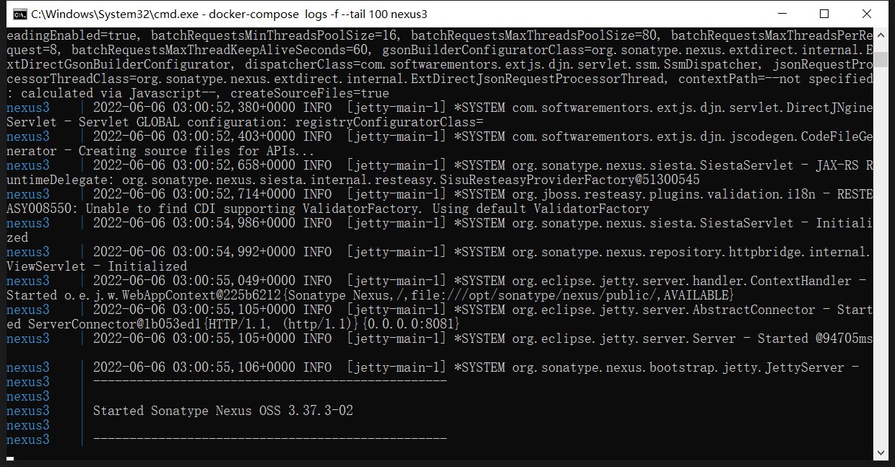

- docker-compose.yaml
	- ```yaml
	  version: "3.4"
	  services:
	    nexus3 :
	      restart: unless-stopped
	      image: sonatype/nexus3
	      container_name: nexus3 
	      volumes:
	      - ./nexus:/var/nexus-data 
	      ports:
	      - "8081:8081"
	  ```
- 查看是否启动成功
	- `docker-compose logs -f --tail 100 nexus3`
	- 
- 查看默认用户 admin 的 密码
	- `docker exec -it nexus3 cat /nexus-data/admin.password`
- 默认仓库
- 名词解析
  nexus默认已建好4个库，简单解析下各个库的作用
  maven-central 默认配好的中央仓库，指向https://repo1.maven.org/maven2/
  maven-releases 一般用于自己存放自己开发项目的稳定版本，默认不能重复发布，即deploy,可以设置为允许重复deploy
  maven-snapshots 一般用于存放自己开发项目的快照版本，默认允许重复发布
  maven-public 组合库，一般是组合以上三种库，通常在项目中配置这个仓库
- 仓库类型说明
  group：仓库聚合，默认是releases>snapshots>central,可以在仓库管理界面引入其他配置的库，并设置顺序
  hosted：私有仓库，存放自己开发的jar
  snapshots：本地项目的快照仓库
  releases： 本地项目发布的正式版本
  proxy：代理类型，可以配置aliyun的仓库
  central：中央仓库