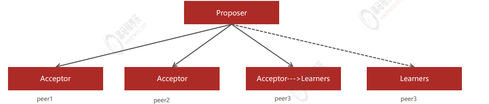

- 
- Paxos算法是基于消息传递且具有高度容错特性的一致性算法，是目前公认的解决分布式一致性问题最有效的
  算法之一，其解决的问题就是**在分布式系统中如何就某个值（决议）达成一致**，paxos是一个分布式选举算法
  该算法定义了三种角色
	- Proposer：提案(决议)发起者
	- Acceptor：提案接收者，可同意或不同意
	- Learners：虽然不同意提案，但也只能被动接收学习；或者是后来的，只能被动接受
- 提案遵循少数服从多数的原则，过半原则。