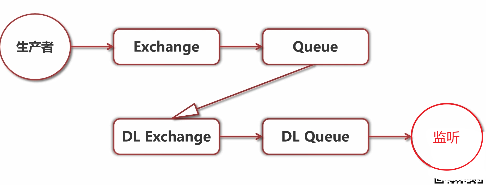

- 基于 [[Erlang]] 的跨平台消息队列，天然具有高性能，使用[[AMQP]]协议提供客户端接口
- RabbitMQ安装
  collapsed:: true
	- [[RabbitMQ Windows 安装]]
- 命令行工具使用
  collapsed:: true
	- 状态
	  collapsed:: true
		- 查看状态
			- ```sh
			  rabbitmqctl status
			  ```
		- 查看绑定
			- ```sh
			  rabbitmqctl list_bindings
			  ```
		- 查看channel
			- ```sh
			  rabbitmqctl list_channels
			  ```
		- 查看connection
			- ```sh
			  rabbitmqctl list_connections
			  ```
		- 查看 消费者
			- ```sh
			  rabbitmqctl list_consumers
			  ```
		- 查看交换机
			- ```sh
			  rabbitmqctl list_exchanges
			  ```
	- 队列
	  collapsed:: true
		- 查看队列
			- ```sh
			  rabbitmqctl list_queues
			  ```
		- 删除队列
			- ```sh
			  rabbitmqctl delete_queue
			  ```
		- 清空队列
			- ```sh
			  rabbitmqctl purge_queuq
			  ```
	- 用户
	  collapsed:: true
		- 新建用户
			- ```sh
			  rabbitmqctl add_user
			  ```
		- 修改用户密码
		- ```sh
		  rabbitmqctl change_password
		  ```
		- 删除用户
			- ```sh
			  rabbitmqctl delete_user
			  ```
		- 查看用户
			- ```sh
			  rabbitmqctl list_users
			  ```
		- 设置用户角色
			- ```sh
			  rabbitmqctl rabbitmqctl set_user_tags
			  ```
		-
	- 应用
	  collapsed:: true
		- 启动应用
			- ```sh
			  rabbitmqctl start_app
			  ```
		- 关闭应用,保留Erlang虚拟机（暂停）
			- ```sh
			  rabbitmqctl stop_app
			  ```
		- 关闭应用 并关闭Erlang虚拟机
			- ```sh
			  rabbitmqctl stop
			  ```
	- 集群
	  collapsed:: true
		- 加入集群
			- ```sh
			  rabbitmqctl join_cluster
			  ```
		- 离开集群
		  collapsed:: true
			- ```sh
			  rabbitmqctl reset
			  ```
	- 镜像队列
	  collapsed:: true
		- 设置镜像队列
			- ```sh
			  rabbitmqctl sync_queue
			  ```
		- 取消镜像队列
			- ```sh
			  rabbitmqctl cancel_sync_queue
			  ```
- 集群
	- 优势
	  collapsed:: true
		- 扩展规模
		  collapsed:: true
			- RabbitMQ集群可以方便地通过Scale-Out扩展规模
		- 数据冗余
		  collapsed:: true
			- RabbitMQ集群可以通过镜像队列，将数据冗余至多个节点
		- 高可用
		  collapsed:: true
			- RabbitMQ集群可以通过负载均衡，将请求转移至可用节点
	-
- 业务中使用
  collapsed:: true
	- spring (spring-rabbit)
	  collapsed:: true
		- 依赖
		  collapsed:: true
			- ```gradle
			  testImplementation 'org.springframework.amqp:spring-rabbit-test'
			  ```
		- 配置
		  collapsed:: true
			- ```yaml
			  rabbitmq.host=localhost
			  rabbitmq.port=5672
			  rabbitmq.username=guest
			  rabbitmq.password=guest
			  ```
		- 配置线程池
		  collapsed:: true
			- ```java
			  @Configuration
			  @EnableAsync
			  public class AsyncTaskConfig implements AsyncConfigurer {
			  
			      // ThredPoolTaskExcutor的处理流程
			      // 当池子大小小于corePoolSize，就新建线程，并处理请求
			      // 当池子大小等于corePoolSize，把请求放入workQueue中，池子里的空闲线程就去workQueue中取任务并处理
			      // 当workQueue放不下任务时，就新建线程入池，并处理请求，如果池子大小撑到了maximumPoolSize，就用RejectedExecutionHandler来做拒绝处理
			      // 当池子的线程数大于corePoolSize时，多余的线程会等待keepAliveTime长时间，如果无请求可处理就自行销毁
			  
			      @Override
			      @Bean
			      public Executor getAsyncExecutor() {
			          ThreadPoolTaskExecutor threadPool = new ThreadPoolTaskExecutor();
			          //设置核心线程数
			          threadPool.setCorePoolSize(10);
			          //设置最大线程数
			          threadPool.setMaxPoolSize(100);
			          //线程池所使用的缓冲队列
			          threadPool.setQueueCapacity(10);
			          //等待任务在关机时完成--表明等待所有线程执行完
			          threadPool.setWaitForTasksToCompleteOnShutdown(true);
			          // 等待时间 （默认为0，此时立即停止），并没等待xx秒后强制停止
			          threadPool.setAwaitTerminationSeconds(60);
			          //  线程名称前缀
			          threadPool.setThreadNamePrefix("Rabbit-Async-");
			          // 初始化线程
			          threadPool.initialize();
			          return threadPool;
			      }
			  
			      @Override
			      public AsyncUncaughtExceptionHandler getAsyncUncaughtExceptionHandler() {
			          return null;
			      }
			  }
			  ```
		- 创建队列
		  collapsed:: true
			- Direct
				- ```java
				              channel.exchangeDeclare(
				                      "exchange.order.restaurant",
				                      BuiltinExchangeType.DIRECT,
				                      true,
				                      false,
				                      null);
				  
				              channel.queueDeclare(
				                      "queue.order",
				                      true,
				                      false,
				                      false,
				                      null);
				  
				              channel.queueBind(
				                      "queue.order",
				                      "exchange.order.restaurant",
				                      "key.order");
				  ```
			- Fanout
				- ```java
				              channel.exchangeDeclare(
				                      "exchange.settlement.order",
				                      BuiltinExchangeType.FANOUT,
				                      true,
				                      false,
				                      null);
				  
				              channel.queueDeclare(
				                      "queue.order",
				                      true,
				                      false,
				                      false,
				                      null);
				  
				              channel.queueBind(
				                      "queue.order",
				                      "exchange.settlement.order",
				                      "key.order");
				  ```
			- Topic
				- ```java
				              channel.exchangeDeclare(
				                      "exchange.order.reward",
				                      BuiltinExchangeType.TOPIC,
				                      true,
				                      false,
				                      null);
				  
				              channel.queueDeclare(
				                      "queue.order",
				                      true,
				                      false,
				                      false,
				                      null);
				  
				              channel.queueBind(
				                      "queue.order",
				                      "exchange.order.reward",
				                      "key.order");
				  ```
		- 监听队列
		  collapsed:: true
			- ```java
			      ObjectMapper objectMapper = new ObjectMapper();
			  
			      DeliverCallback deliverCallback = (consumerTag, message) -> {
			          String messageBody = new String(message.getBody());
			          log.info("deliverCallback:messageBody:{}", messageBody);
			          ConnectionFactory connectionFactory = new ConnectionFactory();
			          connectionFactory.setHost("localhost");
			          try {
			              OrderMessageDTO orderMessageDTO = objectMapper.readValue(messageBody,
			                      OrderMessageDTO.class);
			              List<DeliverymanPO> deliverymanPOS = deliverymanDao.selectAvaliableDeliveryman(DeliverymanStatus.AVALIABIE);
			              orderMessageDTO.setDeliverymanId(deliverymanPOS.get(0).getId());
			              log.info("onMessage:restaurantOrderMessageDTO:{}", orderMessageDTO);
			  
			              try (Connection connection = connectionFactory.newConnection();
			                   Channel channel = connection.createChannel()) {
			                  String messageToSend = objectMapper.writeValueAsString(orderMessageDTO);
			                  channel.basicPublish("exchange.order.restaurant", "key.order", null, messageToSend.getBytes());
			              }
			          } catch (JsonProcessingException | TimeoutException e) {
			              e.printStackTrace();
			          }
			      };
			  
			  
			  
			  channel.basicConsume("queue.deliveryman", true, deliverCallback, consumerTag -> {
			              });
			  ```
		- 发送消息
		  collapsed:: true
			- ```java
			  try (Connection connection = connectionFactory.newConnection();
			                               Channel channel = connection.createChannel()) {
			                              String messageToSend = objectMapper.writeValueAsString(orderMessageDTO);
			                              channel.basicPublish("exchange.order.deliveryman", "key.deliveryman", null,
			                                      messageToSend.getBytes());
			                          }
			  ```
		- 启动监听
		  collapsed:: true
			- ```java
			  @Slf4j
			  @Configuration
			  public class RabbitConfig {
			  
			      @Autowired
			      OrderMessageService orderMessageService;
			  
			      @Autowired
			      public void startListenMessage() throws IOException, TimeoutException, InterruptedException {
			          orderMessageService.handleMessage();
			      }
			  }
			  ```
			- orderMessage
				- ```java
				  @Slf4j
				  @Service
				  public class OrderMessageService {
				  
				      @Value("${rabbitmq.exchange}")
				      public String exchangeName;
				      @Value("${rabbitmq.deliveryman-routing-key}")
				      public String deliverymanRoutingKey;
				      @Value("${rabbitmq.settlement-routing-key}")
				      public String settlementRoutingKey;
				      @Value("${rabbitmq.reward-routing-key}")
				      public String rewardRoutingKey;
				  
				  
				      @Autowired
				      private OrderDetailDao orderDetailDao;
				      ObjectMapper objectMapper = new ObjectMapper();
				  
				  
				      @Async
				      public void handleMessage() throws IOException, TimeoutException, InterruptedException {
				          log.info("start linstening message");
				          ConnectionFactory connectionFactory = new ConnectionFactory();
				          connectionFactory.setHost("localhost");
				          connectionFactory.setHost("localhost");
				          try (Connection connection = connectionFactory.newConnection();
				               Channel channel = connection.createChannel()) {
				  		........
				            } 
				      }
				  }
				            
				  ```
	- springboot(spring-AMQP)
	  collapsed:: true
		- 优点
		  collapsed:: true
			- 异步消息监听容器
			- 原生提供 RabbitTemplate,方便收发消息
			- 原生提供RabbitAdmin,方便队列、交换机声明
			- Spring Boot Config 原生支持RabbitMQ
		- 依赖
		  collapsed:: true
			- ```yaml
			  ```
		- 利用RabbitAdmin快速配置
		  collapsed:: true
			- 手动配置
			  collapsed:: true
				- 在Config文件夹下添加RabbitConfig.java
				  collapsed:: true
					- ```java
					  
					  @Slf4j
					  @Configuration
					  public class RabbitConfig {
					  
					      @Autowired
					      OrderMessageService orderMessageService;
					  
					      @Autowired
					      public void startListenMessage() throws IOException, TimeoutException, InterruptedException {
					          orderMessageService.handleMessage();
					      }
					  
					      @Autowired
					      public void initRabbit() {
					          CachingConnectionFactory connectionFactory = new CachingConnectionFactory();
					          connectionFactory.setHost("127.0.0.1");
					          connectionFactory.setPort(5672);
					          connectionFactory.setPassword("guest");
					          connectionFactory.setUsername("guest");
					  
					          RabbitAdmin rabbitAdmin = new RabbitAdmin(connectionFactory);
					  
					          /*---------------------restaurant---------------------*/
					          Exchange exchange = new DirectExchange("exchange.order.restaurant");
					          rabbitAdmin.declareExchange(exchange);
					  
					          Queue queue = new Queue("queue.order");
					          rabbitAdmin.declareQueue(queue);
					  
					          Binding binding = new Binding(
					                  "queue.order",
					                  Binding.DestinationType.QUEUE,
					                  "exchange.order.restaurant",
					                  "key.order",
					                  null);
					  
					          rabbitAdmin.declareBinding(binding);
					  
					          /*---------------------deliveryman---------------------*/
					          exchange = new DirectExchange("exchange.order.deliveryman");
					          rabbitAdmin.declareExchange(exchange);
					          binding = new Binding(
					                  "queue.order",
					                  Binding.DestinationType.QUEUE,
					                  "exchange.order.deliveryman",
					                  "key.order",
					                  null);
					          rabbitAdmin.declareBinding(binding);
					  
					  
					          /*---------settlement---------*/
					          exchange = new FanoutExchange("exchange.order.settlement");
					          rabbitAdmin.declareExchange(exchange);
					          exchange = new FanoutExchange("exchange.settlement.order");
					          rabbitAdmin.declareExchange(exchange);
					          binding = new Binding(
					                  "queue.order",
					                  Binding.DestinationType.QUEUE,
					                  "exchange.order.settlement",
					                  "key.order",
					                  null);
					          rabbitAdmin.declareBinding(binding);
					  
					  
					          /*--------------reward----------------*/
					          exchange = new TopicExchange("exchange.order.reward");
					          rabbitAdmin.declareExchange(exchange);
					          binding = new Binding(
					                  "queue.order",
					                  Binding.DestinationType.QUEUE,
					                  "exchange.order.reward",
					                  "key.order",
					                  null);
					          rabbitAdmin.declareBinding(binding);
					      }
					  }
					  
					  ```
			- 声明式配置
			  collapsed:: true
				- ```java
				  @Slf4j
				  @Configuration
				  public class RabbitConfig {
				  
				      @Autowired
				      OrderMessageService orderMessageService;
				  
				      @Autowired
				      public void startListenMessage() throws IOException, TimeoutException, InterruptedException {
				          orderMessageService.handleMessage();
				      }
				  
				  
				      /*---------------------restaurant---------------------*/
				      @Bean
				      public Exchange exchange1() {
				          return new DirectExchange("exchange.order.restaurant");
				      }
				  
				      @Bean
				      public Queue queue1() {
				          return new Queue("queue.order");
				      }
				  
				      @Bean
				      public Binding binding1() {
				          return new Binding(
				                  "queue.order",
				                  Binding.DestinationType.QUEUE,
				                  "exchange.order.restaurant",
				                  "key.order",
				                  null);
				      }
				  
				      /*---------------------deliveryman---------------------*/
				      @Bean
				      public Exchange exchange2() {
				          return new DirectExchange("exchange.order.deliveryman");
				      }
				  
				      @Bean
				      public Binding binding2() {
				          return new Binding(
				                  "queue.order",
				                  Binding.DestinationType.QUEUE,
				                  "exchange.order.deliveryman",
				                  "key.order",
				                  null);
				      }
				  
				  
				      /*---------settlement---------*/
				      @Bean
				      public Exchange exchange3() {
				          return new FanoutExchange("exchange.order.settlement");
				      }
				  
				      @Bean
				      public Exchange exchange4() {
				          return new FanoutExchange("exchange.settlement.order");
				      }
				  
				      @Bean
				      public Binding binding3() {
				          return new Binding(
				                  "queue.order",
				                  Binding.DestinationType.QUEUE,
				                  "exchange.order.settlement",
				                  "key.order",
				                  null);
				      }
				  
				      /*--------------reward----------------*/
				      @Bean
				      public Exchange exchange5() {
				          return new TopicExchange("exchange.order.reward");
				      }
				  
				      @Bean
				      public Binding binding4() {
				          return new Binding(
				                  "queue.order",
				                  Binding.DestinationType.QUEUE,
				                  "exchange.order.reward",
				                  "key.order",
				                  null);
				      }
				  
				      @Bean
				      public ConnectionFactory connectionFactory() {
				          CachingConnectionFactory connectionFactory = new CachingConnectionFactory();
				          connectionFactory.setHost("127.0.0.1");
				          connectionFactory.setPort(5672);
				          connectionFactory.setPassword("guest");
				          connectionFactory.setUsername("guest");
				          connectionFactory.setPublisherConfirmType(CachingConnectionFactory.ConfirmType.SIMPLE);
				          connectionFactory.setPublisherReturns(true);
				          connectionFactory.createConnection();
				          return connectionFactory;
				      }
				  
				      @Bean
				      public RabbitAdmin rabbitAdmin(ConnectionFactory connectionFactory) {
				          RabbitAdmin admin = new RabbitAdmin(connectionFactory);
				          admin.setAutoStartup(true);
				          return admin;
				      }
				  
				      @Bean
				      RabbitTemplate rabbitTemplate(ConnectionFactory connectionFactory) {
				          RabbitTemplate rabbitTemplate = new RabbitTemplate(connectionFactory);
				          rabbitTemplate.setMandatory(true);
				  
				          rabbitTemplate.setConfirmCallback((correlationData, ack, cause) ->
				                  log.info("correlationData:{}, ack:{}, cause{}",
				                          correlationData,
				                          ack,
				                          cause));
				          rabbitTemplate.setReturnCallback((message, replyCode, replyText, exchange, routingKey) ->
				                  log.info(
				                          "message:{}, replyCode:{}, replyText:{}, exchange:{}, routingKey{}",
				                          message,
				                          replyCode,
				                          replyText,
				                          exchange,
				                          routingKey));
				          return rabbitTemplate;
				      }
				    
				    	/*
				      *SimpleMessageListenerContainer 简单消息监听容器
				      */  
				    	@Bean
				      public SimpleMessageListenerContainer messageListenerContainer(ConnectionFactory connectionFactory){
				          SimpleMessageListenerContainer messageListenerContainer = new SimpleMessageListenerContainer(connectionFactory);
				          messageListenerContainer.setQueueNames("queue.order");
				          messageListenerContainer.setConcurrentConsumers(1);
				          messageListenerContainer.setMaxConcurrentConsumers(3);
				          messageListenerContainer.setAcknowledgeMode(AcknowledgeMode.AUTO);
				          messageListenerContainer.setMessageListener(new MessageListener() {
				              @Override
				              public void onMessage(Message message) {
				                  log.info("message:{}", message);
				              }
				          });
				          messageListenerContainer.setPrefetchCount(2);
				          messageListenerContainer.setAcknowledgeMode(AcknowledgeMode.MANUAL);
				          messageListenerContainer.setMessageListener(new ChannelAwareMessageListener() {
				              @Override
				              public void onMessage(Message message, Channel channel) throws Exception {
				                  channel.basicAck(message.getMessageProperties().getDeliveryTag(),false);
				              }
				          });
				          return messageListenerContainer;
				      }
				  }
				  
				  ```
				-
		- SimpleMessageListenerContainer 简单消息监听容器
		  collapsed:: true
			- ```java
			    	/*
			      *SimpleMessageListenerContainer 简单消息监听容器
			      */  
			    	@Bean
			      public SimpleMessageListenerContainer messageListenerContainer(ConnectionFactory connectionFactory){
			          SimpleMessageListenerContainer messageListenerContainer = new SimpleMessageListenerContainer(connectionFactory);
			          messageListenerContainer.setQueueNames("queue.order");
			          messageListenerContainer.setConcurrentConsumers(1);
			          messageListenerContainer.setMaxConcurrentConsumers(3);
			          messageListenerContainer.setAcknowledgeMode(AcknowledgeMode.AUTO);
			          messageListenerContainer.setMessageListener(new MessageListener() {
			              @Override
			              public void onMessage(Message message) {
			                  log.info("message:{}", message);
			              }
			          });
			          messageListenerContainer.setPrefetchCount(2);
			          messageListenerContainer.setAcknowledgeMode(AcknowledgeMode.MANUAL);
			          messageListenerContainer.setMessageListener(new ChannelAwareMessageListener() {
			              @Override
			              public void onMessage(Message message, Channel channel) throws Exception {
			                  channel.basicAck(message.getMessageProperties().getDeliveryTag(),false);
			              }
			          });
			          return messageListenerContainer;
			      }
			  ```
			- MessageListenAdapter 自定义消息监听
			  collapsed:: true
				- 简单模式：实现handleMessage方法
				- 高阶模式：自定义“队列名→方法名”映射关系
				- ```java
				          MessageListenerAdapter listenerAdapter = new MessageListenerAdapter();
				          listenerAdapter.setDelegate(orderMessageService);
				  
				          Map<String, String> methodMap = new HashMap<>(8);
				          methodMap.put("queue.order", "handleMessage1");
				          listenerAdapter.setQueueOrTagToMethodName(methodMap);
				          messageListenerContainer.setMessageListener(listenerAdapter);
				  ```
			- MessageConveter 用来在收发消息时自动转换消息
			  collapsed:: true
				- Byte[]数组作为消息体,转化为Java对象
				- Jackson2JsonMessageConverter 转换Json格式
					- 配合ClassMapper可以直接转换为POJO对象
				- ```java
				          MessageListenerAdapter messageListenerAdapter = new MessageListenerAdapter(orderMessageService);
				          Jackson2JsonMessageConverter messageConverter = new Jackson2JsonMessageConverter();
				          messageConverter.setClassMapper(new ClassMapper() {
				              @Override
				              public void fromClass(Class<?> clazz, MessageProperties properties) {
				  
				              }
				  
				              @Override
				              public Class<?> toClass(MessageProperties properties) {
				                  return OrderMessageDTO.class;
				              }
				          });
				  
				  //        messageConverter.setJavaTypeMapper(Jackson2JavaTypeMapper);
				  
				          messageListenerAdapter.setMessageConverter(messageConverter);
				  ```
		- 利用RabbitTemplate发送消息
		  collapsed:: true
			- ```java
			          String messageToSend = objectMapper.writeValueAsString(orderMessageDTO);
			          MessageProperties messageProperties = new MessageProperties();
			          messageProperties.setExpiration("15000");
			          Message message = new Message(messageToSend.getBytes(), messageProperties);
			          CorrelationData correlationData = new CorrelationData();
			          correlationData.setId(orderPO.getId().toString());
			          rabbitTemplate.send(
			                  "exchange.order.restaurant",
			                  "key.restaurant",
			                  message,correlationData
			          );
			  
			          rabbitTemplate.convertAndSend(
			                  "exchange.order.restaurant",
			                  "key.restaurant",
			                  messageToSend,correlationData);
			  
			          //        rabbitTemplate.execute(channel -> {
			          //            channel.abort();
			          //            return null;
			          //        });
			  ```
		- RabbitListener  是一个组合注解，对业务代码无侵入实现监听
			- RabbitListener 组合注解
			  collapsed:: true
				- @Exchange:自动声明Exchange
				- @Queue:自动声明队列
				- @QueueBinding:自动声明绑定关系
			- 使用
				- properties配置文件
				  collapsed:: true
					- ```properties
					  spring.rabbitmq.username=guest
					  spring.rabbitmq.password=guest
					  spring.rabbitmq.addresses=127.0.0.1
					  spring.rabbitmq.port=6379
					  ```
				- 业务代码使用
				  collapsed:: true
					- ```java
					      @RabbitListener(
					  //            containerFactory = "rabbitListenerContainerFactory",
					  //            queues = "queue.order",
					  //            admin = "rabbitAdmin",
					              bindings = {
					                      @QueueBinding(
					                              value = @Queue(name = "${imooc.order-queue}",
					                                      arguments = {
					                                              //                                            @Argument(name =
					                                              //                                            "x-message-ttl", value =
					                                              //                                            "1000", type = "java.lang
					                                              //                                            .Integer"),
					                                              //                                            @Argument(name =
					                                              //                                            "x-dead-letter-exchange",
					                                              //                                            value = "aaaaa"),
					                                              //                                            @Argument(name =
					                                              //                                            "x-dead-letter-routing-key", value = "bbbb")
					                                      }),
					                              exchange = @Exchange(name = "exchange.order.restaurant", type = ExchangeTypes.DIRECT),
					                              key = "key.order"
					                      ),
					                      @QueueBinding(
					                              value = @Queue(name = "queue.order"),
					                              exchange = @Exchange(name = "exchange.order.deliveryman", type = ExchangeTypes.DIRECT),
					                              key = "key.order"
					                      ),
					                      @QueueBinding(
					                              value = @Queue(name = "queue.order"),
					                              exchange = @Exchange(name = "exchange.settlement.order", type = ExchangeTypes.FANOUT),
					                              key = "key.order"
					                      ),
					                      @QueueBinding(
					                              value = @Queue(name = "queue.order"),
					                              exchange = @Exchange(name = "exchange.order.reward", type = ExchangeTypes.TOPIC),
					                              key = "key.order"
					                      )
					              }
					      )
					      public void handleMessage(@Payload Message message) throws IOException {
					          log.info("handleMessage:message:{}", new String(message.getBody()));
					          ConnectionFactory connectionFactory = new ConnectionFactory();
					          connectionFactory.setHost("localhost");
					          try {
					              OrderMessageDTO orderMessageDTO = objectMapper.readValue(message.getBody(),
					                      OrderMessageDTO.class);
					              OrderDetailPO orderPO = orderDetailDao.selectOrder(orderMessageDTO.getOrderId());
					  
					              switch (orderPO.getStatus()) {
					  
					                  case ORDER_CREATING:
					                      if (orderMessageDTO.getConfirmed() && null != orderMessageDTO.getPrice()) {
					                          orderPO.setStatus(OrderStatus.RESTAURANT_CONFIRMED);
					                          orderPO.setPrice(orderMessageDTO.getPrice());
					                          orderDetailDao.update(orderPO);
					                          try (Connection connection = connectionFactory.newConnection();
					                               Channel channel = connection.createChannel()) {
					                              String messageToSend = objectMapper.writeValueAsString(orderMessageDTO);
					                              channel.basicPublish("exchange.order.deliveryman", "key.deliveryman", null,
					                                      messageToSend.getBytes());
					                          }
					                      } else {
					                          orderPO.setStatus(OrderStatus.FAILED);
					                          orderDetailDao.update(orderPO);
					                      }
					                      break;
					                  case RESTAURANT_CONFIRMED:
					                      if (null != orderMessageDTO.getDeliverymanId()) {
					                          orderPO.setStatus(OrderStatus.DELIVERYMAN_CONFIRMED);
					                          orderPO.setDeliverymanId(orderMessageDTO.getDeliverymanId());
					                          orderDetailDao.update(orderPO);
					                          try (Connection connection = connectionFactory.newConnection();
					                               Channel channel = connection.createChannel()) {
					                              String messageToSend = objectMapper.writeValueAsString(orderMessageDTO);
					                              channel.basicPublish(
					                                      "exchange.order.settlement",
					                                      "key.settlement",
					                                      null,
					                                      messageToSend.getBytes()
					                              );
					                          }
					                      } else {
					                          orderPO.setStatus(OrderStatus.FAILED);
					                          orderDetailDao.update(orderPO);
					                      }
					                      break;
					                  case DELIVERYMAN_CONFIRMED:
					                      if (null != orderMessageDTO.getSettlementId()) {
					                          orderPO.setStatus(OrderStatus.SETTLEMENT_CONFIRMED);
					                          orderPO.setSettlementId(orderMessageDTO.getSettlementId());
					                          orderDetailDao.update(orderPO);
					                          try (Connection connection = connectionFactory.newConnection();
					                               Channel channel = connection.createChannel()) {
					                              String messageToSend = objectMapper.writeValueAsString(orderMessageDTO);
					                              channel.basicPublish(
					                                      "exchange.order.reward",
					                                      "key.reward",
					                                      null,
					                                      messageToSend.getBytes()
					                              );
					                          }
					  
					                      } else {
					                          orderPO.setStatus(OrderStatus.FAILED);
					                          orderDetailDao.update(orderPO);
					                      }
					                      break;
					                  case SETTLEMENT_CONFIRMED:
					                      if (null != orderMessageDTO.getRewardId()) {
					                          orderPO.setStatus(OrderStatus.ORDER_CREATED);
					                          orderPO.setRewardId(orderMessageDTO.getRewardId());
					                          orderDetailDao.update(orderPO);
					                      } else {
					                          orderPO.setStatus(OrderStatus.FAILED);
					                          orderDetailDao.update(orderPO);
					                      }
					                      break;
					              }
					  
					          } catch (JsonProcessingException | TimeoutException e) {
					              e.printStackTrace();
					          }
					      }
					  ```
	- 保证消息可靠性
	  collapsed:: true
		- 发送端确认机制 （发送是否成功）
		  collapsed:: true
			- > 慎用
			- 配置channel，确认开启模式
			  collapsed:: true
				- ```java
				  channel.confirmSelect();
				  ```
			- 单条同步确认 (推荐)
				- 每发送一条消息，调用**channel.waitForConfirms()**方法，等待确认
			- 多条同步确认
				- 发送多条消息后，调用**channel.waitForConfirms()**方法，等待确认
			- 异步确认
				- 
				- 在channel上添加监听：**addConfirmListener**,发送消息后，会回调此方法，通知是否发送成功
				- > 异步确认有可能是单条，也有可能是多条，取决于MQ
				- > 异步回调在一个新的线程，所以数据隔离且有并发问题（因为channel不同，所以deliverTag可能重复）。
		- 消息返回机制 （消息是否被路由）
		  collapsed:: true
			- 
			- 原理：Exchange在没有找到路由时候调用回调机制
			- 发送消息时候 mandatory设为true
				- ```java
				                  channel.basicPublish("exchange.order.restaurant", "key.order",true, null, messageToSend.getBytes());
				  ```
			- 设置异步回调
			  collapsed:: true
				- ```java
				                  channel.addReturnListener(new ReturnCallback() {
				                      @Override
				                      public void handle(Return returnMessage) {
				                          log.info("Message Return: returnMessage:{}", returnMessage);
				                      }
				                  });
				  ```
				-
		- 消费端确认  ACK
		  collapsed:: true
			- 监听消息时关闭自动ACK，使用手动ACK。
				- 下面第二个参数为false
				- ```java
				  this.channel.basicConsume("queue.restaurant", false, deliverCallback, consumerTag -> {});
				  ```
			- 监听消费时手动ack
			  collapsed:: true
				- ```java
				  channel.basicAck(message.getEnvelope().getDeliveryTag(),true);}
				  ```
			- > NACK慎用
		- 消费端限流 QoS
		  collapsed:: true
			- 前提：不使用自动确认
			- ```java
			  channel.basicQos(2)
			  ```
			-
			-
		- 消息过期机制 ttl
		  collapsed:: true
			- > 消息ttl 长于业务高峰期时间 与 服务的平均重启时间
			- 设置单条消息TTL
			  collapsed:: true
				- ```java
				  AMQP.BasicProperties properties = new AMQP.BasicProperties.Builder().expiration("100000").build();
				  ```
				- ```java
				  channel.basicPublish("exchange.order.deliveryman", "key.deliveryman", properties,
				                                      messageToSend.getBytes());
				  ```
			- 设置队列TTL
				- ```java
				  Map<String, Object> args = new HashMap<String, Object>();
				  args.put("x-message-ttl", 10000);
				  ```
				- 创建队列时将参数赋值进去
					- ```java
					              channel.exchangeDeclare(
					                      "exchange.order.restaurant",
					                      BuiltinExchangeType.DIRECT,
					                      true,
					                      false,
					                      args);
					  ```
		- 死信队列
		  collapsed:: true
			- 
			- 一个被配置了**DLX**属性的队列，收集ttl过期消息，以供分析
			- 怎么变成死信
			  collapsed:: true
				- 消息被拒绝
				- 消息过期
				- 队列达到最大长度
			- 设置Exchange
			  collapsed:: true
				- 命名规范（非强制的）
				  collapsed:: true
					- Exchange：dlx.exchange
					- Queue:dlx.queue
					- RoutingKey: #
				- 队列添加参数
					- x-dead-letter-exchange = dlx.exchange
					- ```java
					  // 声明死信交换机
					          channel.exchangeDeclare(
					                  "exchange.dlx",
					                  BuiltinExchangeType.TOPIC,
					                  true,
					                  false,
					                  null);
					  // 声明死信队列
					          channel.queueDeclare(
					                  "queue.dlx",
					                  true,
					                  false,
					                  false,
					                  null);
					  // 声明死信绑定
					          channel.queueBind(
					                  "queue.dlx",
					                  "exchange.dlx",
					                  "#");
					  
					  //声明队列时，携带以下参数：
					  
					              Map<String, Object> args = new HashMap<>(16);
					              args.put("x-dead-letter-exchange", "exchange.dlx");
					              args.put("x-max-length", 10);
					  //创建队列时将参数赋值进去
					              channel.exchangeDeclare(
					                      "exchange.order.restaurant",
					                      BuiltinExchangeType.DIRECT,
					                      true,
					                      false,
					                      args);
					  ```
			-
- 业务开发建议
  collapsed:: true
	- 一个业务对应一个exchange
	- 将创建交换机/队列的操作固化在应用代码中，免去复杂的
	  运维操作，高效且不易出错
	- 一般来说，交换机由双方同时声明，队列由接收方声明并配
	  置绑定关系
	- 交换机/队列的参数一定要由双方开发团队确认，否则重复
	  声明时，若参数不一致，会导致声明失败
-
-