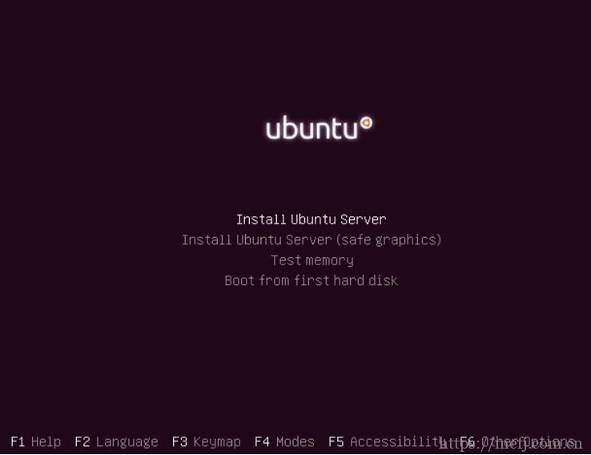
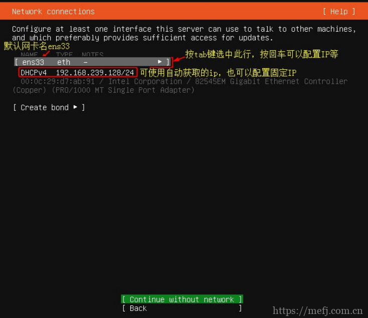
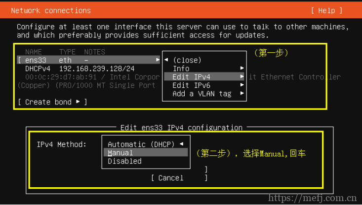
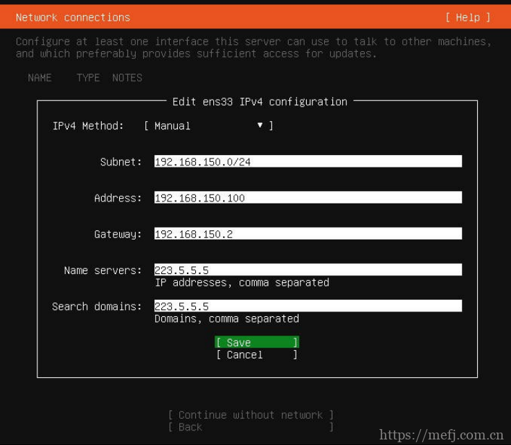
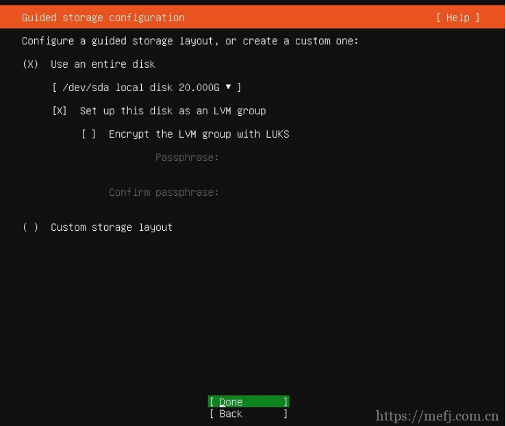
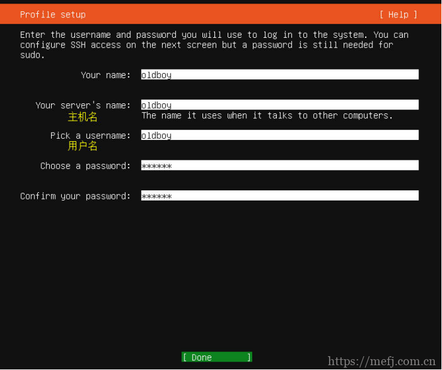
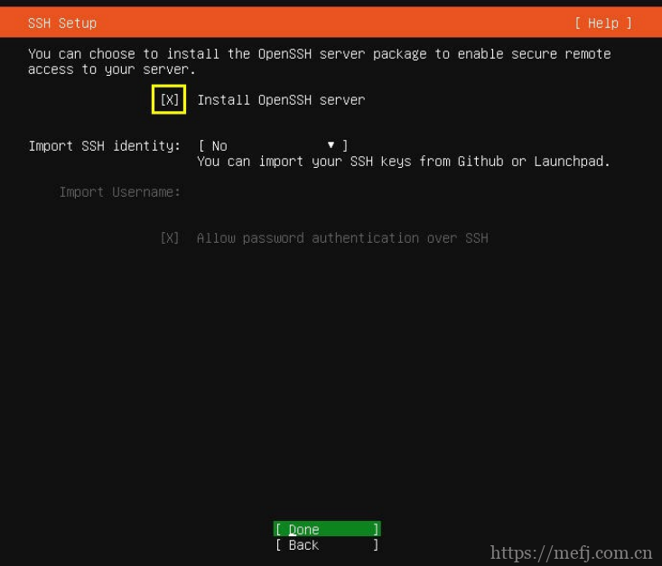
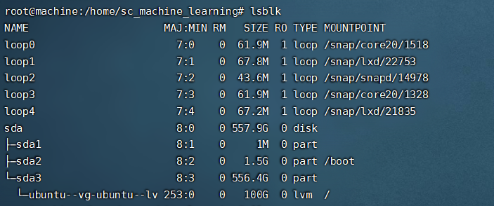
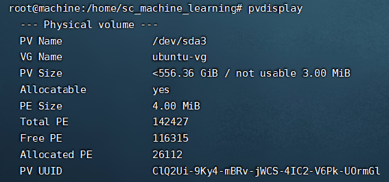
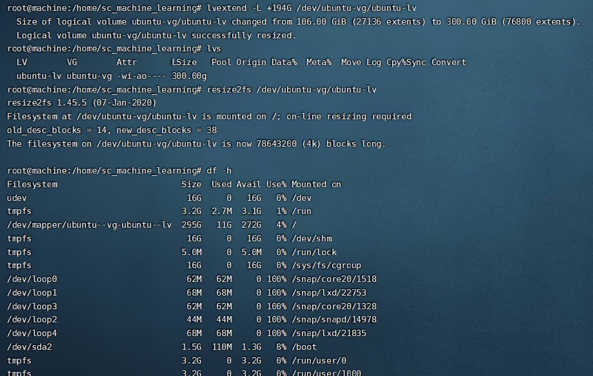

title:: Ubuntu 20.04 live server安装

- PE启动
  collapsed:: true
	- 开启 Legacy+EFI启动
	- 开机选择u盘PE启动
	  collapsed:: true
		- 开机按f11 选择对应磁盘 （U盘）启动
		- 如果需要输入密码 可以输入服务器对应的默认密码尝试
		- 例如华为服务器默认密码为 **Huawei12 #$**
- PE装机
  collapsed:: true
	- 我这选择的PE是Ventory+Edgless
	- 自动进入Ventory页面选择 Ubuntu 20.04 live server 的IOS镜像
	- 在以下界面快速按 F5，然后按ESC 出现安装Ubuntu安装选择界面
	  collapsed:: true
		- 
	- 选择 Install Ubuntu Server
	  collapsed:: true
		- 
	- 选择语言与键盘
	  collapsed:: true
		- 默认即可
	- 配置网络
	  collapsed:: true
		- 
		- 
		- 
		- 如果这一步选择自动获取ip，也可以安装好系统后配置固定IP
		  collapsed:: true
			- ubuntu从17.10开始，已放弃在/etc/network/interfaces里固定IP配置，即使配置也不会生效，而 是改成netplan方式。
			- 配置写在/etc/netplan/01-netcfg.yaml或者类似名称的yaml文件里。
			- 修改配置以后不用重启，执行 `netplan apply` 命令可以让配置直接生效。
			- ```sh
			  $ sudo vim /etc/netplan/00-installer-config.yaml
			  ```
			- ```yaml
			  # This is the network config written by 'subiquity'
			  network:
			    ethernets:
			      enp2s0f0:
			        addresses: [192.168.8.130/24]
			        optional: true
			        gateway4: 192.168.8.1
			        nameservers:
			          addresses: [114.114.114.114]
			        dhcp4: no
			      enp2s0f1:
			        dhcp4: true
			      enp2s0f2:
			        dhcp4: true
			      enp2s0f3:
			        dhcp4: true
			    version: 2
			  
			  ```
	- 配置软件源
	  collapsed:: true
		- PE装机
	- 选择代理
	  collapsed:: true
		- 默认即可
	- 配置磁盘分区
	  collapsed:: true
		- 选择默认的使用整块磁盘自动分区，并使用lvm
			- 
			- > 注意：如果是用u盘装的话这里默认安装的磁盘是U盘，需要更改disk到目标硬盘
		- 选择完后的文件系统配置信息，并完成
	- 配置系统信息
	  collapsed:: true
		- 配置系统主机名、登录用户和密码。
		- 
		-
	- 安装openssh远程连接工具
	  collapsed:: true
		- 按空格键勾选图中的小方框内为小叉子，然后按tab键选择Done继续。
		- 
	- 安装完成重启即可
- 系统配置
  collapsed:: true
	- SSH配置
	  collapsed:: true
		- 默认Ubuntu不允许root远程登录，后期如果想通过root登陆系统则必须修改SSH配置文件中的相关参数 才行。
		- ```sh
		  sudo vim /etc/ssh/sshd_config PermitRootLogin yes
		  ```
		- 修改后记得重启sshd进程
		- ```sh
		  sudo systemctl restart sshd
		  ```
	- root用户密码修改
	  collapsed:: true
		- 切换root账户
		- ```sh
		  sudo su
		  ```
		- 修改root密码
		- ```SH
		  sudo passwd root
		  ```
		-
	- 添加硬盘空间
		- lsblk查看分区情况
		  collapsed:: true
			- 
		- lvdisplay 查看逻辑卷
		  collapsed:: true
			- 
		- pvdisplay 查看物理卷
		  collapsed:: true
			- 
		- **lvextend**  修改LVM分区容量
		  collapsed:: true
			- ```sh
			  lvextend -L +2G /dev/ubuntu-vg/ubuntu-lv     //扩容逻辑卷
			  lvs                                        //查看逻辑卷已经扩容完成
			  df -h                                      
			  xfs_growfs /dev/test_vg/test_data          //更新文件系统大小  xfs文件系统，使用xfs_growfs命令扩展容量  ext4文件系统，则使用resize2fs
			  df -h        
			  ```
			- 