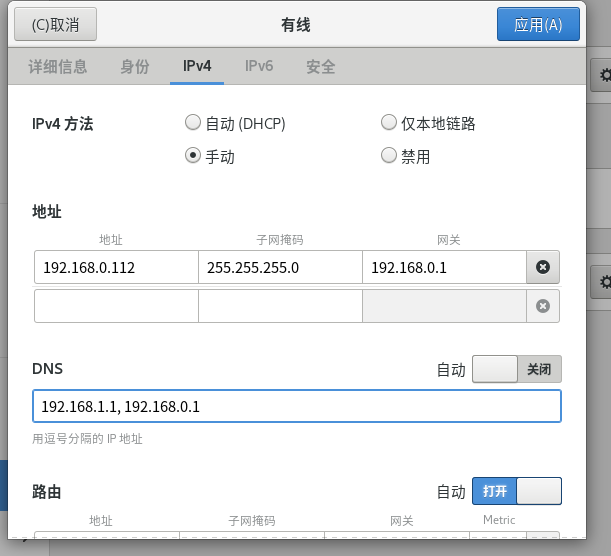

- [官网](https://www.vmware.com/)
  title:: VMware
- [果核破解版](https://www.ghxi.com/vmware15.html)
  collapsed:: true
	- [16版本网盘](https://www.123pan.com/s/HQeA-aX1Sh)
	- 激活码
		- 16版本
			- ZF3R0-FHED2-M80TY-8QYGC-NPKYF
		- 15版本
			- 可以使用网盘附带的注册机算key激活，或者直接使用下面的一组激活即可
			- FG78K-0UZ15-085TQ-TZQXV-XV0CD
			- ZA11U-DVY97-M81LP-4MNEZ-X3AW0
			- YU102-44D86-48D2Z-Z4Q5C-MFAWD
- JA0W8-AX216-08E19-A995H-1PHH2
- Ubuntu for server live 下安装
  collapsed:: true
	- [安装包下载地址](https://customerconnect.vmware.com/downloads/info/slug/desktop_end_user_computing/vmware_workstation_pro/16_0)
	- Centos 源
		- mirrors.aliyun.com/centos/8.3.2011/BaseOS/x86_64/os
- 网络设定
	- 
	- 