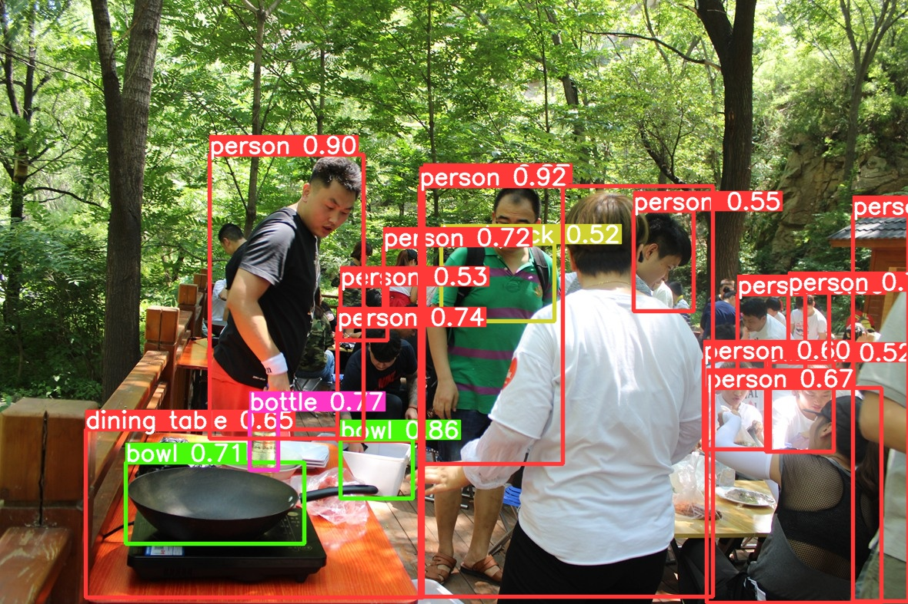

- [官网地址](https://github.com/meituan/YOLOv6)
- 简单使用
	- 安装
	  id:: 62baad58-668b-4608-b579-d4018b451f89
		- ```sh
		  git clone https://github.com/meituan/YOLOv6
		  cd YOLOv6
		  pip install -r requirements.txt
		  ```
	- 在 [此处](https://github.com/meituan/YOLOv6/releases/tag/0.1.0) 下载训练好的数据集（那几个pt文件），放到sources目录下
	- 运行命令识别
		- ```sh
		  python ./tools/infer.py --weights ./configs/yolov6s.pt --source ./source/001.jpg
		  ```
	- 效果图在 .\runs\inference\exp下
	  collapsed:: true
		- 
		- 
		- 
- 如何自己训练数据
	- [官网Demo](https://github.com/meituan/YOLOv6/blob/main/docs/Train_custom_data.md)