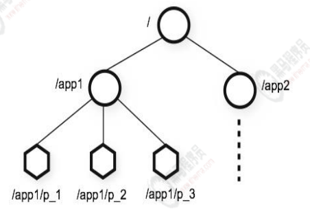
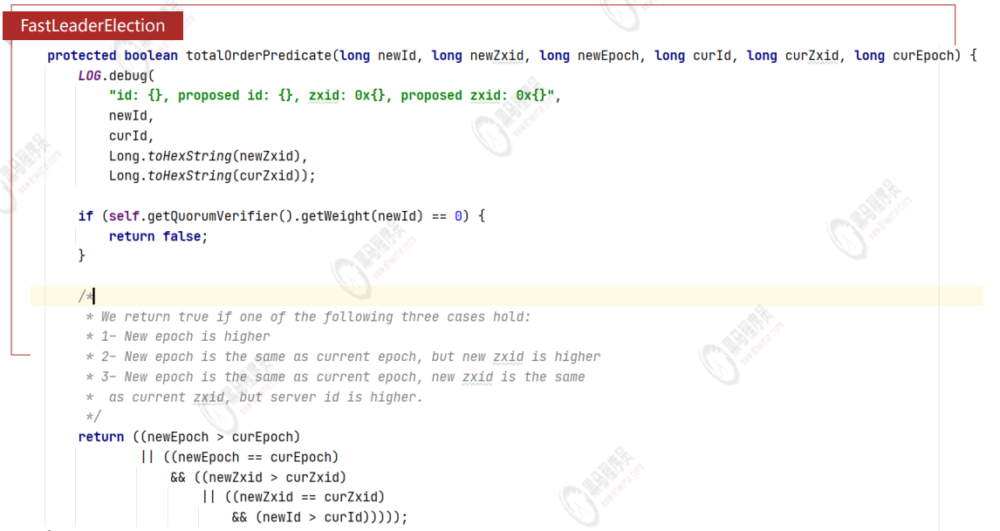

- ## 概述
  collapsed:: true
	- > CP 本质上是一个文件存储系统 + 监听机制
	- ZooKeeper 是 Apache 软件基金会的一个软件项目，它为大型分布式计算提供开源的分布式配置服务、同步服务和命名注册。
	- ZooKeeper 的架构通过冗余服务实现高可用性（CP:最终一致性 分区容错性）。
	- Zookeeper 的设计目标是将那些复杂且容易出错的分布式一致性服务封装起来，构成一个高效可靠的原语集，并以一系列简单
	- 易用的接口提供给用户使用。
	- 一个典型的分布式数据一致性的解决方案，分布式应用程序可以基于它实现诸如数据发布/订阅、负载均衡、命名服务、分布式
	  协调/通知、集群管理、Master 选举、分布式锁和分布式队列等功能
- ## 安装
  collapsed:: true
	- linux 安装
		- 安装JAVA 并设置变量
		  collapsed:: true
			- {{embed ((62d5641e-67f7-4578-88bb-5b9eedd323bf))}}
		- 安装 ZooKeeper
		  collapsed:: true
			- ```sh
			  cd /opt/ZooKeeper
			  wget https://dlcdn.apache.org/zookeeper/zookeeper-3.7.1/apache-zookeeper-3.7.1-bin.tar.gz
			  tar -zxf  apache-zookeeper-3.7.1-bin.tar.gz 
			  cd apache-zookeeper-3.7.1-bin/conf/
			  mv zoo_sample.cfg zoo.cfg
			  cd ..
			  mkdir zkData
			  cd zkData/
			  pwd
			  vim ../conf/zoo.cfg
			  #-·修改数据存放路径··
			  dataDir=/opt/ZooKeeper/apache-zookeeper-3.7.1-bin/zkData
			  #---
			  ```
		- 启动
		  collapsed:: true
			- ```sh
			  bin/zkServer.sh start
			  ```
		- 启动 CLI
		  collapsed:: true
			- ```sh
			  bin/zkCli.sh
			  ```
- ## 数据结构
  collapsed:: true
	- 
	- >  每个路径下的节点key(完整路径，名称)是唯一的，即同一级节点 key 名称是唯一的   **key：/app1/p_1**
	- >  每个节点中存储了节点value和对应的状态属性（多个） **value: data 与 znode status**
	- zookeeper本身是一个**树形目录服务**（名称空间），**非常类似于标准文件系统**，key-value 的形式存储。名称 key 由斜线 / 分
	  割的一系列路径元素，zookeeper 名称空间中的每个节点都是由一个路径来标识的。
- ## Java 客户端
  collapsed:: true
	- zookeeper 原生Api
	  collapsed:: true
		- 缺点
			- 监听反复注册
			- 不支持session超时重连
	- Curator (推荐)
	- zkClient
- ## ZooKeeper分布式锁
  collapsed:: true
	- [[分布式锁]]
- 注册中心
- 集群与ZAB协议
	- LATER ZAB协议
	  collapsed:: true
		- 崩溃恢复模式
			- 情况
			  collapsed:: true
				- 集群刚刚启动
				- 运行中Leader挂了
		- 原子模式
	- LATER 原子广播
- LATER 选举
  collapsed:: true
	- 
- 集群搭建
	- 奇数
		- 容错率
		- 防脑裂