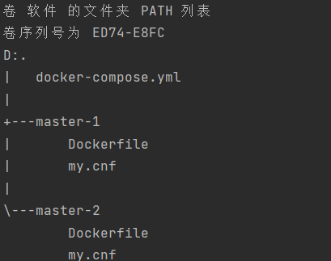
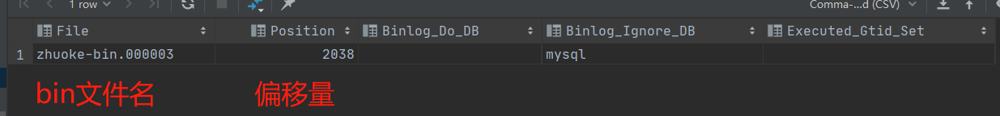

- 
- ## docker-compose
  collapsed:: true
	- 目录结构
	  collapsed:: true
		- 
	- master-1文件夹
	  collapsed:: true
		- Dockerfile  -- docker 镜像打包文件
			- ```Dockerfile  
			  FROM mysql:5.7.17
			  MAINTAINER harrison
			  ADD ./master-1/my.cnf /etc/mysql/my.cnf
			  ```
		- my.cnf master1的mysql配置文件
			- ```cnf
			  [mysqld]
			  ## 设置server_id，一般设置为IP，注意要唯一
			  server_id=1
			  ## 复制过滤：也就是指定哪个数据库不用同步（mysql库一般不同步）
			  binlog-ignore-db=mysql,information_schema
			  ## 开启二进制日志功能，可以随便取，最好有含义（关键就是这里了）
			  log-bin=zhuoke-bin
			  # 设置一个 binlog 文件的最大字节
			  # 设置最大 100MB
			  max_binlog_size=104857600
			  ## 为每个session分配的内存，在事务过程中用来存储二进制日志的缓存
			  binlog_cache_size=1M
			  ## 主从复制的格式（mixed,statement,row，默认格式是statement）
			  binlog_format=ROW
			  ## 二进制日志自动删除/过期的天数。默认值为0，表示不自动删除。
			  expire_logs_days=7
			  ## 跳过主从复制中遇到的所有错误或指定类型的错误，避免slave端复制中断。
			  ## 如：1062错误是指一些主键重复，1032错误是因为主从数据库数据不一致
			  slave_skip_errors=1062
			  ```
			- >>  **server_id** :在主从环境下的唯一标志符，给个任意数字，注意不能和 M2 重复，因为将来 server-id 用于标志 binlog 是由哪个库产生的，所以主从数据库的 server-id 千万不能一样，不然可能导致主从数据库 binlog 的循环复制问题。
	- master-2文件夹
	  collapsed:: true
		- 结构与master-1一致 ，不同在于Dockerfile  中目录改为master-2，my.cnf 中**server_id**与master-1不能一样
		- Dockerfile  -- docker 镜像打包文件
			- ```Dockerfile  
			  FROM mysql:5.7.17
			  MAINTAINER harrison
			  ADD ./master-2/my.cnf /etc/mysql/my.cnf
			  ```
		- my.cnf master1的mysql配置文件
			- ```cnf
			  [mysqld]
			  ## 设置server_id，一般设置为IP，注意要唯一
			  server_id=2
			  ## 复制过滤：也就是指定哪个数据库不用同步（mysql库一般不同步）
			  binlog-ignore-db=mysql,information_schema
			  ## 开启二进制日志功能，可以随便取，最好有含义（关键就是这里了）
			  log-bin=zhuoke-bin
			  # 设置一个 binlog 文件的最大字节
			  # 设置最大 100MB
			  max_binlog_size=104857600
			  ## 为每个session分配的内存，在事务过程中用来存储二进制日志的缓存
			  binlog_cache_size=1M
			  ## 主从复制的格式（mixed,statement,row，默认格式是statement）
			  binlog_format=ROW
			  ## 二进制日志自动删除/过期的天数。默认值为0，表示不自动删除。
			  expire_logs_days=7
			  ## 跳过主从复制中遇到的所有错误或指定类型的错误，避免slave端复制中断。
			  ## 如：1062错误是指一些主键重复，1032错误是因为主从数据库数据不一致
			  slave_skip_errors=1062
			  ```
	- docker-compose.yaml
	  collapsed:: true
		- ```Yaml
		  version: '2'
		  services:
		    mysql-1:
		      build:
		        context: ./
		        dockerfile: master-1/Dockerfile
		      environment:
		        - "MYSQL_ROOT_PASSWORD=root"
		        - "MYSQL_DATABASE=replicas_db"
		      links:
		        -   mysql-2
		      ports:
		        - "33065:3306"
		      restart: always
		  #    hostname: mysql-1
		    mysql-2:
		      build:
		        context: ./
		        dockerfile: master-2/Dockerfile
		      environment:
		        - "MYSQL_ROOT_PASSWORD=root"
		        - "MYSQL_DATABASE=replicas_db"
		      ports:
		        - "33066:3306"
		      restart: always
		  #    hostname: mysql-2
		  ```
	- 运行docker-compose
	  collapsed:: true
		- ```xshell
		  docker-compose up -d
		  ```
		- 会分别调用 master-1与master-2下的Dockerfile 构建镜像 将各自的 cnf配置文件打包进基础镜像为**mysql:5.7.17** ，新成两个新的镜像，并启动对应镜像。
		-
	-
- 创建用户
  collapsed:: true
	- 分别在master-1与master-2中创建专门用来同步的用户rep1，密码为 root，登录IP设为任意ip
	  collapsed:: true
		- ```shell
		  GRANT REPLICATION SLAVE ON *.* to 'rep1'@'%' identified by 'root';
		  ```
		- Mysql 8.0 开始需分开设置
		- ```shell
		  CREATE USER `rep1`@`%` IDENTIFIED WITH caching_sha2_password BY 'root';
		  
		  GRANT Replication Slave ON *.* TO `rep1`@`%`;
		  ```
- 查看数据库偏移量
  collapsed:: true
	- 查看当前数据库二进制日志名和偏移量，待会设置主从同步会用上
	  id:: 62a005ba-d6d8-466e-b1b6-334c800e9b68
		- ```shell
		  show master status;
		  ```
		- 
- 主从配置
  collapsed:: true
	- 分别在master-1与master-2执行主从同步命令
		- master-1
		  collapsed:: true
			- ```shell
			  change master to master_host='mysql-2',master_port=3306,master_user='rep1',master_password='root',master_log_file='zhuoke-bin.000003',master_log_pos=2038;
			  ```
			- **master_log_file** 与**master_log_pos** 值需与 ((62a005ba-d6d8-466e-b1b6-334c800e9b68))中**master-2**的值一致
		- master-2
		  collapsed:: true
			- ```shell
			  change master to master_host='mysql-1',master_port=3306,master_user='rep1',master_password='root',master_log_file='zhuoke-bin.000003',master_log_pos=154;
			  ```
			- 与master-1配置基本一致
- 启动 slave 进程
  collapsed:: true
	- ```shell
	  start slave;
	  ```
- 查看主从同步状态
  collapsed:: true
	- ```shell
	  show slave status;
	  ```
		- Slave_IO_Running 与 Slave_SQL_Running 为Yes时  即成功开启主从同步
- 从库只读
- 设置只读
	- ·