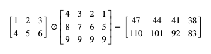
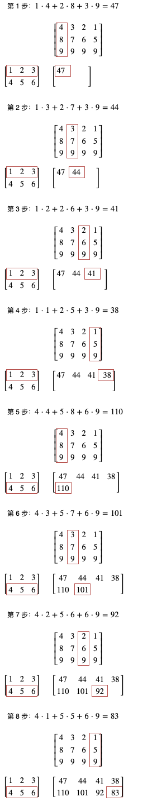

- 简介
  collapsed:: true
	- pytorch 是目前世界上最流行的两个机器学习框架的其中之一，与 tensoflow 并峙双雄。
	- pytorch基于 python 但底层完全由 c++ 编写，支持自动并列化计算和使用 GPU 加速运算，所以它的性能非常好。
	- pytorch 与 tensorflow 和传统机器学习不一样的是，它们把重点放在了组建类似人脑的神经元网络 (Neural Network)，所以能实现传统机器学习无法做到的非常复杂的判断
	- 它提供了很多方便的功能，例如
	  collapsed:: true
		- 根据损失自动微分计算应该怎样调整参数
		- 提供了一系列的数学函数封装
		- 还提供了一系列现成的模型
		- 把模型组合起来进行训练的框架
	- Dynamic Graph 与 Static Graph
	  collapsed:: true
		- ```python
		  # Dynamic Graph 的印象，运算的每一步都可以插入自定义代码
		  def forward(w, x, b):
		      wx = w * x
		      print(wx)
		      y = wx + b
		      print(y)
		      return y
		  forward(w, x, b)
		  
		  # Static Graph 的印象，需要预先编译整个计算流程
		  forward = compile("wx+b")
		  forward(w, x, b)
		  ```
- 安装
  collapsed:: true
	- ```python
	  pip3 install pytorch
	  ```
- 基本操作
  collapsed:: true
	- 引用
		- ```python
		  import torch
		  ```
	- Tensor对象
	  collapsed:: true
		- pytorch 会用 **torch.Tensor** 类型来统一表现数值，向量 (一维数组) 或矩阵 (多维数组)，模型的参数也会使用这个类型。
		- 构建
		  collapsed:: true
			- torch.Tensor 类型可以使用 **torch.tensor** 函数构建
			  collapsed:: true
				- ```PEPL
				  # 创建一个整数 tensor
				  >>> torch.tensor(1)
				  tensor(1)
				  
				  # 创建一个小数 tensor
				  >>> torch.tensor(1.0)
				  tensor(1.)
				  
				  # 单值 tensor 中的值可以用 item 函数取出
				  >>> torch.tensor(1.0).item()
				  1.0
				  
				  # 使用一维数组创建一个向量 tensor
				  >>> torch.tensor([1.0, 2.0, 3.0])
				  tensor([1., 2., 3.])
				  
				  # 使用二维数组创建一个矩阵 tensor
				  >>> torch.tensor([[1.0, 2.0, 3.0], [-1.0, -2.0, -3.0]])
				  tensor([[ 1.,  2.,  3.],
				          [-1., -2., -3.]])
				  ```
			- 生成指定长度的 tensor 对象
			  collapsed:: true
				- ```python
				  # 生成 2 行 3 列的矩阵 tensor，值全部为 0
				  >>> torch.zeros(2, 3)
				  tensor([[0., 0., 0.],
				          [0., 0., 0.]])
				  
				  # 生成 3 行 2 列的矩阵 tensor，值全部为 1
				  torch.ones(3, 2)
				  >>> torch.ones(2, 3)
				  tensor([[1., 1., 1.],
				          [1., 1., 1.]])
				  
				  # 生成 3 行 2 列的矩阵 tensor，值全部为 100
				  >>> torch.full((3, 2), 100)
				  tensor([[100., 100.],
				          [100., 100.],
				          [100., 100.]])
				  
				  # 生成 3 行 3 列的矩阵 tensor，值为范围 [0, 1) 的随机浮点数
				  >>> torch.rand(3, 3)
				  tensor([[0.4012, 0.2412, 0.1532],
				          [0.1178, 0.2319, 0.4056],
				          [0.7879, 0.8318, 0.7452]])
				  
				  # 生成 3 行 3 列的矩阵 tensor，值为范围 [1, 10] 的随机整数
				  >>> (torch.rand(3, 3) * 10 + 1).long()
				  tensor([[ 8,  1,  5],
				          [ 8,  6,  5],
				          [ 1,  6, 10]])
				  
				  # 和上面的写法效果一样
				  >>> torch.randint(1, 11, (3, 3))
				  tensor([[7, 1, 3],
				          [7, 9, 8],
				          [4, 7, 3]])
				  ```
		- 属性
		  collapsed:: true
			- tensor 对象的数值类型可以看它的 dtype 成员
			  collapsed:: true
				- ```PEPL
				  >>> torch.tensor(1).dtype
				  torch.int64
				  >>> torch.tensor(1.0).dtype
				  torch.float32
				  >>> torch.tensor([1.0, 2.0, 3.0]).dtype
				  torch.float32
				  >>> torch.tensor([[1.0, 2.0, 3.0], [-1.0, -2.0, -3.0]]).dtype
				  torch.float32
				  ```
				- > 一个 tensor 对象里面只能保存一种类型的数值，不能混合存放。
			- 使用 storage 查看 tensor 对象使用的储存空间
			  collapsed:: true
				- ```python
				  # 数值的储存空间长度是 1
				  >>> torch.tensor(1).storage()
				   1
				  [torch.LongStorage of size 1]
				  
				  # 向量的储存空间长度等于向量的长度
				  >>> torch.tensor([1, 2, 3], dtype=torch.float32).storage()
				   1.0
				   2.0
				   3.0
				  [torch.FloatStorage of size 3]
				  
				  # 矩阵的储存空间长度等于所有维度相乘的结果，这里是 2 行 3 列总共 6 个元素
				  >>> torch.tensor([[1, 2, 3], [-1, -2, -3]], dtype=torch.float64).storage()
				   1.0
				   2.0
				   3.0
				   -1.0
				   -2.0
				   -3.0
				  [torch.DoubleStorage of size 6]
				  ```
			- 创建 tensor 对象时可以通过 dtype 参数强制指定类型
			  collapsed:: true
				- ```PEPL
				  >>> torch.tensor(1, dtype=torch.int32)
				  tensor(1, dtype=torch.int32)
				  >>> torch.tensor([1.1, 2.9, 3.5], dtype=torch.int32)
				  tensor([1, 2, 3], dtype=torch.int32)
				  
				  >>> torch.tensor(1, dtype=torch.int64)
				  tensor(1)
				  
				  >>> torch.tensor(1, dtype=torch.float32)
				  tensor(1.)
				  
				  >>> torch.tensor(1, dtype=torch.float64)
				  tensor(1., dtype=torch.float64)
				  >>> torch.tensor([1, 2, 3], dtype=torch.float64)
				  tensor([1., 2., 3.], dtype=torch.float64)
				  
				  >>> torch.tensor([1, 2, 0], dtype=torch.bool)
				  tensor([ True,  True, False])
				  ```
			- tensor 对象的元素个数可以看它的 shape 成员
			  collapsed:: true
				- ```PEPL
				  # 整数 tensor 的 shape 为空
				  >>> torch.tensor(1).shape
				  torch.Size([])
				  >>> torch.tensor(1.0).shape
				  torch.Size([])
				  
				  # 数组 tensor 的 shape 只有一个值，代表数组的长度
				  >>> torch.tensor([1.0]).shape
				  torch.Size([1])
				  >>> torch.tensor([1.0, 2.0, 3.0]).shape
				  torch.Size([3])
				  
				  # 矩阵 tensor 的 shape 根据它的维度而定，每个值代表各个维度的大小，这个例子代表矩阵有 2 行 3 列
				  >>> torch.tensor([[1.0, 2.0, 3.0], [-1.0, -2.0, -3.0]]).shape
				  torch.Size([2, 3])
				  ```
		- 函数
		  collapsed:: true
			- 使用 stride 来确定一个 tensor 对象的维度
			  collapsed:: true
				- ```python
				  # stride 的意义是表示每个维度之间元素的距离
				  # 第一个维度会按 3 个元素来切分 (6 个元素可以切分成 2 组)，第二个维度会按 1 个元素来切分 (3 个元素)
				  >>> torch.tensor([[1, 2, 3], [-1, -2, -3]])
				  tensor([[ 1,  2,  3],
				          [-1, -2, -3]])
				  >>> torch.tensor([[1, 2, 3], [-1, -2, -3]]).stride()
				  (3, 1)
				  # 上面的3指的是第0个维度中的一个元素[0, 1, 2]到下一个元素[3, 9, 5]所需要的步长为3，
				  # 也可以理解从第一个的第一个索引到下一个元素第一个索引跨度是3。
				  # 而1指的是第1个维度[0, 1, 2]中的一个元素0到下一个元素1所需要的步长为1。
				  ```
			- 支持比较 tensor 对象来生成布尔值类型的 tensor
			  collapsed:: true
				- ```python
				  # tensor 对象与数值比较
				  >>> torch.tensor([1.0, 2.0, 3.0]) > 1.0
				  tensor([False,  True,  True])
				  >>> torch.tensor([1.0, 2.0, 3.0]) <= 2.0
				  tensor([ True,  True, False])
				  
				  # tensor 对象与 tensor 对象比较
				  >>> torch.tensor([1.0, 2.0, 3.0]) > torch.tensor([1.1, 1.9, 3.0])
				  tensor([False,  True, False])
				  >>> torch.tensor([1.0, 2.0, 3.0]) <= torch.tensor([1.1, 1.9, 3.0])
				  tensor([ True, False,  True])
				  ```
			- 一系列方便的函数求最大值，最小值，平均值，标准差
			  collapsed:: true
				- ```python
				  >>> torch.tensor([1.0, 2.0, 3.0])
				  tensor([1., 2., 3.])
				  >>> torch.tensor([1.0, 2.0, 3.0]).min()
				  tensor(1.)
				  >>> torch.tensor([1.0, 2.0, 3.0]).max()
				  tensor(3.)
				  >>> torch.tensor([1.0, 2.0, 3.0]).mean()
				  tensor(2.)
				  >>> torch.tensor([1.0, 2.0, 3.0]).std()
				  tensor(1.)
				  ```
			- tensor 对象之间的运算使用 _ 结尾的函数修改原有的对象,避免生成新对象
			  collapsed:: true
				- ```python
				  # 生成新对象，原有对象不变，add 和 + 意义相同
				  >>> a = torch.tensor([1,2,3])
				  >>> b = torch.tensor([7,8,9])
				  >>> a.add(b)
				  tensor([ 8, 10, 12])
				  >>> a
				  tensor([1, 2, 3])
				  
				  # 在原有对象上执行操作，避免生成新对象
				  >>> a.add_(b)
				  tensor([ 8, 10, 12])
				  >>> a
				  tensor([ 8, 10, 12])
				  ```
			- 通过 view 函数可以修改 tensor 对象的维度
			  collapsed:: true
				- 内部改变了 **stride**，但是不需要创建新的储存空间并复制元素
				- 支持共用同一个空间实现转置
				- ```python
				  # 创建一个 2 行 3 列的矩阵
				  >>> a = torch.tensor([[1, 2, 3], [-1, -2, -3]])
				  >>> a
				  tensor([[ 1,  2,  3],
				          [-1, -2, -3]])
				  >>> a.shape
				  torch.Size([2, 3])
				  >>> a.stride()
				  (3, 1)
				  
				  # 把维度改为 3 行 2 列
				  >>> b = a.view(3, 2)
				  >>> b
				  tensor([[ 1,  2],
				          [ 3, -1],
				          [-2, -3]])
				  >>> b.shape
				  torch.Size([3, 2])
				  >>> b.stride()
				  (2, 1)
				  
				  # 转换为向量
				  >>> c = b.view(6)
				  >>> c
				  tensor([ 1,  2,  3, -1, -2, -3])
				  >>> c.shape
				  torch.Size([6])
				  >>> c.stride()
				  (1,)
				  
				  # 它们的储存空间是一样的
				  >>> a.storage()
				   1
				   2
				   3
				   -1
				   -2
				   -3
				  [torch.LongStorage of size 6]
				  >>> b.storage()
				   1
				   2
				   3
				   -1
				   -2
				   -3
				  [torch.LongStorage of size 6]
				  >>> c.storage()
				   1
				   2
				   3
				   -1
				   -2
				   -3
				  [torch.LongStorage of size 6]
				  ```
			- 截取储存空间的一部分来作为一个新的 tensor 对象
				- 基于内部的 storage_offset 与 size 属性，同样不需要复制
				- ```python
				  # 截取向量的例子
				  >>> a = torch.tensor([1, 2, 3, -1, -2, -3])
				  >>> b = a[1:3]
				  >>> b
				  tensor([2, 3])
				  >>> b.storage_offset()
				  1
				  >>> b.size()
				  torch.Size([2])
				  >>> b.storage()
				   1
				   2
				   3
				   -1
				   -2
				   -3
				  [torch.LongStorage of size 6]
				  
				  # 截取矩阵的例子
				  >>> a.view(3, 2)
				  tensor([[ 1,  2],
				          [ 3, -1],
				          [-2, -3]])
				  >>> c = a.view(3, 2)[1:] # 第一维度 (行) 截取 1~结尾, 第二维度不截取
				  >>> c
				  tensor([[ 3, -1],
				          [-2, -3]])
				  >>> c.storage_offset()
				  2
				  >>> c.size()
				  torch.Size([2, 2])
				  >>> c.stride()
				  (2, 1)
				  >>> c.storage()
				   1
				   2
				   3
				   -1
				   -2
				   -3
				  [torch.LongStorage of size 6]
				  
				  # 截取转置后矩阵的例子，更复杂一些
				  >>> a.view(3, 2).transpose(0, 1)
				  tensor([[ 1,  3, -2],
				          [ 2, -1, -3]])
				  >>> c = a.view(3, 2).transpose(0, 1)[:,1:] # 第一维度 (行) 不截取，第二维度 (列) 截取 1~结尾
				  >>> c
				  tensor([[ 3, -2],
				          [-1, -3]])
				  >>> c.storage_offset()
				  2
				  >>> c.size()
				  torch.Size([2, 2])
				  >>> c.stride()
				  (1, 2)
				  >>> c.storage()
				   1
				   2
				   3
				   -1
				   -2
				   -3
				  [torch.LongStorage of size 6]
				  ```
		- 运算
			- 对象与数值
			  collapsed:: true
				- ```python
				  >>> torch.tensor(1.0) * 2
				  tensor(2.)
				  ```
			- 对象与对象
			  collapsed:: true
				- ```Python
				  >>> torch.tensor(1.0) * torch.tensor(2.0)
				  tensor(2.)
				  >>> torch.tensor(3.0) * torch.tensor(2.0)
				  tensor(6.)
				  ```
			- 向量和数值
			  collapsed:: true
				- ```python
				  >>> torch.tensor([1.0, 2.0, 3.0])
				  tensor([1., 2., 3.])
				  >>> torch.tensor([1.0, 2.0, 3.0]) * 3
				  tensor([3., 6., 9.])
				  >>> torch.tensor([1.0, 2.0, 3.0]) * 3 - 1
				  tensor([2., 5., 8.])
				  ```
			- 矩阵和对象
			  collapsed:: true
				- ```python
				  >>> torch.tensor([[1.0, 2.0, 3.0], [-1.0, -2.0, -3.0]])
				  tensor([[ 1.,  2.,  3.],
				          [-1., -2., -3.]])
				  >>> torch.tensor([[1.0, 2.0, 3.0], [-1.0, -2.0, -3.0]]) / torch.tensor(2)
				  tensor([[ 0.5000,  1.0000,  1.5000],
				          [-0.5000, -1.0000, -1.5000]])
				  ```
			- 矩阵和与矩阵
			  collapsed:: true
				- ```python
				  >>> torch.tensor([[1.0, 2.0, 3.0], [-1.0, -2.0, -3.0]]) * torch.tensor([1.0, 1.5, 2.0])
				  tensor([[ 1.,  3.,  6.],
				          [-1., -3., -6.]])
				  ```
			- 矩阵乘法计算
			  id:: 62c54417-4f30-4690-aadc-b0642fe72a18
				- 二维调用 mm 函数
					- ```python
					  >>> a = torch.tensor([[1,2,3],[4,5,6]])
					  >>> b = torch.tensor([[4,3,2,1],[8,7,6,5],[9,9,9,9]])
					  >>> a.mm(b)
					  tensor([[ 47,  44,  41,  38],
					          [110, 101,  92,  83]])
					  
					  # 如果大小不匹配会出错
					  >>> a = torch.tensor([[1,2,3],[4,5,6]])
					  >>> b = torch.tensor([[4,3,2,1],[8,7,6,5]])
					  >>> a.mm(b)
					  Traceback (most recent call last):
					    File "<stdin>", line 1, in <module>
					  RuntimeError: size mismatch, m1: [2 x 3], m2: [2 x 4] at ../aten/src/TH/generic/THTensorMath.cpp:197
					  
					  # mm 函数也可以用 @ 操作符代替，结果是一样的
					  >>> a = torch.tensor([[1,2,3],[4,5,6]])
					  >>> b = torch.tensor([[4,3,2,1],[8,7,6,5],[9,9,9,9]])
					  >>> a @ b
					  tensor([[ 47,  44,  41,  38],
					          [110, 101,  92,  83]])
					  ```
				- 针对更多维度的矩阵乘法，pytorch 提供了 matmul 函数
					- ```python
					  # n x m 的矩阵与 q x m x p 的矩阵相乘会得出 q x n x p 的矩阵
					  >>> a = torch.ones(2,3)
					  >>> b = torch.ones(5,3,4)
					  >>> a.matmul(b)
					  tensor([[[3., 3., 3., 3.],
					           [3., 3., 3., 3.]],
					  
					          [[3., 3., 3., 3.],
					           [3., 3., 3., 3.]],
					  
					          [[3., 3., 3., 3.],
					           [3., 3., 3., 3.]],
					  
					          [[3., 3., 3., 3.],
					           [3., 3., 3., 3.]],
					  
					          [[3., 3., 3., 3.],
					           [3., 3., 3., 3.]]])
					  >>> a.matmul(b).shape
					  torch.Size([5, 2, 4])
					  ```
	- 矩阵乘法
	  collapsed:: true
		- 意义
		  collapsed:: true
			- 可以把对多个输入输出或者中间值的计算合并到一个操作中 (在数学上也可以大幅简化公式)，框架可以在内部并列化计算，因为高端的 GPU 有几千个核心，把计算分布到几千个核心中可以大幅提升运算速度。
		- 一个 n 行 m 列的矩阵和一个 m 行 p 列的矩阵相乘，会得出一个 n 行 p 列的矩阵 (第一个矩阵的列数与第二个矩阵的行数必须相同)
		- 举个栗子
		  collapsed:: true
			- 一个 2 行 3 列的矩阵乘以一个 3 行 4 列的矩阵可以得出一个 2 行 4 列的矩阵
			- 
			- 
		- 使用Tensor进行矩阵计算
		  collapsed:: true
			- {{embed ((62c54417-4f30-4690-aadc-b0642fe72a18))}}
		-
- **自动微分功能**
  collapsed:: true
	- ```python
	  # 定义参数
	  # 创建 tensor 对象时设置 requires_grad 为 True 即可开启自动微分功能
	  >>> w = torch.tensor(1.0, requires_grad=True)
	  >>> b = torch.tensor(0.0, requires_grad=True)
	  
	  # 定义输入和输出的 tensor
	  >>> x = torch.tensor(2)
	  >>> y = torch.tensor(5)
	  
	  # 计算预测输出
	  >>> p = x * w + b
	  >>> p
	  tensor(2., grad_fn=<AddBackward0>)
	  
	  # 计算损失
	  # 注意 pytorch 的自动微分功能要求损失不能为负数，因为 pytorch 只会考虑减少损失而不是让损失接近 0
	  # 这里用 abs 让损失变为绝对值
	  >>> l = (p - y).abs()
	  >>> l
	  tensor(3., grad_fn=<AbsBackward>)
	  
	  # 从损失自动微分求导函数值
	  >>> l.backward()
	  
	  # 查看各个参数对应的导函数值
	  # 注意 pytorch 会假设让参数减去 grad 的值才能减少损失，所以这里是负数（参数会变大）
	  >>> w.grad
	  tensor(-2.)
	  >>> b.grad
	  tensor(-1.)
	  
	  # 定义学习比率，即每次根据导函数值调整参数的比率
	  >>> learning_rate = 0.01
	  
	  # 调整参数时需要用 torch.no_grad 来临时禁止自动微分功能
	  >>> with torch.no_grad():
	  ...     w -= w.grad * learning_rate
	  ...     b -= b.grad * learning_rate
	  ...
	  
	  # 我们可以看到 weight 和 bias 分别增加了 0.02 和 0.01
	  >>> w
	  tensor(1.0200, requires_grad=True)
	  >>> b
	  tensor(0.0100, requires_grad=True)
	  
	  # 最后我们需要清空参数的 grad 值，这个值不会自动清零（因为某些模型需要叠加导函数值）
	  # 你可以试试再调一次 backward，会发现 grad 把两次的值叠加起来
	  >>> w.grad.zero_()
	  >>> b.grad.zero_()
	  ```
- 损失计算器封装
  collapsed:: true
	- L1损失
	  collapsed:: true
		- 所有预测输出与正确输出的相差的绝对值的平均
		- ```python
		  # 定义参数
		  >>> w = torch.tensor(1.0, requires_grad=True)
		  >>> b = torch.tensor(0.0, requires_grad=True)
		  
		  # 定义输入和输出的 tensor
		  # 注意 pytorch 提供的损失计算器要求预测输出和正确输出均为浮点数，所以定义输入与输出的时候也需要用浮点数
		  >>> x = torch.tensor(2.0)
		  >>> y = torch.tensor(5.0)
		  
		  # 创建损失计算器
		  >>> loss_function = torch.nn.L1Loss()
		  
		  # 计算预测输出
		  >>> p = x * w + b
		  >>> p
		  tensor(2., grad_fn=<AddBackward0>)
		  
		  # 计算损失
		  # 等同于 (p - y).abs().mean()
		  >>> l = loss_function(p, y)
		  >>> l
		  tensor(3., grad_fn=<L1LossBackward>)
		  ```
	- MSE 损失
	  collapsed:: true
		- 计算相差值的平方作为损失称为 MSE 损失
		- ```python
		  # 定义参数
		  >>> w = torch.tensor(1.0, requires_grad=True)
		  >>> b = torch.tensor(0.0, requires_grad=True)
		  
		  # 定义输入和输出的 tensor
		  >>> x = torch.tensor(2.0)
		  >>> y = torch.tensor(5.0)
		  
		  # 创建损失计算器
		  >>> loss_function = torch.nn.MSELoss()
		  
		  # 计算预测输出
		  >>> p = x * w + b
		  >>> p
		  tensor(2., grad_fn=<AddBackward0>)
		  
		  # 计算损失
		  # 等同于 ((p - y) ** 2).mean()
		  >>> l = loss_function(p, y)
		  >>> l
		  tensor(9., grad_fn=<MseLossBackward>)
		  ```
	- [其他损失计算器](https://pytorch.org/docs/stable/nn.html#loss-functions)
- 参数调整器封装
	- (随机初始化参数值，然后根据导函数值 * 学习比率调整参数减少损失) 又称随机梯度下降法
	- ```python
	  # 定义参数
	  >>> w = torch.tensor(1.0, requires_grad=True)
	  >>> b = torch.tensor(0.0, requires_grad=True)
	  
	  # 定义输入和输出的 tensor
	  >>> x = torch.tensor(2.0)
	  >>> y = torch.tensor(5.0)
	  
	  # 创建损失计算器
	  >>> loss_function = torch.nn.MSELoss()
	  
	  # 创建参数调整器
	  # 需要传入参数列表和指定学习比率，这里的学习比率是 0.01
	  >>> optimizer = torch.optim.SGD([w, b], lr=0.01)
	  
	  # 计算预测输出
	  >>> p = x * w + b
	  >>> p
	  tensor(2., grad_fn=<AddBackward0>)
	  
	  # 计算损失
	  >>> l = loss_function(p, y)
	  >>> l
	  tensor(9., grad_fn=<MseLossBackward>)
	  
	  # 从损失自动微分求导函数值
	  >>> l.backward()
	  
	  # 确认参数的导函数值
	  >>> w.grad
	  tensor(-12.)
	  >>> b.grad
	  tensor(-6.)
	  
	  # 使用参数调整器调整参数
	  # 等同于:
	  # with torch.no_grad():
	  #     w -= w.grad * learning_rate
	  #     b -= b.grad * learning_rate
	  optimizer.step()
	  
	  # 清空导函数值
	  # 等同于:
	  # w.grad.zero_()
	  # b.grad.zero_()
	  optimizer.zero_grad()
	  
	  # 确认调整后的参数
	  >>> w
	  tensor(1.1200, requires_grad=True)
	  >>> b
	  tensor(0.0600, requires_grad=True)
	  >>> w.grad
	  tensor(0.)
	  >>> b.grad
	  tensor(0.)
	  ```