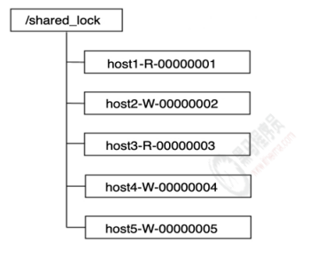
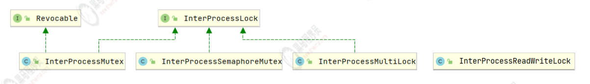

- 概念
	- 分布式锁
		- 指在分布式环境下，保护跨进程、跨主机、跨网络的共享资源，实现互斥访问，保证一致性；
	- 共享锁（读锁）
	  id:: 62d55f06-904f-48a8-98d5-fa6018f06b8a
		- 如果事务T1对数据对象O1加上了共享锁，那么当前事务只能对O1进行读取操作，其他事务也只能对
		  这个数据对象加共享锁，直到该数据对象上的所有共享锁都被释放
	- 排它锁（写锁或独占锁）
	  id:: 62d55f17-b30b-4617-8cfe-dd22236b737f
		- 如果事务T1对数据对象O1加上了排他锁，那么在整个加锁期间，只允许事务T1对O1进行读
		  取或更新操作，其他任务事务都不能对这个数据对象进行任何操作，直到T1释放了排他锁
- 分布式锁将不可锁资源转化为可上锁资源
- ZK实现
	- 在zk中，锁就是一个数据节点
	- 普通实现
	  collapsed:: true
		- 注册临时节点，谁注册成功谁获取锁，其他监听该节点的删除事件，一旦被删除，通知其他客户端，再次重复该流程；
		  此为最简单的实现，但容易引发一些问题 如 羊群效应
		- > 羊群效应： 被删除时所有客户端接收消息，再次全部客户端一起竞争锁。造成大量的性能开销。
	- 高级实现
	  collapsed:: true
		- 
		- 流程
		  collapsed:: true
			- 所有服务要获取锁时都去zookeeper中注册一个临时顺序节点，并将基本信息写入临时节点
			- 所有服务获取节点列表并判断自己的节点是否是最小的那个，谁最小谁就获取了锁
			- 未获取锁的客户端添加对前一个节点删除事件的监听
			- 锁释放/持有锁的客户端宕机 后，节点被删除
			- 下一个节点的客户端收到通知，重复上述流程
		- ((62d55f06-904f-48a8-98d5-fa6018f06b8a))
		  collapsed:: true
			- 对于读锁节点而言，其**只需要关心前一个写锁节点的释放**。如果前一个写锁释放了，则多个读锁节点对应的线程可以并发地读取数据
		- ((62d55f17-b30b-4617-8cfe-dd22236b737f))
		  collapsed:: true
			- 对于写锁节点而言，其只需要关心前一个节点的释放，而不需
			  要关心前一个节点是写锁节点还是读锁节点。因为为了保证有
			  序性，写操作必须要等待前面的读操作或者写操作执行完成
		- > 锁仅仅是保证在加锁期间的数据不会被影响
	- Curator实现
		- 
		- InterProcessMutex：分布式可重入排它锁（可重入可以借助LocalMap存计数器）
		- InterProcessSemaphoreMutex：分布式排它锁
		- InterProcessMultiLock：将多个锁作为单个实体管理的容器
		- InterProcessReadWriteLock：分布式读写锁
	-