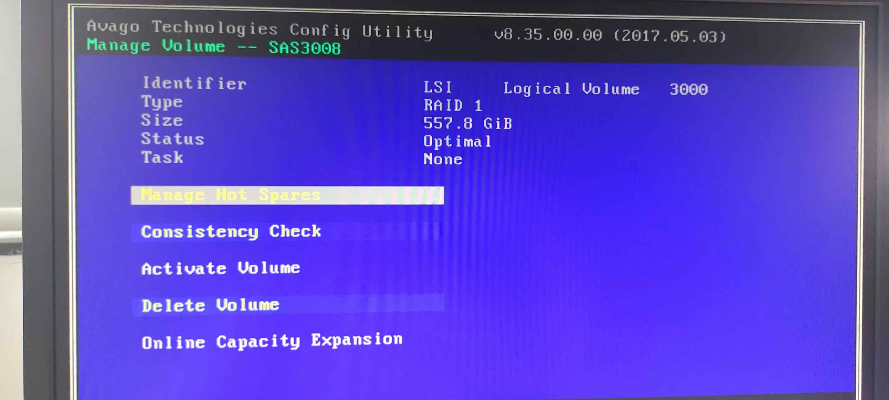
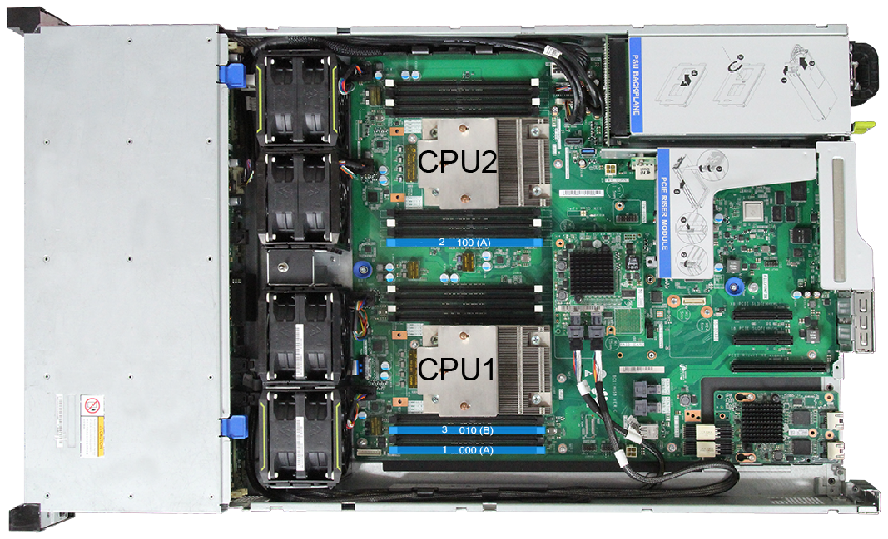

- 服务器基本信息
  collapsed:: true
	- 服务器型号：H20M-03/RH2288H v3
	  id:: 62ccc5f8-cebf-419f-a3b5-d16a49a8f45a
	- CPU：2*E5-2680 v4@2.4GHz
	- 内存：32G
	- [官方文档](https://support.huawei.com/enterprise/zh/rack-servers/rh2288h-v3-pid-9901881/software)
- 硬件配置
	- 基本资料
		- 
		- 
		  id:: 62ce15ac-f1c9-4d48-b844-8836f236aa2e
	- 磁盘RAID配置
	  collapsed:: true
		- 官方文档
			- {{embed ((62ce15ac-f1c9-4d48-b844-8836f236aa2e))}}
		- 步骤
		  collapsed:: true
			- 设为LEGACY模式
			- 开局 Ctrl+C 然后Ctrl+H
			- 可以看见RAID为 RAID1，不做改动
			- 
	- 内存配置
		- 内存的条件
		  collapsed:: true
			- ((62ce1ce4-775b-4327-9949-308ae3dd1aa1))
			- ((62ce1ce0-13b9-447f-ba46-95235f28c391))
			- ((62ce1ce8-629c-4a77-a74c-a2ae834804d9))
			- ((62ce1cf0-04ff-47e8-b342-dcecb3700282))
			- ((62ce1d60-5c05-40c6-b4c3-ca00f5e59752))
			- ((62ce1d62-89d7-40f8-9baf-6e5be103f987))
			- ((62ce1d5a-2610-47fd-ad99-f03056d31cd6))
			- > ((62cf84ca-ffda-47d8-9ee5-9e4988ed59fc))
		- 安装
		  collapsed:: true
			- 文档
			  collapsed:: true
				- ((62ce1dc9-f8ea-483f-99b0-46eeb2ca5437))
			- 具体内存条配置可以参考 [内存配置助手](https://support-it.huawei.com/smca/)
			- 网站给出的内存不一定与服务器具体型号位置对应，根据网站DIMM槽位安装顺序再对应服务器上具体标明的内存插槽进行安装
			- 目前三个内存条槽位安装图为
				- 
- 系统配置
	- ESXI 7.0 安装
	  collapsed:: true
		- [参考文档](https://zhuanlan.zhihu.com/p/166568514)
		- {{embed [[ESXI 安装]]}}
	- Ubuntu 20.04 live server安装
		- {{embed [[Ubuntu 20.04 live server安装]]}}
- 开发环境配置
	- python
		- ```sh
		  $sudo apt-get update
		  $sudo apt-get install python3.8
		  ```
-