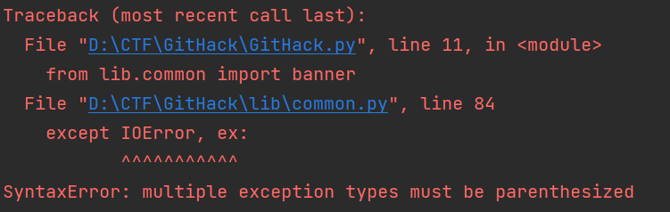

- 修改依赖源
	- ```shell
	   pip config set global.index-url https://mirrors.aliyun.com/pypi/simple
	  ```
- 安装依赖
- ```shell
  pip install -r requirements.txt
  ```
- 运行
	- python2
		- ```shell
		  python GitHack.py http://www.openssl.org/.git/
		  ```
	- python3
		- 运行
- 报错
	- 
	- 原因
	  collapsed:: true
		- 在python3 语法不同
	- 解决方法
	  collapsed:: true
		- IOError, e 改成 IOError as e
	- ModuleNotFoundError: No module named 'urlparse'
	- 原因：
		- python3版本中已经将urllib2、urlparse、和robotparser并入了urllib模块中，并且修改urllib模块，其中包含5个子模块，即是help()中看到的那五个名字。如下：
		- urllib.error：ContentTooShortError、HTTPError、URLError
		- urllib.parse：parseqs、parseqsl、quote、quotefrombytes、quote_plus、unquote unquoteplus、unquoteto_bytes、urldefrag、 urlencode、urljoin、 urlparse、 urlsplit、 urlunparse、 urlunsplit
		- urllib.request：AbstractBasicAuthHandler、 AbstractDigestAuthHandler、 BaseHandler、 CatheFTPHandler、 FTPHandler、 FancyURLopener、FileHandler、HTTPBasicAuthHandler、 HTTPCookieProcessor、HTTPDefaultErrorHandler、 HTTPDigestAuthHandler、 HTTPErrorProcessorl、 HTTPHandler、HTTPPasswordMgr、 HTTPPasswordMgrWithDefaultRealm、 HTTPRedirectHandler、HTTPSHandler、OpenerDirector、ProxyBasicAuthHandler ProxyDigestAuthHandler、 ProxyHandler、 Request、URLopener、UnknowHandler、 buildopener、 getproxies、 installopener、 pathname2url、 url2pathname、 urlcleanup、 urlopen、 urlretrieve
		- urllib.response：addbase、addclosehook、addinfo、addinfourl
		- urllib.robotparser：RobotFileParser
	- 解决方法
	- 将
	- id:: 62a9ea48-9163-4d29-b0d4-9e3fd4bae64b
	  ```python
	  import urlparse
	  my_url = urlparse.urlparse(url)
	  ```
	- 改为
	- ```python
	  from urllib.parse import urlparse
	  my_url = urlparse(url)
	  ```
	-