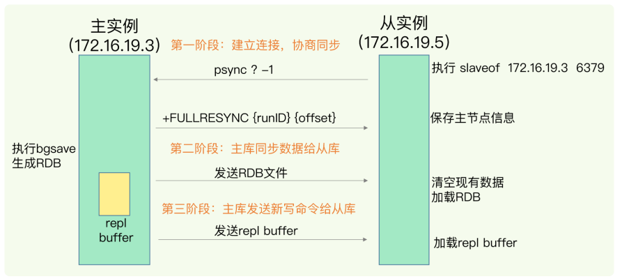

- ### 复制
    
  当有了持久化机制后，确保了redis断电重启后可以恢复好之前的数据，提高了可靠性，但是还无法避免服务不可用的状态，而提高可靠性最为常用的方式就是增加服务的实例节点，增加数据冗余。将一份数据保存到多个服务节点上。即使有的节点宕机情况整体依旧可以提供服务，减少对服务的影响；
  redis则采用**读写分离**，主从同步的方式多个实例保存同一份数据；又主库提供写操作然后同步到其他从库；而读操作主从共同提供服务，在普遍读大于写的业务需求下提供较高的可靠性与性能；
  而采用一写多从，读写分离的方式可以有效的避免了多个实例之间的分布式多个实例之间的数据一致性与事务的开销。那么具体又是如何实现主从直接的数据一致呢。
- #### 数据同步
    
  主要分为三大阶段：
    
  
- ##### 全量同步
    
  首先 由从库发送**replicaof**命令到主库，主库通过**fullresync**命令返回自己的**runid**与offset 偏移量的确认主从关系后开始全量同步；
    
  从库给主库发送**psync**命令，表示要进行数据同步，主库根据这个命令的参数来启动复制。psync命令包含了主库的runlD和复制进度offset两个参数。
    
  主库执行bgsave命令后将生成的rdb文件发送给从库，从库接受rdb文件后先清空本地数据然后载入rdb文件。
    
  主库将同步期间的写命令记录到replication buffer 中，待从库加载完先前的rdb文件就将replication buffer中命令发送给从库执行；完成第一次全量数据的同步；
- ##### 命令传播
    
  在完成第一次主从同步后，主从之间的数据就达到数据的一致；但这种数据一致情况一定主库执行新的写操作就会被破坏；为此主库将与每一个从库维持一个**长链接**，在执行完写操作后对从服务器执行命令传播操作；即将该写操作发送给从服务器执行，维护主从数据库的一致性；
- ##### 部分重同步
- ### 哨兵
- ### 集群
- ### 持久化
    
  ​	Redis是一个内存型的数据库，它所有的数据都是保存在内存中的，而内存虽然可以快速的读写，但是一旦断电，内部存储的所有数据都会丢失。即使是像用作缓存的这种其他数据库仍有备份数据的场景，重新加载数据依旧会对其他的数据库造成一定的压力。所以为了就觉这方面的问题，Redis本身自己就提供了持久化的机制，分别为**AOF日志**与**RDB快照**两种持久化方式。
- #### AOF日志
    
  ​	AOF日志是redis通过保存每一条对数据库操作的命令来实现最终对数据库所有数据的保存。是数据库常见的一种存储同步数据的一种方式。AOF持久化实现的主要过程通常分为命令追加,文件写入与同步三步。
- ##### 命令追加
    
  ​	服务器在每一次成功执行一条写命令后，就会以redis命令请求协议的格式追加到aof_buf缓冲区的末尾；
    
  ​	例如 成功执行一个普通的SET命令后以以下协议格式的内容追加到缓冲区。
    
  ​	命令： SET zhuoke blog
    
  ​	追加内容： 
    
  ```
  *3
  $3
  set
  $6
  zhuoke
  $4
  blog
  ```
    
  ​	通过这种先执行成功再写入缓冲区的方式  可以**减去命令语法检查操作**与**不会阻塞写操作**却增加了成功执行命令后尚未持久化就宕机丢失数据的风险与在aof写盘时给下一个写操作造成阻塞的风险。
- ##### 文件同步写入
    
  ​	那么在命令追加阶段的风险其实都是可以通过控制文件的写入与同步的频率来减少这种风险。文件同步写入的操作会在服务器每一个事件循环结束前调用**flushAppendOnlyFile**这个函数来根据服务器的设置提供的频率来判断是否执行文件的同步与执行操作。而这个频率是由服务器提供的一个配置项 **appendfsync**来设置的。**appendfsync**具体有三个选项可供选择
- Always 每个写命令执行完立刻**同步写回**到磁盘；
- Everysec 每秒由一个线程专门负责执行将缓冲区内容写回到文件
- No 由操作系统控制缓冲区写回到磁盘文件
    
  三种策略对比优缺点
   
  三种策略由上到下性能递增，而可靠性却相反在递减。具体选择就根据应用场景了。redis默认选项是一个折中选择了Everysec。
- ##### AOF文件载入
    
  ​	AOF光将数据保存到磁盘的操作还不行，我们还需要将文件存储到磁盘的aof日志文件读取会redis的内存空间。
  前文提到，aof中具体保存的是redis命令格式的数据。因而只需要一个客户端读取aof文件中的命令发送给redis的服务端即可。
  AOF具体的文件的载入的流程如下：
	- 服务端启动一个伪客户端（不带网络连接）
	- 读取并执行aof文件中的命令
	- 读取完毕，载入结束
- ##### AOF重写
  ​	随着aof日志不断的写入，aof文件的大小也会不断的增大，当aof过大时会影响aof追加与载入恢复数据的效率；这个时候redis就提供**aof重写机制**来**减少**aof文件的大小了；
  ​	AOF会保存redis执行成功的每一条写命令。当多条命令都是对同一个对象进行数据写操作时，往往这多条命令会存在大量冗余的数据；AOF重写是比较有意思的一个点，他重写并不是对原先aof文件内容使用压缩算法进行精简，而是**直接根 据数据库中键值对的最新数据生成对应的写命令**；使原本对应该键值对的多条写操作合并成一条；大大的压缩了aof文件的大小；
  ​	但是aof重写机制与aof原本机制最大不同在于，它并没有相关的配置项来控制落盘频率，每一次重写所有数据都是直接写入硬盘因而存在大量的读写操作；因为aof重写只有在aof文件比较大的时候才会进行重写，重写的频率并不频繁，所以可以使用较大的开销，直接开启了新的**子进程**对**数据副本**进行重写；
    
  对数据副本进行重写却令重写期间的数据并没有拷贝到数据副本，导致数据库数据与aof文件数据不一致。因此redis在重写期间设置了aof重写的缓冲区，在重写期间，每一条写命令运行成功后除了需要加入原本的aof缓冲区外还需要追加到aof重写的缓冲区；那么整个aof重写的流程如下：
   
    
    
  主进程
- 主进程创建出子进程**bgrewriteao**f并且拷贝出数据副本
- 执行写命令并分别追加到aof缓冲区与aof追加缓冲区；
- 接收到子进程发送的重写完成信号，将重写期间写命令追加到新aof文件中；
- 用新的aof文件覆盖旧aof文件；
    
  子进程
- 开始重写
- 遍历所有的键值对 （忽略过期的键）
- 根据键的类型镜像重写
- 重写完毕
- 向主进程发送重写完成的信号 
    
  可以看到由子进程来执行重写的操作可以很大程度避免了主进程的阻塞；但是在fork子进程与重写完毕将aof重写缓冲区内容追加到新aof文件依旧不可避免地产生**阻塞风险**；AOF文件载入时也是逐一执行命令，这样效率也比较慢；
- #### RDB快照
    
  说完aof日志那就来叨叨另一个持久化机制：RDB快照；与aof记录写命令不同，rdb是直接记录某个是时刻的内存内的数据写到磁盘上；
    
  触发rdb文件生成的方式又两种，一种是命令形式，另一种是在配置文件设置好触发条件的自动间隔性保存；
    
  redis有两个命令可以主动生成rdb文件；
- save ： 在主线程执行；会阻塞主线程；
- bgsave：创建一个子进程来执行；（默认配置选项）
    
  配置文件中默认触发条件
    
  ```
  save 900 1
  
  save 300 10
  
  save 60 1000
  ```
    
  那么满足其中一个条件即可触发bgsave命令
    
  例如： 在900秒内对数据库执行了一次修改命令 即可触发bgsave命令
    
  最终配置文件中save的配置会被加载到redisServer中的 saveparams数组中；同时redisServer还保存了上次执行完rdb之后成功修改次数的计数器**dirty**与上次执行rdb的unix时间戳lastsave属性；
    
  ​	周期性函数serverCron每一执行就会根据这三个值来判断是否执行bgsave函数；
    
  ​	bgsave子进程与主进程之间共享所有内存数据；当主进程需要修改数据时就会使用操作系统提供COW(copy on write)写时复制技术；子进程读取复制出来的旧数据；主进程直接修改原来的数据；子进程与主进程之间数据避免影响；
    
   
    
    
    
    
    
  那么对于平时redis我们应该用哪种方式来持久化呢？
    
  
    
  小孩子才做选择题~ 
    
  平时日常可混合使用aof与rdb，使用rdb做全量备份，在两次rdb之间使用aof做增量备份；
    
  这样一来，快照不用很频繁地执行，这就避免了频繁fork对主线程的影响。而且，AOF日志也只用记录两次快照间的操作，也就是说，不需要记录所有操作了，因此就不会出现文件过
  大的情况了，也可以避免重写开销。
    
  